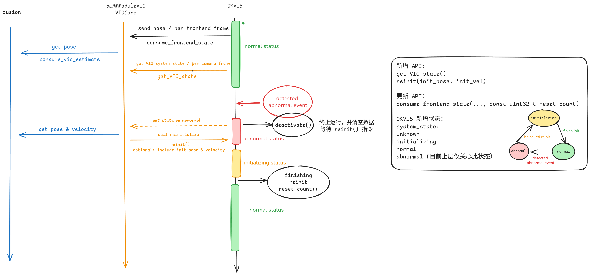

# VSLAM初始化逻辑

# 一、初始化时机

1. 接收到重新初始化命令

2. vslam系统状态异常

3. 实现：

   1. ThreadedSlam增加需要初始化的状态

      * 新增：Pose状态，融合根据此状态判断是否用此姿态，以及是否需要重定位。具体的触发开发的方式开发的过程中确定。 &#x20;

        1. Unknown

        2. Init

        3. Normal

        4. Bad (Need init)

           2. 上帧处理的图像时间戳距离当前帧时间戳达到一定阈值

           3. 速度异常

      * 融合通过新增的ID判断vslam是否初始化过。

4. TODO

# 二、初始化方式

1. 实现reset接口

   * 线程等待\&join&重开

   * 需要重置的变量重置

     * Saved = xxxx

     * \* this = Class();

     * this->recover = saved

* TODO

  * 终止Ceres优化

  * reset可以加参数，比如融合模块/RTK的姿态或者速度（待定）。

# 三、初始化期间的其他模块处理逻辑

1. 初始化期间给其他模块返回空姿态

# 四、TODO

1. 姿态带ID，当重新初始化后，ID自增。

2. 融合模块一旦发现ID变化，需要重置Tvw变量。

3. 以odo数据初始化速度。

4. 接RTK、融合模块的速度信息，初始化时

5. 长时间丢图，但是机器不动的情况的处理？

   1. 再行考虑，目前直接初始化

6. 异常情况

   1. 跟踪丢失，达到一定时长以后

