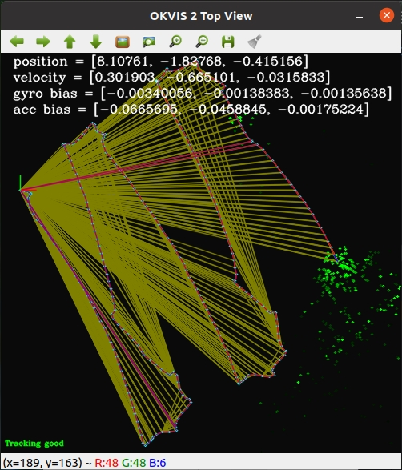

# maplab建图与重定位板测耗时

# 1、建图

|                                                                                                                            | **Unoptimized VIMap帧数** | **Unoptimized VIMap地图点数** | **保留帧数** | **after optimizedandmarks** | **summary map landmarks** | **OKVIS componen大小/MB** | **加载OKVIS componen耗时/s** | **feature\_tracking\_triangulation/s** | **vimap\_optimization/s** | **summary\_map\_conversion/s** | **mapping\_demo\_total/s** |
| -------------------------------------------------------------------------------------------------------------------------- | ----------------------- | ------------------------- | -------- | --------------------------- | ------------------------- | ----------------------- | ------------------------ | -------------------------------------- | ------------------------- | ------------------------------ | -------------------------- |
| **MK2-12\_circle**                                                                                                         | 3460                    | 241765                    | 950      | 83738                       | 3007                      | 349.7                   | 311.04                   | 41.48                                  | 1906.71                   | 7.16                           | 2476.70                    |
| **MK2-12\_lake2\_0.5m**                                                                                                    | 1111                    | 83872                     | 378      | 54362                       | 3988                      | 117.6                   | 103.11                   | 13.87                                  | 136.44                    | 2.73                           | 302.34                     |
| **MK2-12\_normal\_z\_0.5m**                                                                                                | 1504                    | 110272                    | 559      | 70781                       | 7890                      | 158.0                   | 139.35                   | 18.52                                  | 321.57                    | 3.93                           | 552.23                     |
| **MK2-12\_normal\_z\_0.8m**                                                                                                | 1132                    | 83752                     | 360      | 51130                       | 4959                      | 114.5                   | 102.49                   | 14.72                                  | 166.08                    | 2.68                           | 340.94                     |
| **MK2-12\_normal\_z\_0.8m2**                                                                                               | 1392                    | 99214                     | 365      | 55606                       | 3241                      | 138.2                   | 123.21                   | 18.40                                  | 124.36                    | 2.59                           | 343.64                     |
| **MK2-12\_slip**                                                                                                           | 915                     | 71872                     | 270      | 45768                       | 3447                      | 91.3                    | 83.03                    | 12.49                                  | 73.60                     | 1.90                           | 214.44                     |
| **MK2-33\_78\_lake2\_sunshine**                                                                                            | 4571                    | 327964                    | 1219     | 241435                      | 12653                     | 463.2                   | 410.13                   | 55.68                                  | 799.87                    | 8.81                           | 1607.18                    |
| **MK2-50\_78\_lake2\_sunlight**                                                                                            | 3729                    | 250844                    | 1040     | 174851                      | 9593                      | 375.2                   | 330.16                   | 44.86                                  | 797.23                    | 7.18                           | 1423.62                    |
| **definition\_limit\_corrected\_B1-138\_corrected**                                                                        | 4964                    | 326376                    | 1764     | 240368                      | 21157                     | 495.7                   | 434.97                   | 54.97                                  | 1923.65                   | 11.49                          | 2735.84                    |
| **definition\_limit\_corrected\_B1-L2\_corrected**                                                                         | 4452                    | 290412                    | 1726     | 219422                      | 17904                     | 449.3                   | 390.07                   | 48.31                                  | 1912.77                   | 10.97                          | 2616.86                    |
| **ydiff\_corrected\_B1-138\_corrected**                                                                                    | 7248                    | 473006                    | 2295     | 341207                      | 22329                     | 681.1                   | 590.27                   | 81.18                                  | 3185.20                   | 14.94                          | 4448.86                    |
| **ydiff\_corrected\_B1-L1\_corrected**                                                                                     | 6583                    | 440598                    | 2211     | 329903                      | 19361                     | 642.3                   | 565.66                   | 72.54                                  | 1436.52                   | 13.91                          | 2577.30                    |
| **ydiff\_corrected\_B1-L2\_corrected**                                                                                     | 6826                    | 477451                    | 2162     | 357947                      | 23389                     | 675.9                   | 592.86                   | 78.55                                  | 1581.17                   | 15.37                          | 2798.91                    |
| **MK2-12\_normal\_z\_0.8m**                                                                                                | 1132                    | 83752                     | 360      | 51130                       | 4959                      | 114.5                   | 102.49                   | 14.72                                  | 166.08                    | 2.68                           | 340.94                     |
| **MK2-12\_normal\_z\_0.8m小弓子(30-40平)** | 529                     | 37578                     | 171      | 24491                       | 2569                      | 52.9                    | 48.81                    | 92.87                                  | 31.66                     | 1.09                           | 199.71                     |

# 2、重定位

|                                                                                                                            | **待匹配帧数** | **successes** | **success\_rate** | **OKVIS componen大小/MB** | **加载OKVIS componen耗时/s** | **relocalization\_processing/s** | **single\_frame\_processing/s** |
| -------------------------------------------------------------------------------------------------------------------------- | --------- | ------------- | ----------------- | ----------------------- | ------------------------ | -------------------------------- | ------------------------------- |
| **MK2-12\_circle**                                                                                                         | 3460      | 3460          | 100.00%           | 349.7                   | 309.51                   | 819.23                           | 0.24                            |
| **MK2-12\_lake2\_0.5m**                                                                                                    | 1111      | 1110          | 99.91%            | 117.6                   | 103.00                   | 191.71                           | 0.17                            |
| **MK2-12\_normal\_z\_0.5m**                                                                                                | 1504      | 1504          | 100.00%           | 158.0                   | 138.05                   | 248.34                           | 0.17                            |
| **MK2-12\_normal\_z\_0.8m**                                                                                                | 1132      | 1132          | 100.00%           | 114.5                   | 101.85                   | 171.09                           | 0.15                            |
| **MK2-12\_normal\_z\_0.8m2**                                                                                               | 1392      | 1392          | 100.00%           | 138.2                   | 123.31                   | 279.97                           | 0.20                            |
| **MK2-12\_slip**                                                                                                           | 915       | 914           | 99.89%            | 91.3                    | 82.11                    | 149.60                           | 0.16                            |
| **MK2-33\_78\_lake2\_sunshine**                                                                                            | 4571      | 3246          | 71.01%            | 463.2                   | 405.79                   | 581.56                           | 0.13                            |
| **MK2-50\_78\_lake2\_sunlight**                                                                                            | 3729      | 3447          | 92.44%            | 375.2                   | 328.65                   | 634.62                           | 0.17                            |
| **definition\_limit\_corrected\_B1-138\_corrected**                                                                        | 4964      | 4945          | 99.62%            | 495.7                   | 432.13                   | 1540.82                          | 0.31                            |
| **definition\_limit\_corrected\_B1-L2\_corrected**                                                                         | 4452      | 4415          | 99.17%            | 449.3                   | 389.24                   | 1612.90                          | 0.36                            |
| **ydiff\_corrected\_B1-138\_corrected**                                                                                    | 7248      | 6698          | 92.41%            | 681.1                   | 582.53                   | 1606.18                          | 0.22                            |
| **ydiff\_corrected\_B1-L1\_corrected**                                                                                     | 6583      | 4719          | 71.68%            | 642.3                   | 562.87                   | 928.66                           | 0.14                            |
| **ydiff\_corrected\_B1-L2\_corrected**                                                                                     | 6826      | 5753          | 84.28%            | 675.9                   | 591.28                   | 1150.07                          | 0.17                            |
| **MK2-12\_normal\_z\_0.8m小弓子(30-40平)** | 529       | 524           | 99.05%            | 52.9                    | 48.21                    | 76.69                            | 0.14                            |
