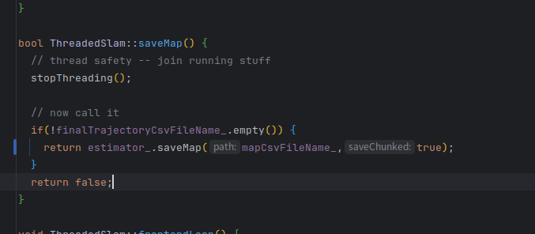

# 跑通Maplab 建图 & 重定位

[ Maplab 建图 & 重定位](https://roborock.feishu.cn/wiki/GMDEwOFMCiUDLZkEU91cd1PfnBc)

# 编译

**okvis\_depend 分支 private/songs/mapping**

* 这个库之前已经被转移到 okvis 中，但建图涉及对 opengv 的优化，以及 faiss & yaml-cpp 的加入，改动较大，因此先单独在 okvis\_depend 原来的库上修改；

* 使用：备份 okvis 中的 okvis\_depend 文件夹，并将 okvis\_depend 库软链接到 okvis 中；

* 本地运行：`./do_prebuild_x86.sh`

**maplab 分支 private/songs/mapping**

**编译**：其他三个库都放到 okvis 的目录下，运行：

```plain&#x20;text
cmake ../ -DBUILD_MAPLAB=ON -DBUILD_CONVERTER=ON -DCMAKE_BUILD_TYPE=RelWithDebInfo -DUSE_ASAN=OFF -DUSE_RERUN=ON
make -j10 VERBOSE=1
```

okvis\_depend/third\_party路径下的opengv需要更换为自己的

lc\_projection\_matrix\_filename:描述子降采样码本

# 运行

重定位运行:

```plain&#x20;text
okvis_app_synchoronous okvis.yaml $seqence_path --reloc-freq {freq} --map-dir $map_folder --lc_projection_matrix_filename brisk_matrix_32.dat
```

第一步：离线生成 okvis component，同步模式下

配置文件：

```plain&#x20;text
/home/roborock/relocalization/okvis/cmake-build-relwithdebinfo/okvis_app_synchronous /home/roborock/relocalization/data/MK2-12-608_okvis.yaml /home/roborock/benchmark_v1.0/MK2-12_normal_z_0.5m
```

第二步 mapping\_demo：输入okvis component 转换为 vi\_map，重新进行帧间跟踪生成地图点，生成 vi\_map 和 sunmmary map

```plain&#x20;text
export MAPLAB_LOOPCLOSURE_DIR=~
/home/roborock/relocalization/okvis/cmake-build-debug/okvis_maplab_converter/mapping_demo --okvis_config_path /home/roborock/relocalization/data/MK2-12-608_okvis.yaml --okvis_map_path  /home/roborock/benchmark_v1.0/MK2-12_normal_z_0.5m/okvis2-vio-calib-final_map.g2o --output_vimap_path /home/roborock/relocalization/vi_map --lc_projection_matrix_filename /home/roborock/relocalization/data/brisk_matrix_32.dat
```

第三步 relocalization\_demo：输入 okvis component 作为查询帧，summary map 作为地图。

```bash
/home/roborock/relocalization/okvis/cmake-build-debug/okvis_maplab_converter/relocalization_demo --okvis_config_path /home/roborock/relocalization/data/MK2-12-608_okvis.yaml --okvis_component_path /home/roborock/benchmark_v1.0/MK2-12_normal_z_0.5m/okvis2-vio-calib-final_map.g2o --summary_map_path /home/roborock/relocalization/vi_map_localization --output_trajectory_path /home/roborock/relocalization/tra/result.txt --lc_projection_matrix_filename /home/roborock/relocalization/data/brisk_matrix_32.dat
```

地图转换 vi\_map -> sunmmary map

```plain&#x20;text
/home/roborock/relocalization/okvis/cmake-build-debug/okvis_maplab_converter/vimap_to_summary_map_demo --input_vimap_path /home/roborock/relocalization/vi_map --output_summary_map_path /home/roborock/relocalization/summary_map --lc_projection_matrix_filename /home/roborock/relocalization/data/brisk_matrix_32.dat
```

vi\_map ->  okvis component

```plain&#x20;text
/home/roborock/relocalization/okvis/cmake-build-relwithdebinfo/okvis_maplab_converter/vimap_to_okvis_demo --vimap_path /home/roborock/relocalization/vi_map --okvis_config_path /home/roborock/relocalization/data/MK2-12-608_okvis.yaml --output_okvis_path /home/roborock/relocalization/okvis_path/okvis.g2o

```

**先打通流程，目前实现：分块存子图，savechunked 置为TRUE**



**批处理子图**

constexpr size\_t kChunkSize = 500;

```plain&#x20;text
/home/roborock/relocalization/okvis/cmake-build-debug/okvis_maplab_converter/mapping_demo
--okvis_config_path
/home/roborock/桌面/AWB-7010953X152700092-感知-白天泛物体避障/MK2-12-608_okvis.yaml
--okvis_map_dir
/home/roborock/benchmark_v1.0/MK2-12_105_pothelo_400_3/okvis2-vio-calib-final_map_submaps/
--output_vimap_path
/home/roborock/vi_map_test
--lc_projection_matrix_filename
/home/roborock/relocalization/data/brisk_matrix_32.dat
--batch_num_workers=8
```

**优化后的多子图拼接submap\_merge\_demo**

```javascript
--submaps_root
/home/roborock/vi_map_test
--output
/home/roborock/vi_map_test/subma_total
--lc_projection_matrix_filename
/home/roborock/relocalization/data/brisk_matrix_32.dat
--lc_against_cumulative_map=true
```


arm编译[ OKVIS 交叉编译](https://roborock.feishu.cn/wiki/Fc84w4CF0iKvptkvpsvcFfCYn5p)

```plain&#x20;text
cmake ../ -DCMAKE_EXPORT_COMPILE_COMMANDS=ON -DCMAKE_POSITION_INDEPENDENT_CODE=ON -DCMAKE_BUILD_TYPE=RelWithDebInfo -DUSE_RERUN=OFF -DCMAKE_TOOLCHAIN_FILE=/home/roborock/toolchain/toolchain/aarch64-mr527-linux-gnu.cmake
```


arm批测脚本,结合 的脚本，进行批测[ X5批测脚本/数据说明文档](https://roborock.feishu.cn/docx/Y8Tidva0IoXlPWxKhh3cAX4CnJb)


