# PC端benchmarks建图效果和耗时

| 数据集                                             | OKVIS第一次运行的RMSE (m) | 整图优化后的RMSE (m)                                                                              | OKVIS第二次运行的RMSE (m) | 子图优化拼接后的RMSE (m)                                                                                                                                                            |
| ----------------------------------------------- | ------------------- | ------------------------------------------------------------------------------------------- | ------------------- | --------------------------------------------------------------------------------------------------------------------------------------------------------------------------- |
| MK2-12\_normal\_z\_0.5m                         | 0.377252            | 0.040818                                                                                    | 0.358359            | 0.066                                                                                                                                                                       |
| MK2-12\_normal\_z\_0.8m2                        | 0.312448            | 0.05577                                                                                     | 0.302604            | 0.076                                                                                                                                                                       |
| MK2-12\_lake2\_0.5m                             | 0.429897            | 0.057329                                                                                    | 0.410983            | 0.071                                                                                                                                                                       |
| MK2-12\_normal\_z\_0.8m                         | 0.143831            | 0.047773                                                                                    | 0.223926            | 0.127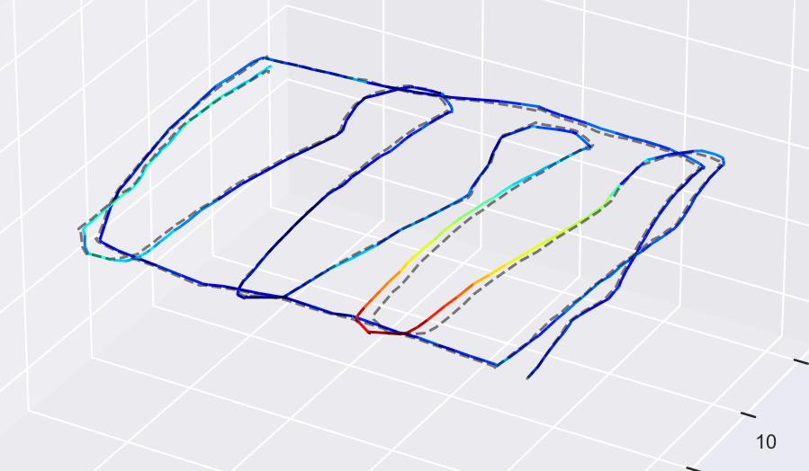                                                                                    |
| B1-37\_7.22\_105\_lake\_corrected               | 0.283607            | 0.427681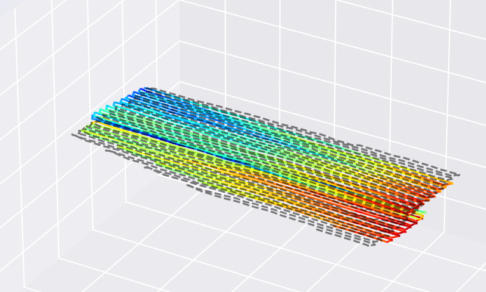 | 0.279934            | 0.208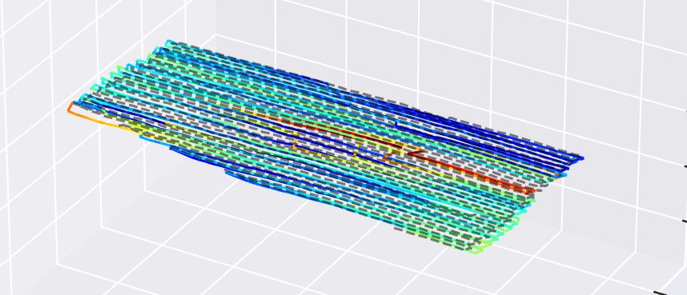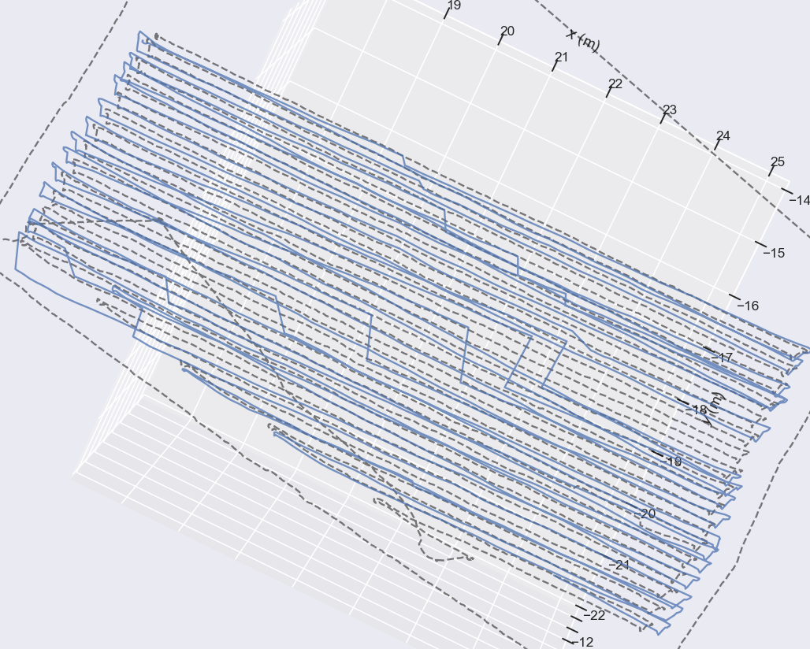 |
| MK2-12\_circle                                  | 0.263483            | 0.083642                                                                                    | 0.239802            | 0.08                                                                                                                                                                        |
| MK2-12\_slip                                    | 4.786745            | 3.41474                                                                                     | 4.726275            | 3.877                                                                                                                                                                       |
| MK2-12\_105\_lake\_400\_2\_new                  | 0.504299            | 0.06747                                                                                     | 0.195041            | 0.134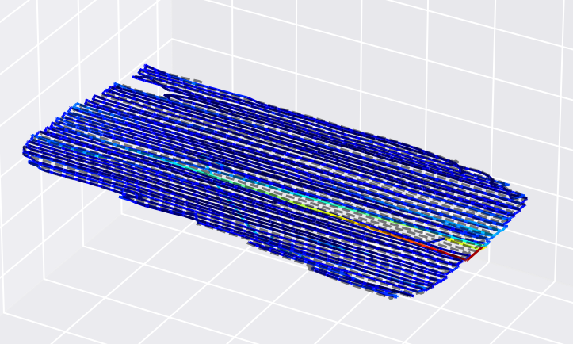                                                                                    |
| MK2-33\_78\_lake2\_sunshine                     | 0.831148            | 0.080365                                                                                    | 0.788562            | 0.441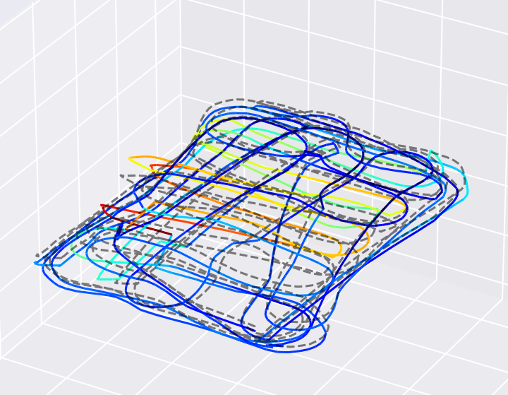                                                                                    |
| MK2-43\_105\_slope1\_10x8\_sunlight             | 5.00946             | 3.166341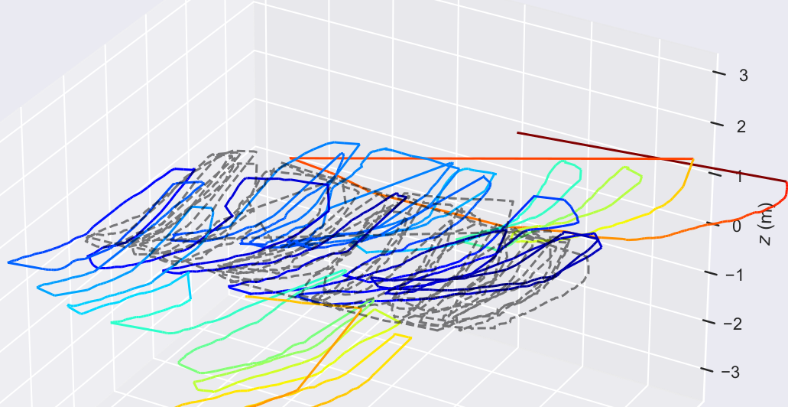 | 5.063967            | 0.574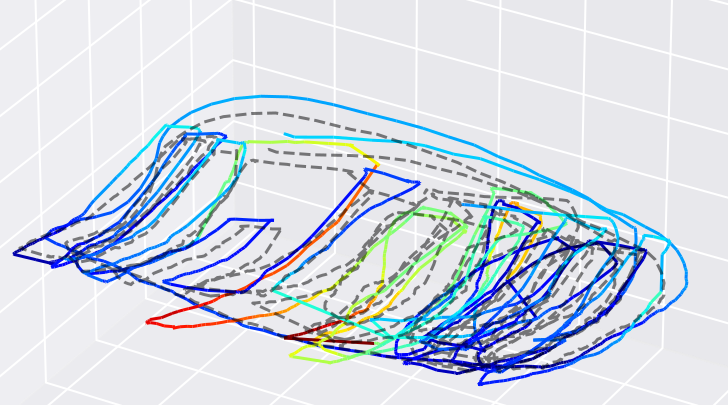                                                                                    |
| MK2-50\_78\_lake2\_sunlight                     | 0.988772            | 0.067885                                                                                    | 1.061247            | 0.176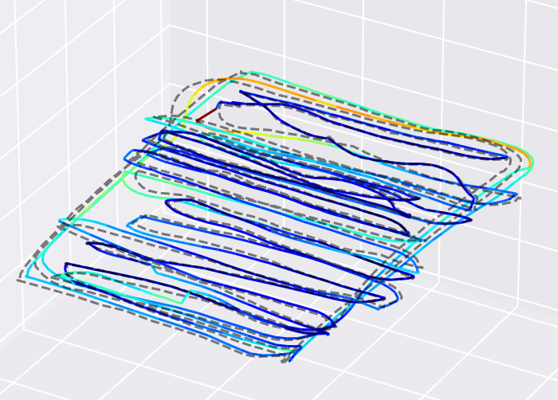                                                                                    |
| MK2-12\_105\_forest\_400\_3                     | 0.492964            | 0.06804                                                                                     | 0.477643            | 0.091                                                                                                                                                                       |
| MK2-12\_105\_pothelo\_400\_3                    | 0.448081            | 0.047044                                                                                    | 0.53356             | 0.098                                                                                                                                                                       |
| B1-037\_105\_forest\_400\_2\_new\_corrected     | 0.60615             | 0.368259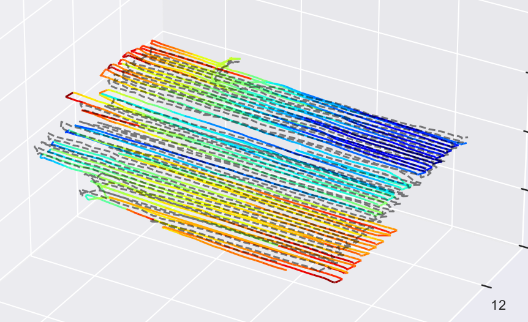 | 0.581646            | 0.184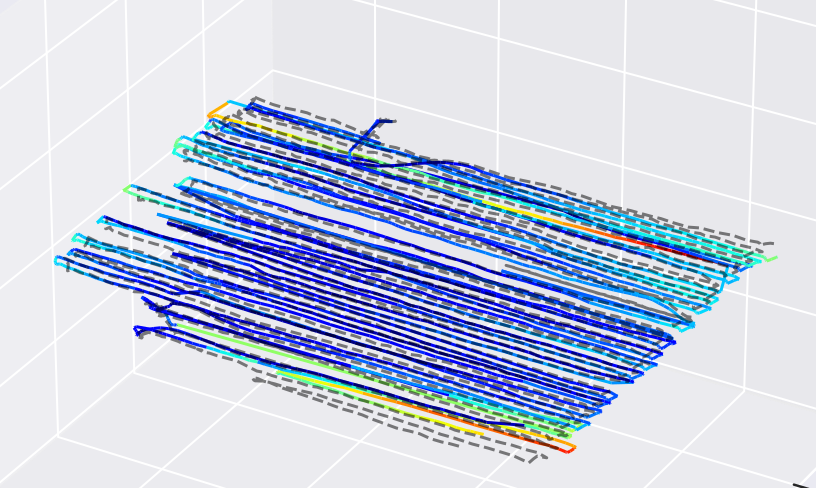                                                                                    |
| B1-37\_7.22\_78\_lake\_corrected                | 0.61385             | 0.063626                                                                                    | 0.641116            | 0.082                                                                                                                                                                       |
| ydiff\_corrected\_B1-138\_corrected             | 0.329009            | 0.072105                                                                                    | 0.346232            | 0.088                                                                                                                                                                       |
| ydiff\_corrected\_B1-L1\_corrected              | 0.399952            | 0.089014                                                                                    | 0.378863            | 0.097                                                                                                                                                                       |
| ydiff\_corrected\_B1-L2\_corrected              | 0.843431            | 0.104962                                                                                    | 0.764941            | 0.103                                                                                                                                                                       |
| definition\_limit\_corrected\_B1-138\_corrected | 0.22999             | 0.07603                                                                                     | 0.318404            | 0.073                                                                                                                                                                       |
| definition\_limit\_corrected\_B1-092\_corrected | 0.318093            | 0.088802                                                                                    | 0.321645            | 0.095                                                                                                                                                                       |
| definition\_limit\_corrected\_B1-L2\_corrected  | 0.666886            | 0.065411                                                                                    | 0.664401            | 0.078                                                                                                                                                                       |
| MK2-12\_105\_forest\_400\_2                     | 0.402956            | 0.106014                                                                                    | 0.501611            | 0.119                                                                                                                                                                       |
| MK2-12\_105\_pothelo\_400\_2                    | 0.80315             | 0.044483                                                                                    | 0.799386            | 0.196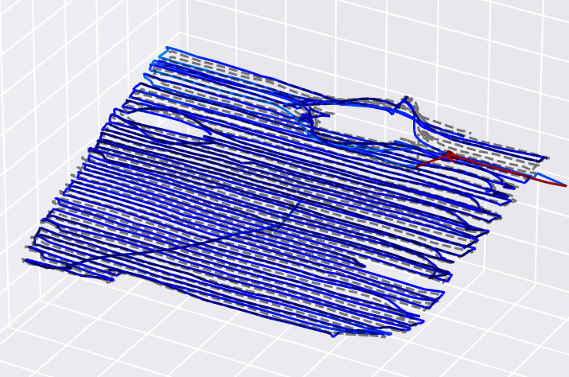                                                                                    |

# 整图优化耗时

| 整图优化耗时                                          | component\_loading(s) | feature\_tracking\_triangulation(s) | vimap\_optimization(s) | summary\_map\_conversion\_total(s) | mapping\_demo\_total(s)&#xA;整图优化 | mapping\_demo\_total(s)&#xA;分子图优化 | merge\_submaps\_total\_s |
| ----------------------------------------------- | --------------------- | ----------------------------------- | ---------------------- | ---------------------------------- | -------------------------------- | --------------------------------- | ------------------------ |
| MK2-12\_normal\_z\_0.5m                         | 5.082                 | 3.554                               | 131.53                 | 0.510                              | 146.596                          | 68.759                            | 3.109                    |
| MK2-12\_normal\_z\_0.8m2                        | 3.648                 | 2.990                               | 39.238                 | 0.268                              | 50.665                           | 24.944                            | 1.609                    |
| MK2-12\_lake2\_0.5m                             | 4.348                 | 2.842                               | 82.04                  | 0.268                              | 94.737                           | 26.656                            | 1.919                    |
| MK2-12\_normal\_z\_0.8m                         | 3.577                 | 2.064                               | 68.336                 | 0.275                              | 78.859                           | 31.885                            | 1.61                     |
| B1-37\_7.22\_105\_lake\_corrected               | 24.514                | 17.295                              | 307.272                | 1.248                              | 408.045                          | 54.959                            | 12.661                   |
| MK2-12\_circle                                  | 11.229                | 8.439                               | 387.242                | 0.877                              | 425.842                          | 78.177                            | 9.061                    |
| MK2-12\_slip                                    | 2.866                 | 1.917                               | 26.56                  | 0.181                              | 34.196                           | 24.118                            | 0.924                    |
| MK2-12\_105\_lake\_400\_2\_new                  | 26.700                | 23.906                              | 867.644                | 1.811                              | 1022.445                         | 76.148                            | 20.062                   |
| MK2-33\_78\_lake2\_sunshine                     | 13.258                | 7.000                               | 304.3                  | 0.927                              | 349.703                          | 30.305                            | 8.08                     |
| MK2-43\_105\_slope1\_10x8\_sunlight             | 12.482                | 7.111                               | 194.792                | 0.796                              | 232.159                          | 54.975                            | 10.636                   |
| MK2-50\_78\_lake2\_sunlight                     | 11.104                | 6.306                               | 358.283                | 0.868                              | 396.774                          | 79.000                            | 6.766                    |
| MK2-12\_105\_forest\_400\_3                     | 19.283                | 15.681                              | 531.505                | 1.257                              | 615.499                          | 67.357                            | 14.343                   |
| MK2-12\_105\_pothelo\_400\_3                    | 20.477                | 16.001                              | 877.107                | 1.162                              | 966.018                          | 92.120                            | 14.511                   |
| B1-037\_105\_forest\_400\_2\_new\_corrected     | 23.069                | 17.815                              | 278.371                | 1.622                              | 378.13                           | 54.327                            | 21.705                   |
| B1-37\_7.22\_78\_lake\_corrected                | 20.005                | 14.181                              | 550.947                | 1.709                              | 647.104                          | 103.337                           | 18.37                    |
| ydiff\_corrected\_B1-138\_corrected             | 23.754                | 16.994                              | 853.863                | 1.860                              | 972.449                          | 61.108                            | 23.93                    |
| ydiff\_corrected\_B1-L1\_corrected              | 21.847                | 13.685                              | 393.132                | 1.614                              | 490.772                          | 79.112                            | 20.056                   |
| ydiff\_corrected\_B1-L2\_corrected              | 23.245                | 15.43                               | 435.126                | 1.832                              | 545.402                          | 73.333                            | 20.822                   |
| definition\_limit\_corrected\_B1-138\_corrected | 16.064                | 12.677                              | 636.069                | 1.362                              | 706.401                          | 70.072                            | 17.966                   |
| definition\_limit\_corrected\_B1-092\_corrected | 13.458                | 9.943                               | 546.459                | 1.286                              | 605.728                          | 63.684                            | 12.458                   |
| definition\_limit\_corrected\_B1-L2\_corrected  | 16.490                | 9.459                               | 538.561                | 1.196                              | 596.012                          | 83.852                            | 14.55                    |
| MK2-12\_105\_forest\_400\_2                     | 30.587                | 24.165                              | 872.339                | 2.129                              | 1031.402                         | 83.330                            | 24.627                   |
| MK2-12\_105\_pothelo\_400\_2                    | 24.809                | 19.957                              | 1082.719               | 1.875                              | 1206.254                         | 57.311                            | 21.359                   |

# 子图优化耗时

| 子图优化耗时                                          | component\_loading(s) | feature\_tracking\_triangulation(s) | vimap\_optimization(s) | summary\_map\_conversion\_total(s) | mapping\_demo\_total(s) | merge\_submaps\_total\_s |
| ----------------------------------------------- | --------------------- | ----------------------------------- | ---------------------- | ---------------------------------- | ----------------------- | ------------------------ |
| MK2-12\_normal\_z\_0.5m                         | 5.795                 | 4.262                               | 213.844                | 0.679                              | 68.759                  | 3.109                    |
| MK2-12\_normal\_z\_0.8m2                        | 4.374                 | 2.815                               | 51.86                  | 0.255                              | 24.944                  | 1.609                    |
| MK2-12\_lake2\_0.5m                             | 4.472                 | 3.055                               | 49.394                 | 0.285                              | 26.656                  | 1.919                    |
| MK2-12\_normal\_z\_0.8m                         | 3.733                 | 2.833                               | 52.605                 | 0.313                              | 31.885                  | 1.61                     |
| B1-37\_7.22\_105\_lake\_corrected               | 30.013                | 23.361                              | 269.869                | 1.479                              | 54.959                  | 12.661                   |
| MK2-12\_circle                                  | 13.324                | 13.408                              | 505.642                | 1.028                              | 78.177                  | 9.061                    |
| MK2-12\_slip                                    | 2.950                 | 2.028                               | 34.801                 | 0.173                              | 24.118                  | 0.924                    |
| MK2-12\_105\_lake\_400\_2\_new                  | 37.389                | 28.718                              | 365.069                | 1.987                              | 76.148                  | 20.062                   |
| MK2-33\_78\_lake2\_sunshine                     | 15.120                | 13.950                              | 150.933                | 1.160                              | 30.305                  | 8.08                     |
| MK2-43\_105\_slope1\_10x8\_sunlight             | 15.971                | 12.999                              | 252.99                 | 1.587                              | 54.975                  | 10.636                   |
| MK2-50\_78\_lake2\_sunlight                     | 12.205                | 11.778                              | 437.750                | 0.900                              | 79.000                  | 6.766                    |
| MK2-12\_105\_forest\_400\_3                     | 24.798                | 20.848                              | 348.885                | 1.628                              | 67.357                  | 14.343                   |
| MK2-12\_105\_pothelo\_400\_3                    | 27.362                | 23.861                              | 499.716                | 1.595                              | 92.120                  | 14.511                   |
| B1-037\_105\_forest\_400\_2\_new\_corrected     | 28.588                | 23.203                              | 248.411                | 2.352                              | 54.327                  | 21.705                   |
| B1-37\_7.22\_78\_lake\_corrected                | 24.528                | 21.711                              | 558.649                | 1.982                              | 103.337                 | 18.37                    |
| ydiff\_corrected\_B1-138\_corrected             | 28.084                | 24.759                              | 307.646                | 2.018                              | 61.108                  | 23.93                    |
| ydiff\_corrected\_B1-L1\_corrected              | 26.403                | 21.780                              | 458.128                | 1.963                              | 79.112                  | 20.056                   |
| ydiff\_corrected\_B1-L2\_corrected              | 26.232                | 24.049                              | 417.474                | 1.968                              | 73.333                  | 20.822                   |
| definition\_limit\_corrected\_B1-138\_corrected | 21.178                | 18.386                              | 323.940                | 1.911                              | 70.072                  | 17.966                   |
| definition\_limit\_corrected\_B1-092\_corrected | 18.117                | 16.581                              | 283.957                | 1.589                              | 63.684                  | 12.458                   |
| definition\_limit\_corrected\_B1-L2\_corrected  | 19.368                | 16.529                              | 407.153                | 1.895                              | 83.852                  | 14.55                    |
| MK2-12\_105\_forest\_400\_2                     | 35.504                | 30.269                              | 396.630                | 2.220                              | 83.330                  | 24.627                   |
| MK2-12\_105\_pothelo\_400\_2                    | 32.516                | 27.726                              | 282.099                | 2.076                              | 57.311                  | 21.359                   |
