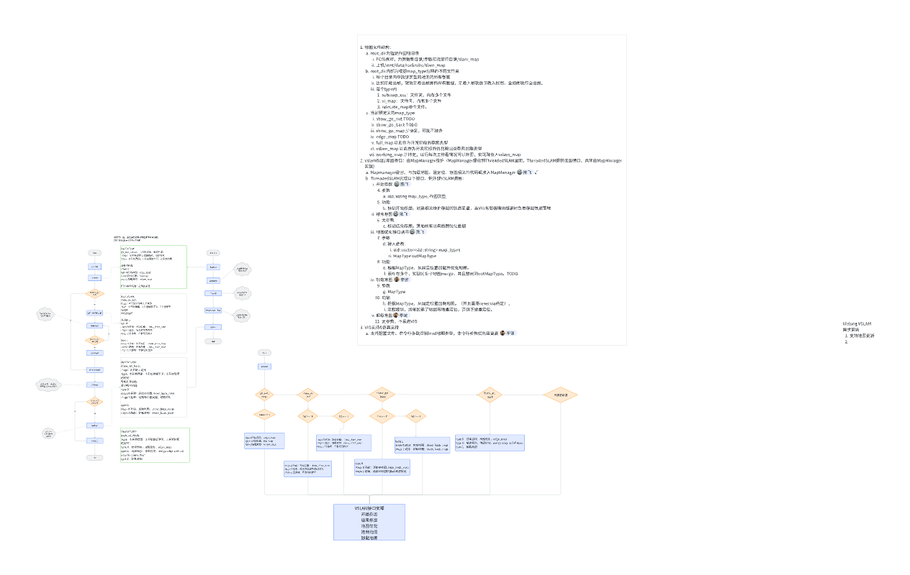

# 全局图工作项

# 会议信息

会议主题：RTK阴影区域出桩工作安排

会议时间：Nov 18 (Tue) 16:01 - 17:03 (GMT+08)

参会人：       &#x20;

# 会议议程

# 1. 目标

1. 实现小范围内建图+重定位

[ RTK阴影区域出桩回桩方法](https://roborock.feishu.cn/wiki/PWsYwkSDHinkZNkoXR7c2t6Qnke)

* 兼容未来纯视觉割草机

# 2. 流程图

# 3. 工作内容

* 重定位（调优） &#x20;

  * 上机、仿真情况的适配

- [x] 加观测实现（Done）&#x20;

* 消息接入与逻辑调用  &#x20;

* 新采集数据批测，问题分析    &#x20;

  * [ VSLAM定位数据采集数据描述](https://roborock.feishu.cn/wiki/ZQrdw4AVXiagdJkAoMPcPeyjnRf?open_in_browser=true) rebase后第一轮批测（取消）    &#x20;

*

# 4. 工程细节

## 4.1 代码分支

1. 1~~118可运行分支~~

   1. ~~okvis~~

   2. ~~maplab~~

   3. ~~okvis\_maplab\_converter~~

   4. ~~toolchain~~

2. 开发分支

   1. okvis

      1. vl\_slam/map\_bulding/develop

   2. Toolchain: private/xiaohongfei/RelocCompile

## 4.2 运行方式文档

## 参考文档

[ 跑通Maplab 建图 & 重定位](https://roborock.feishu.cn/wiki/WjeAwLeziiEx1rkBYhjc4KUBnrg)

[ 重定位功能建图流程](https://roborock.feishu.cn/wiki/L2hfwNp74isj2dkghENcdnDxnSh?open_in_browser=true)

# 交互需求

1. 挂载地图成功前输出为相对位姿，成功后输出绝对位姿，中间会发生位姿跳变
   SLAM 给导航的 pose 加一个是否重定位成功的标志位 is\_relocal

# 开会讨论

1. 出桩和回桩轨迹不一致是否可以

   1. 可以，只要有公式区域即可

   2. 要求精度高

      1. 考虑看建两张图/一张图/两张子图拼到一起

2. 出桩转前的数据加入存图，初始化完成前的数据必须加入视觉建图

   1. 用初始化完成的姿态，对齐全局图与RTK坐标系（单帧6dof姿态对齐）

   2. 回桩相应的要做对齐

3. 保存建图数据入/dev/shm

   1. 只有1.6G，可以先往/mnt/data/rockrobo/

   2. 500KB/s 可能不稳定

4. 输出精度/时间

   1. 数据

      1. 能拼到一起的情况下，两张图分开建图是否精度下降严重

   2. 代码，下周一ready

5. 打通整体流程后再各自优化

