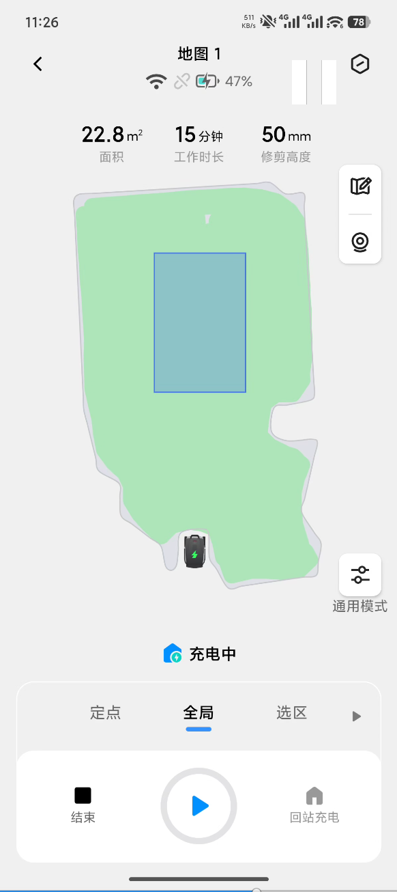
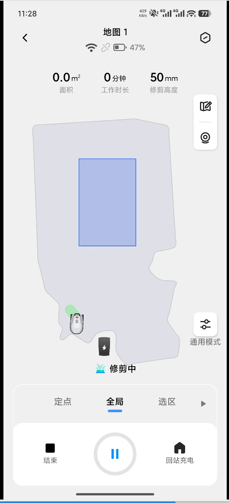
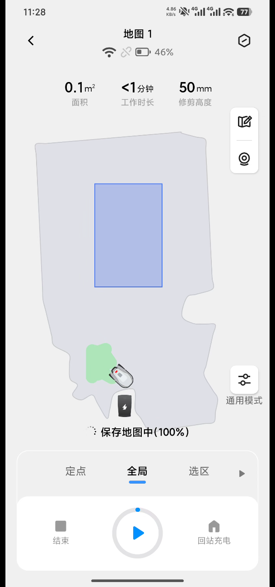
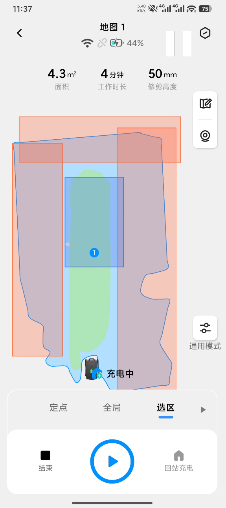
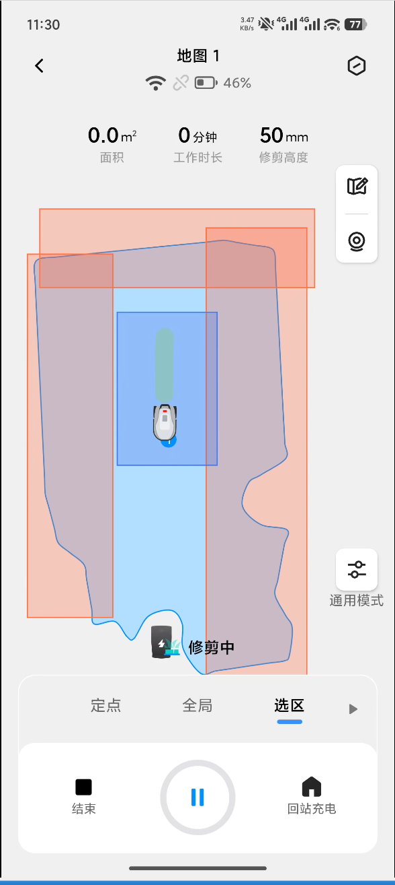
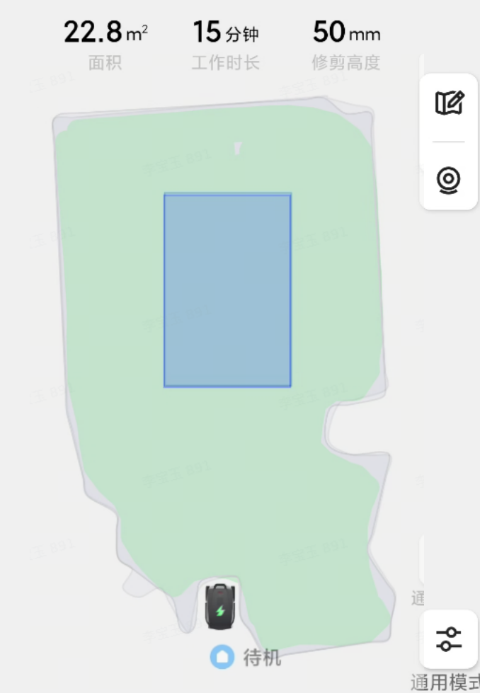
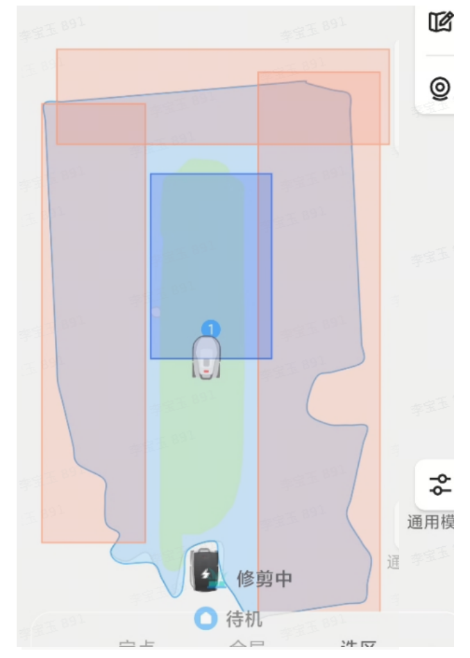

# Eden VSLAM算法方案

# 会议信息

会议主题：Eden VSLAM算法规划

会议时间：Jan 07 (Wed) 17:49 - 18:00 (GMT+08)

参会人：       &#x20;

# 会议议程

# 1. Terramow算法逻辑整理

1. VIO部分

   1. VIO基本不受轮子影响，无论怎么制造打滑，基本上不会姿态错乱。

2. 建图部分

   1. 地图实时更新，即使保存地图，开始割草后，也能够实时更新。见下图。

   2. 割草过程中的地图，疑似有轮廓缩小+轮廓平滑。割草完成后恢复。

   3. 建图过程中能够存盘，重启后未建完的地图还存在。

   4. 出桩后重新跑了个VIO/vslam，可能和已经保存的地图找回环的频率很低，甚至没有。

      1. 从搬桩测试可以推测出来：搬桩后，定位错误，与桩的相对位置准确，而不是相对于已保存的地图定位准确。

      2. 遮挡、搬动、偶发自行地重定位。重定位后定位在老地图上。

      3. 这种策略可能导致边缘漏割/出界。或者搬动桩时出界。

* 业务逻辑部分

  1. 异常处理

     1. 打滑对定位完全无影响，推测使用了纯VIO，或者轮子使用了更严格的过滤方式。

     2. 遮挡、搬起，直接触发重定位。

  2. 重定位

     1. 已建地图的情况下，重定位失败会持续进行重定位。成功后根据是否在界内正常工作或者上报错误。

     2. 未完成建图的情况下，重定位失败会直接上报重定位失败错误。

  3. 边界扩建

     1. 扩建需要结合通道进行

        1. 遥控机器到通道起点

        2. 点击到达起点后，机器会转一圈，疑似vslam进行了重定位，或者保存特别的数据。

        3. 转完圈后，人为遥控到通道终点。

        4. 在通道终点处走建图逻辑。

  4. 依据当地太阳是否落山判断机器是否进行工作

     1. 软件会有工作硬的工作时间限制。日出前，日落后，强制无法开始任务。

     2. 并且可以设置，日出后、日落前一小时内，不工作。

     3. 默认是日落前半小时，日出后半小时内不工作。

     4. 手机系统日期改了，这个日出日落时间不受影响。不过进入机器人设置界面会提示手机或机器人网络不佳。

# 2. Eden现状以及要做的改进

1. 不太明确的点

   1. 真的要像Terramow那样自主吗？号称不需要人工介入，但是效率确实低，并且还容易出界，不受人为控制。要像只在想要割的区域建图，还得多此一举布置一下场地。

      1. 可否做一个“软指导”，比如遥控一圈，允许机器在遥控轨迹一米范围内自主扩建？

   2. 目前已知Terramow定位精度不受轮子干扰，那么他们对于IMU会不会要求更高？有没有相关的拆机视频确定Terramow的IMU情况。

   3. Terramow的CPU为Hi 3588，咱们是否可以使用相对应算力的CPU：按x5继续开发。

   4. 据 反馈，Terramow的双目只用来做定位，所以只针对灰度图tuning，传感器利用的会比较好，对VSLAM更友好。

      1. 在软件端，是否可以进行多路ISP tuning？：暂时还好

   5. 建图期间，VIO正常时要不要做/回环检测全局图优化？TODO

   6. 割草期间的重定位是否要足够频繁？

      1. 目前看Terramow很少触发。说明他们正常情况下不怎么和落地地图做交互，才会发生搬桩后出界问题。

2. okvis2官方版本回环

   1. 包含以下功能

      1. 找回环；校验回环；

         1. 在realtimeGraph内找

      2. 局部优化搬窗口；误差均摊，全图调

         1. 在realtimeGraph部分修改

      3. 回环帧加入realtimeGraph的active window，共视点融合，支持跟踪。

         1. realtimeGraph部分逻辑

      4. 触发后端优化（在fullGraph内）

         1. fullGraph逻辑

      5. 同步后端优化的结果（fullGraph->realtimeGraph）

      6. ~~所有数据完成后执行FinalBA~~

   2. 缺少功能

      1. 持续的和已经存盘的地图建立关联，可能导致不同次割草vslam的坐标系方向偏移。

   3. 开会更新

      1. okvis做回环检测、搬动重定位恢复、PoseGraph、存图

      2. realtimeGraph只做poseGraph

      3. fullGraph ICE BA

      4. 密集弓子建图， 或者直接割草建图

         1. 先弓字，再沿边

            1. 增量BA、IMU期间引入更有优势

      5. 避障模式 建图和割草不一样。

      6. 地图实时优化完成，没有做回桩整体优化

         1. 建图的时候可以任意搬动机器，也能做重定位

         2. 搬动后不走到原始位置。希望走到原始位置。

      7. 割草的时候地图会更新

      8. 重定位成功率高----重定位使用已经保存的地图，不使用临时地图

         1. 老地图的使用方式是怎样的？ 还有啥时候会使用老地图

      9. 抗打滑能力很好，怀疑没有用odom

      10. 遮挡和脏污检测都做了

      11. 动态障碍物不影响slam&#x20;

          1. 测测不同距离情况下的定位结果

          2. vslam测试动态障碍物、打滑性能

      12. 充电桩的特征不影响定位结果

      13. IMU型号排查

3. okvis与maplab对比

   1. 讨论方案如下：[ okvis\&maplab对比](https://roborock.feishu.cn/wiki/PUKiwG4Oxi3evokmLULcJA5Nnje)

4. Eden业务逻辑

   1. 主要目标

      1. **完成建图过程中的重定位功能。**

      2. 完成重定位成功后，将后续VIO定位数据附加到已有的建图数据上的功能。

      3. 完成带中断轨迹的地图优化功能。（预期风险不大）

      4. 建图优化时间足够快（目标为板端400平2\~3分钟）

      5. 重定位多帧校验

      6. 重新割草时必须与持续与老地图关联

         1. 否则每次割草自己的地图精度再高，也不一定和老地图对齐，导致出界

   2. 算法策略

      1. 建图重定位都使用同一套算法框架（maplab）

         1. 存图、单帧重定位的方案设计     [ 宽弓字建图时重定位方案](https://roborock.feishu.cn/wiki/S3xNwyqEoidzRZkOVcXc9AZJnKd?open_in_browser=true)

      2. 建图过程中数据落地、重定位  开发时间确定  对齐目标：**完成建图过程中的重定位功能**

         1. 数据保存入磁盘的同时，在内存中也保存。（okvis -> summary map）

            1. 保存时直接存为vimap/summary map。

            2. 支持保存后的地图能够立即用来重定位。

         2. 触发重定位后，在已有地图上继续存图。

         3. Optional

            1. 存图的过程中持续进行回环检测，检测成功后触发vimap的姿态图优化/全局优化。

      3. 建图完成后

         1. 启动时，自动加载已有地图。

         2. 加载后，导航调用重定位/set\_pose接口后，才能进行工作。

         3. 建图完成后的地图更新策略待定

            1. 选取部分轨迹数据，更新入地图

            2. 还要再存哪些数据？

            3. 何种更新方式？

   3. 建图优化部分

      1. 优化、回环检测，极致地加速&#x20;

         1. 建图优化算法进一步参数调整

         2. 缩减建图数据收集的轨迹。

         3. maplab只做PGO？

         4. VIO运行过程中，并行找回环，存图时整体优化，只做PGO（现在的maplab是个批处理算法，不便于增量式并行）

      2. 重定位的多帧校验模块  &#x20;

         1. 单帧的重定位\&ransac检测由建图模块负责

         2. 重定位模块，基于单帧重定位结果，实现滑窗方案

            1. 问题排查完成后设计

      # 3. 总结

      1. 建图

         1. okvis回环检测+全局BA

            1. 只保存单份全局图，位于fullGraph

            2. 回环检测 +重定位 &#x20;

               1. 重定位姿态精度统计（同一份数据，持续与component重定位，看看vio输出的姿态，和重定位的姿态的差别、成功率，使用密集弓字。主要看波动性，是不是有大的跳变）。

               2. 打通多线程的okvis回环检测

               3. 输出回环检测结果至输出队列

            3. 全局BA优化 or PGO &#x20;

               1. 整理okvis现有的全局图优化流程，确定修改方案  &#x20;

               2. 在已存的fullGraph上，调用okvis的回环检测，进行全局BA优化

            4. 回环帧观测利用、局部优化窗口处理&#x20;

               1. 整理okvis对于回环观测使用方案，确定修改方案&#x20;

               2. [ okvis建图逻辑](https://roborock.feishu.cn/wiki/LgebwqB1MiEmQEkDlCJck4Junvc)

            5. 0114更新

               1. 分工保持不变

               2. 建图过程中，当前帧与当前图做回环检测

               3. 已有图，当前帧与老地图做重定位得到Tmv

               4. 方案选择

                  1. online\_mode：用作“vio\_mode”

                  2. ※方案1：CodeBase建立并且跑通，再进一步缩减内存

                     1. 定位时，Component地图，fullGraph，realtimeGraph都存在。Component重定位，fullGraph，realtimeGraph做VSLAM。

                        * realtimeGraph里面，闭环帧能够恢复出landmark。

                        * fullGraph位姿图信息被严格，无法恢复出landmark。找到回环后触发姿态图优化（后台线程）

                          1. 第一轮优化，权重调整调整步数，收敛阈值放宽。

                             1. 约束

                                1. 重投影误差（闭环帧、当前滑窗所有帧，重投影误差）

                                2. 位姿图边（图内帧的相对姿态+闭环帧与当前帧的相对姿态约束Hx100)

                                3. IMU边

                             2. 待优化变量

                                1. kf的姿态，kf的范围：回环帧到当前帧+回环帧前K帧

                          2. 第二轮优化。

                             1. 约束

                                1. 重投影误差（闭环帧、当前滑窗所有帧，重投影误差）

                                2. 位姿图边（图内帧的相对姿态）

                                3. IMU边

                             2. 待优化变量

                                1. kf的姿态，kf的范围：回环帧到当前帧+回环帧前K帧

                        * Component

                          1. 持续做重定位

                          2. 输出当前帧到全局图的姿态

                          3. 套用现在Maplab的重定位代码，做老地图与当前滑窗的关联 TODO

                        * Maplab对Component进行优化 TODO

                  3. 需要看看fullGraph优化后，滑窗外的landmark是怎么优化的&#x20;

                  4. 注意重定位的轨迹，会不会有在全局图上有跳变。

                  5. 其他方案

                     1. 方案2

                        1. 建图时只有fullGraph

                        2. 定位时只有Component

                           1. 后续可以加地图点到当前帧的观测

                        3. 只有重定位

                     2. 方案3

                        1. 建图时，只有fullGraph，VSLAM。存为fullGraph。

                        2. 定位时，加载地图，只有fullGraph，VSLAM。

      2. 优化（maplab）

         1. maplab方案继续进行，用作后台优化，提升精度&#x20;

         2. okvis读写用vimap格式，降低文件大小，支持后续优化 &#x20;

            1. 输出开发周期&#x20;

            2. 0114更新

               1. 梳理清楚了保存的数据内容，component、vimap都已梳理

               2. Action

                  1. 找到真正用于存储的google protobuf类

                  2. okvis直接向这个“真正用于存储的google protobuf类”转换并且保存。读取也是读取到“真正用于存储的google protobuf类”，再转为okvis的数据结构。

                  3. 将优化过程中，常量和变量分块存储

      3. 定位

         1. 有老地图，也有新的VIO地图

         2. 能在老地图上重定位

         3. 能在新的VIO地图里面回环

      4. 异常处理

         1. Okvis增加异常处理，及时上报需要重定位 &#x20;

         2. fullGraph上调用重定位代码&#x20;

