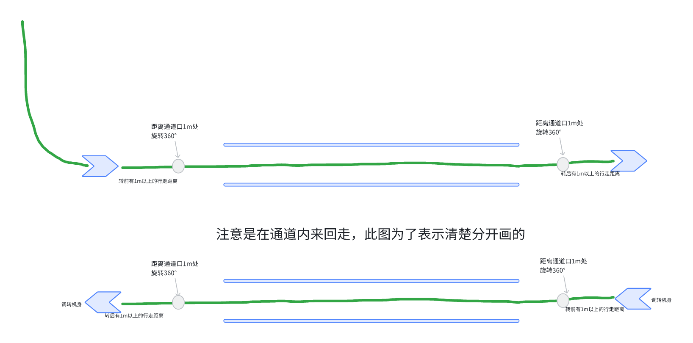
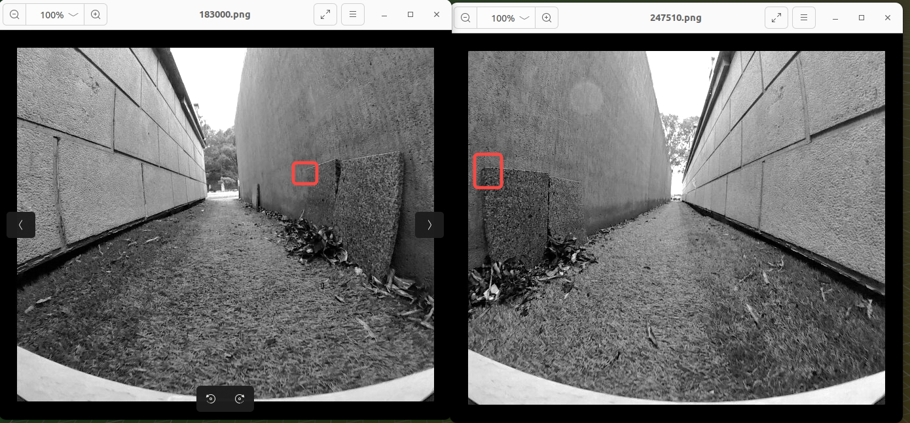

# 窄通道视觉数据采集需求

1. 采集方式：遥控

2. 机器：Butchart/Pro、Monet都可以

3. 版本：正常Dev，带存图

4. 采集动作如下，循环3圈

&#x20; 窄通道数据测试 （<https://roborock.feishu.cn/wiki/K3YhwrWgbigES5krUhecY265nlh>）

1. 建图：仅正向通过；重定位：反向通过 ；

   * 重定位成功率为 0；

2. 建图：正向通过 & 首尾转圈；重定位：反向通过；

   * 仅通道入口 & 出口处，可重定位成功；

3. 建图：正向通过 & 反向通过建图；重定位：正向 & 反向通过；

   * 重定位成功率 > 90%；（且目前数据来看，轨迹 & scale 正常，重定位结果正常）

&#x20;

数据表现：

1. 远景：反向完全不一致；近景：相同的点，视角变化 > 90度，描述子 pattern 差异过大；

