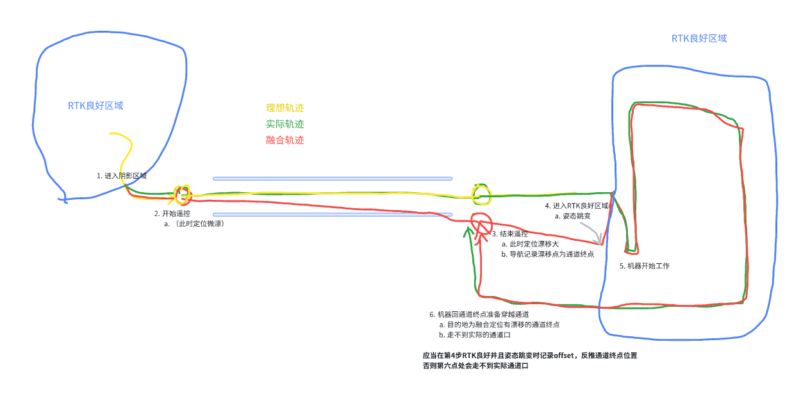

# 窄通道建图行为分析，以及处理方案

# 1. 窄通道工作过程

# 2. 机器运动方案：

## 2.1 方案1

* 要求用户建通道前后各转360°，并且走个来回。视觉建图。

  * 效果：

    1. 可以做到丝滑地通过通道

  * 动作太多产品不会同意

## 2.2 方案2

* 要求用户建通道前后各转360°。出通道位置**不一定**是固定解（靠视觉重定位，有风险）。

  * 效果：

    1. 第一次逆向走通道可能会磕碰（逆向地图无法重定位，轨迹不准确）

  * 有动作，风险高，产品不太会同意

## 2.3 方案3

* 建通道过程与现在保持一致，但要求出通道位置**必须**是固定解。

  1. 效果：

     1. 不引入视觉建图，每次走通道可能会磕碰。

     2. 引入视觉建图，仅在第一次逆向走通道可能会磕碰（逆向地图无法重定位，轨迹不准确）

## 2.4 方案4

* 建通道过程与现在保持一致，但要求出通道位置不**必须**是固定解。

  1. 效果：

     1. 不引入视觉建图，每次走通道可能会磕碰。

     2. 引入视觉建图，仅在第一次逆向走通道可能会磕碰（逆向地图无法重定位，轨迹不准确）

## 2.5 解释

1. 走来回：可以建来回的视觉地图，建图后第一次过通道就可以很丝滑。

   1. 感觉产品不会允许

2. 转360°：允许定位漂的情况下，有重定位的能力，有风险，待测。

   1. 感觉产品不会允许

3. 出通道位置必须是固定解：固定解处，能够修正通道出口位置。否则会面临对不准通道口。

   1. 需要增加界面提示以及限制用户行为。要和产品协商争取。

4. 视觉建图建图：第二次走，能够丝滑通过。

# 3. Action

