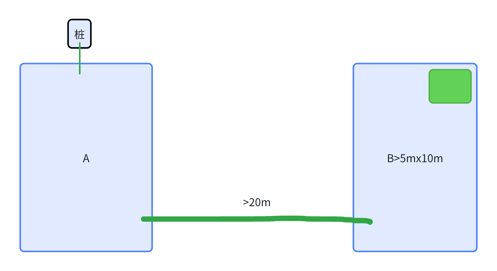
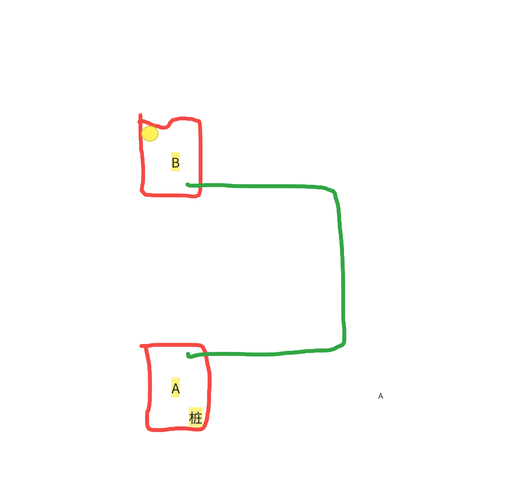

# 窄通道竞品测试需求

# 国外窄通道测试项：

* 验证 RTK 竞品竞品是否能跑下来以下测试。重复以下测试 3 次。场地布局见下图。

  1. 清空所有地图。

  2. 出桩，建图区域 A。A 离桩很近。

  3. 从区域 A，遥控到区域 B，建区域 B。B 离桩很远。并且跨两道窄墙通道。

  4. 建立通道 B->A。要求走出窄通道后立即结束。

  5. 桩出去 B 区域选区割草，割草完成后点击回桩。

  6. 观察以下现象

     1. 能否进入窄通道？

     2. 进入窄通道时是否有磕碰？

        1. 如果有磕碰，第一次磕碰时，APP 显示机器是否在通道上，机器是否实际在通道上。

     3. 进入窄通道后是否会产生磕碰

     4. 进入窄通道后，APP 显示机器是否在通道上，机器是否实际在通道上

| 测试轮次 | 是否能进入窄通道 | 进入窄通道时是否有磕碰 | 进入窄通道瞬间，APP 显示机器是否在通道口 | 进入窄通道瞬间，机器是否实际在通道口 | 进入窄通道后是否会产生磕碰 | 进入窄通道后，APP 显示机器是否在通道上 | 进入窄通道后，机器是否实际在通道上 | APP 录像 | 机器工作录像 |
| ---- | -------- | ----------- | ---------------------- | ------------------ | ------------- | --------------------- | ----------------- | ------ | ------ |
| 1    |          |             |                        |                    |               |                       |                   |        |        |
| 2    |          |             |                        |                    |               |                       |                   |        |        |
| 3    |          |             |                        |                    |               |                       |                   |        |        |

# ~~国内目芯科技窄通道测试（机器已还，无法测试了）~~

1. 直通道建通道测试

   1. 在 78 栋别墅两端用障碍物围出两片的区域 A\B

      1. A 的范围大于 3x3

      2. B 的范围大于 5 x 10&#x20;

   2. 清空所有地图

   3. 在 A 区域建图

   4. 扩建地图，走绿色通道，在 B 处新建区域，等待建图完成。

   5. 机器搬动到黄色圆圈位置（场地内离通道最远点）。点击回桩。

   6. 重复 ii～v，统计以下信息

   | 测试轮次 | 是否能进入窄通道 | 进入窄通道时是否有磕碰 | 进入窄通道瞬间，APP 显示机器是否在通道口 | 进入窄通道瞬间，机器是否实际在通道口 | 进入窄通道后是否会产生磕碰 | 进入窄通道后，APP 显示机器是否在通道上 | 进入窄通道后，机器是否实际在通道上 | APP 录像（建图、建通道、回充） | 机器工作录像 |
   | ---- | -------- | ----------- | ---------------------- | ------------------ | ------------- | --------------------- | ----------------- | ----------------- | ------ |
   | 1    |          |             |                        |                    |               |                       |                   |                   |        |
   | 2    |          |             |                        |                    |               |                       |                   |                   |        |
   | 3    |          |             |                        |                    |               |                       |                   |                   |        |

* 弯曲通道建通道测试

  1. 测试过程与直通道一致，场地布局如下图。统计以下信息

| 测试轮次 | 是否能进入窄通道 | 进入窄通道时是否有磕碰 | 进入窄通道瞬间，APP 显示机器是否在通道口 | 进入窄通道瞬间，机器是否实际在通道口 | 进入窄通道后是否会产生磕碰 | 进入窄通道后，APP 显示机器是否在通道上 | 进入窄通道后，机器是否实际在通道上 | APP 录像（建图、建通道、回充） | 机器工作录像 |
| ---- | -------- | ----------- | ---------------------- | ------------------ | ------------- | --------------------- | ----------------- | ----------------- | ------ |
| 1    |          |             |                        |                    |               |                       |                   |                   |        |
| 2    |          |             |                        |                    |               |                       |                   |                   |        |
| 3    |          |             |                        |                    |               |                       |                   |                   |        |

