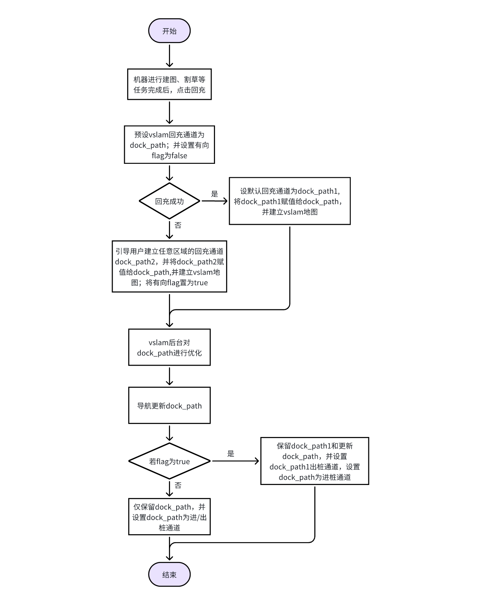

# 割草机进出桩vslam建图方案——导航

# 一、背景

为保证rtk产品桩在阴影区域机器可以正常工作，需要对进/出桩做vslm建图，在rtk信号不好的情况，保证割草机可以正常回充。

# 二、需求

1. 与充电桩联通的区域，需要支持两个或以上回充通道。若默认回充通道dock\_path1回充失败，需要用户手遥通道dock\_path2回充，并在过程中建立vslam地图，保证后续割草机可以通过回充通道dock\_path2回充；

2. 用户建完摇完回充通道dock\_path2后，vslam会对通道dock\_path2进行轨迹优化，导航需要支持在vslam优化完毕后，更新并重新保存回充通道dock\_path2；

3. 需要对通道dock\_path进行弧长最长40m的限制；

4. 由于通道dock\_path2仅用来回充，所以需要支持对通道dock\_path1和通道dock\_path2设置方向。

注：导航需要在回充阶段，在topo图中，将回充通道设为有向边。

后续考虑在所有通道使用vslam地图

# 三、实现方案

## 3.1 导航实现需求流程图

图3.1 导航实现需求流程图

## 3.2 接口设计

## 3.3 方案实现设计

1. 为做统一化设计，导航将topo图所有边都设置为双向边，默认两个方向cost值都一样。

2. 若存在3.1的有向flag为true，导航将dock\_path1的进桩方向cost设置为无穷大，将dock\_path2的出桩方向cost设置为无穷大。

3. 记录第一次回充成功的状态，并在之后的0.5-1min内接收回充通道更新的信号，更新回充通道并保存。

4. 到达进/出通道起点时，导航给定位发送达到信号。

5. 对充电桩通道弧长进行限制，最长40m。

