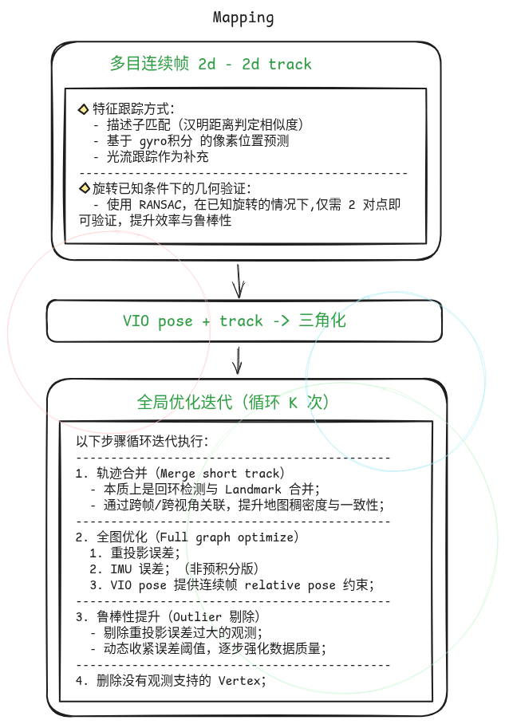
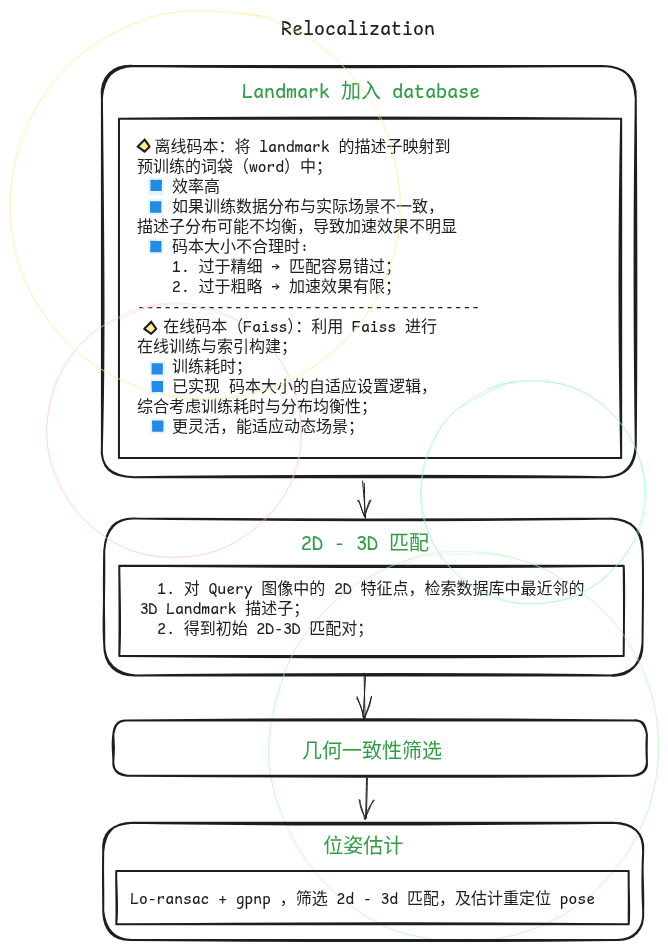
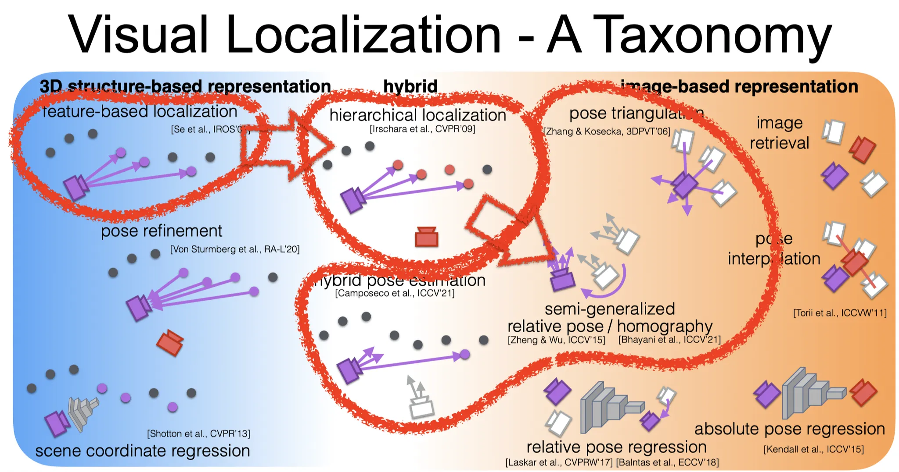
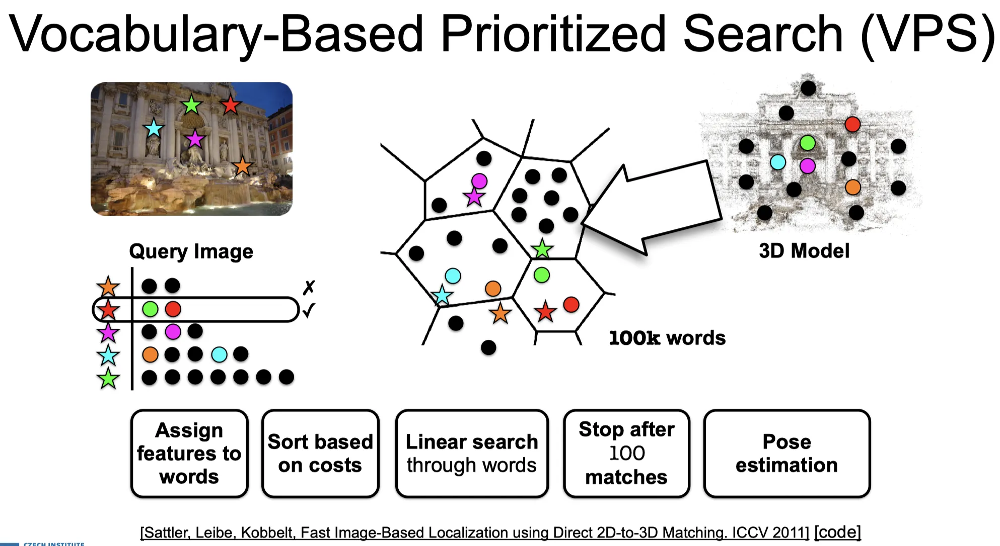
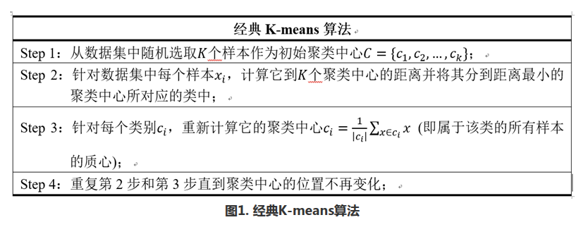
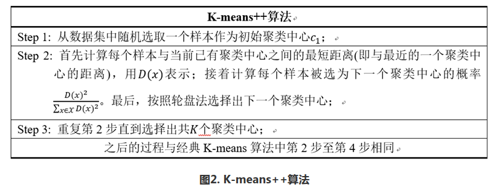
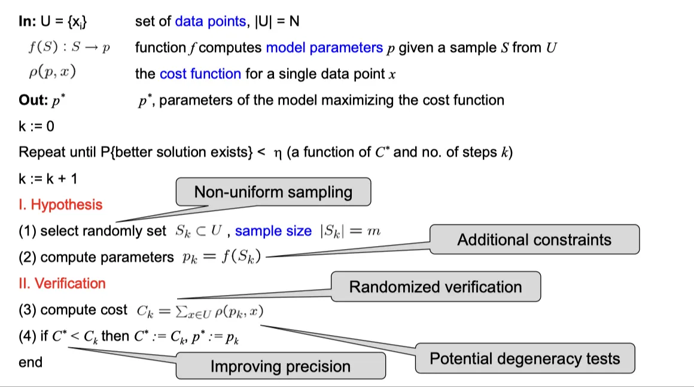
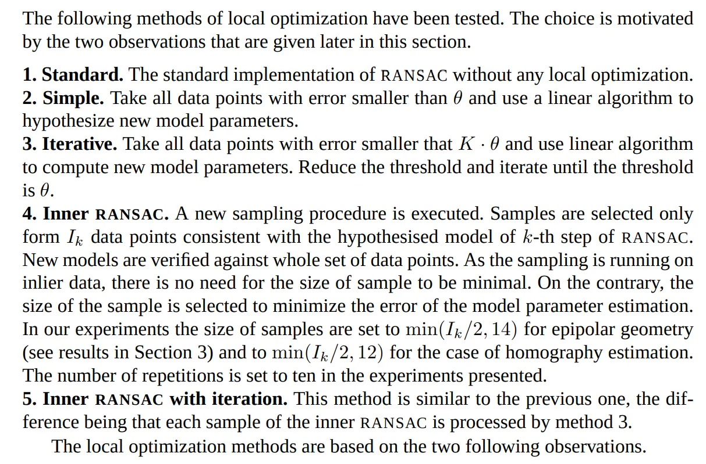
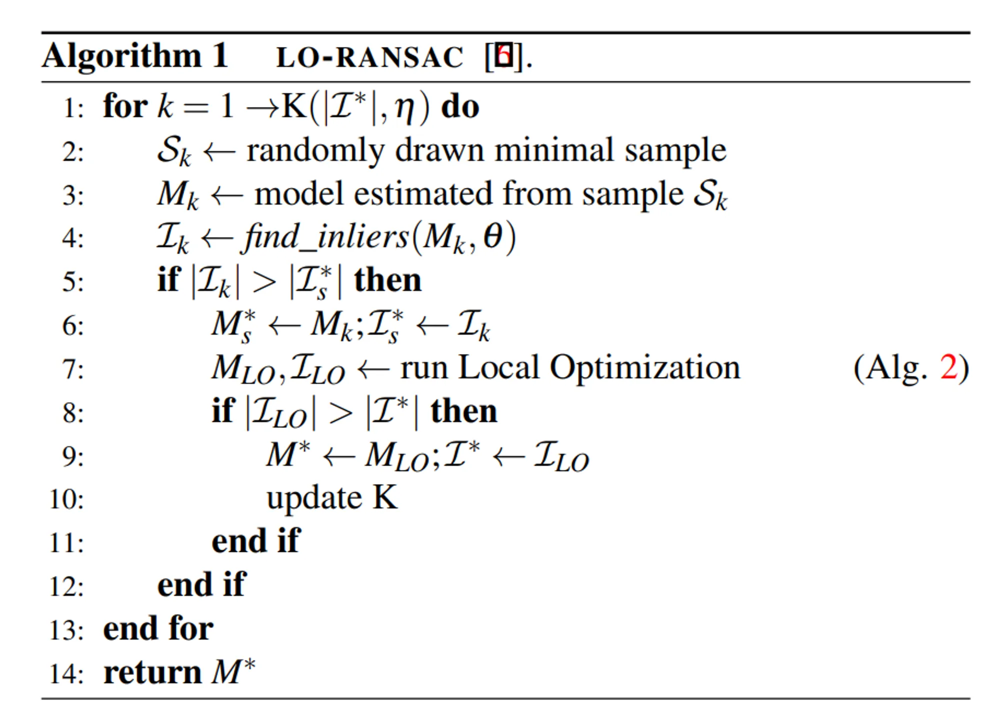
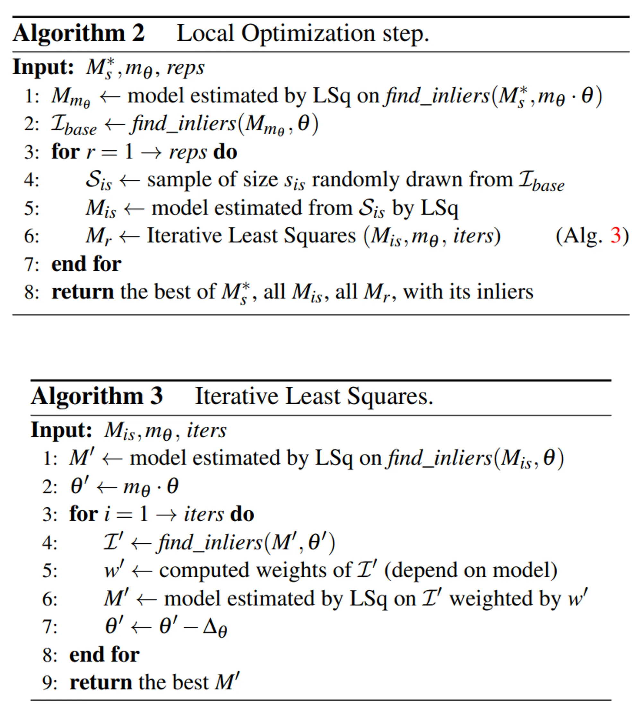

# Maplab 建图 & 重定位

# 1 引入 & 当前效果

1. 任务背景：割草机项目，在阴影区域（RTK 无固定解）建图 & 重定位，提升 vslam 轨迹定位精度，及系统鲁棒性；&#x20;

2. 当前效果演示 / 总结：

   * 建图效果：[ Maplab Mapping](https://roborock.feishu.cn/wiki/EsO9wixLRilO5bkxExlcw3iLn6f)

   * 重定位效果：[ 重定位测试](https://roborock.feishu.cn/wiki/T8lswaIloif7ZjkZcVrcfPi8nMe)

     * 巡边建图 + 弓字重定位：

       * 部分数据可在 bound & bow 均重定位上，但弓字处轨迹波动大，且两侧边缘，表现为一侧准确，另一侧波动大；

       * 还有部分数据仅可在一侧边缘重定位上；

3. 工程状态：

   1. 支持保存 VIO 的结果，再加载到建图 & 重定位模块中使用；

   2. 支持交叉编译 x5 版本，并在开发板上仿真测试；

   3. 但目前建图 & 重定位模块和 vslam 系统的运行，仍处于分离状态；

# 2 算法原理

## 2.1 pipeline

> vslam & sfm 提升精度的灵魂：
>
> 1. 充分的数据关联；
>
> 2. 充分的 outlier 剔除；

## 2.2 算法细节

### 2.2.1 码本训练

#### **离线码本训练**

1. 描述子降维；[主成分分析](https://zh.wikipedia.org/wiki/%E4%B8%BB%E6%88%90%E5%88%86%E5%88%86%E6%9E%90)

2. 分层码本训练：

   1. **k-means**：目标是将数据点划分成 k 个簇，最小化点到簇中心的平方误差。

      

   2. **k-means++ 初始化**：改进了传统 k-means 随机初始化簇中心的问题，使得中心点选择更分散，避免局部最优。

      

   3. 分层 k-means++（Hierarchical k-means++）

      1. 每层只做一个较小的 k-means 聚类（如每层分成 $$k=10
         $$ 类）。

      2. 重复 L 层后，整个树结构的叶子节点数量为 k^L。

      3. 数据点通过层层划分，最终落在某个叶子节点。

   4. inverted multi-index；

   > 参考论文：[Get Out of My Lab: Large-scale， Real-Time Visual-Inertial Localization](https://www.researchgate.net/profile/Marc-Pollefeys/publication/281094777_Get_Out_of_My_Lab_Large-scale_Real-Time_Visual-Inertial_Localization/links/565629df08ae4988a7b36e51/Get-Out-of-My-Lab-Large-scale-Real-Time-Visual-Inertial-Localization.pdf)

#### **在线训练 （faiss）**

码本均衡性分析：

1. 码本平衡性分析，经验证：

   1. 单码本 > 多码本；

   2. 码本与 database ⼤⼩配适的情况下，online > offline；

   3. 码本⼤⼩配适（单个 word 关联 16 - 128 个 descriptors）时，平衡性最佳，因此需要⾃适应计算码本⼤⼩；

2. 算法综合考虑搜索的时间 & 码本的平衡性，自适应确定 online training 码本大小；

#### **经验**

* 定位召回率：faiss-binary > faiss-inverted > faiss-imi > maplab-imi；

* 定位耗时：faiss-imi < maplab-imi < maplab-inverted < faiss-inverted；

* Training: faiss 存在 online training 耗时，multi-index << index，⼩ 1 - 2 个数量级；

### 2.2.2 Locally Optimized RANSAC

1. 支持 Locally Optimized RANSAC

   1. Ransac 标准算法

      

      * ransac 迭代次数计算： $$N=\log (1-p) / \log \left(1-w
        ^s\right)$$

      * 其中，w 是内点率，随迭代更新，s 是采样点数；

      **改进点：**

      1. 采样方案；

      2. 参数估计：

         1. 误差定义；

         2. solver；

         3. local optimize；

      3. score；

      4. 终止方案；

   2. Locally Optimized RANSAC

      * 动机：标准 RANSAC 的问题：

        * 仅依赖随机采样 → 收敛速度慢。

        * 模型估计结果可能欠拟合（只用 minimal sample）。

        * 没有进一步利用 inlier 数据去优化模型。

      * **LO-RANSAC 的思路**：在找到较好的模型后，利用 **局部优化（local optimization）** 对其 inliers 做更稳定的模型估计，从而加快收敛，提高精度。

   

   1. **Simple**

      * 用所有 residual < θ 的点重新线性估计模型。

   2. **Iterative**

      * 用 residual < K·θ 的点估计模型；逐步收缩阈值直到 θ，类似迭代收敛。

   3. **Inner RANSAC**

      * 在当前 inliers 集合 $$I_k
        $$ 内再做一次“小型 RANSAC”。

      * 采样规模不是 minimal，而是足够大以降低参数估计误差。

   

   

   * chum 等设计了四种 local optimization 算法，以找到更多的 inlier，可提升召回率和 pose 估计精度；&#x20;

     * Colmap 中实现了 Simple 版；

     * VSAC 中实现了 Simple & Inner 版；

     * RansacLib 中实现 Inner with iteration 版；（选用的版本）

2. 支持 RANSAC 使用 位姿先验，提前结束迭代；（加速必备）

3. 支持多种 gpnp solver:

   * Opengv gpnp: gp3p\_kneip;

   * PoseLib: gp3p\_kukelova;

   * Colmap: gp3p\_lee; (综合效率 & 求解稳定性，选用的版本)

### 2.2.3 地图稀疏化

1. Keyframe 筛选；

2. landmark 筛选；（仅保留 good quality landmark）

3. vi\_map 转 summary map；

**（目前还没用上）进一步控制 landmark 数量；**

* 压缩 landmark 的数量到指定数目（或比例）；

* 每个关键帧上有足够多的观测，共视尽可能丰富，以有效地约束关键帧状态；

* 问题建模：

  $$\begin{aligned}& \operatorname{minimize} \mathbf{q}^T \mathbf{x}+\lambda \mathbf{1}^T \boldsymbol{\zeta} \\& \text { subject to } \mathbf{A x}+\boldsymbol{\zeta} \geq b \mathbf{1} \\& \sum_{i=1}^N \mathbf{x}_i=n_{\text {desired }} \\& \mathbf{x} \in\{0,1\}^N \\& \boldsymbol{\zeta} \in\left\{\{0\} \cup \mathbb{Z}^{+}\right\}^M .\end{aligned}$$

  * 其中 x 是一个二进制向量，其 i 元素为 1 表示 i 点在模型中保留，否则为 0；

  * A 是一个 M x N 可见性矩阵，其中 M 是图像的数量，N 是模型中点的数量，b 表示每个关键帧保留的最小 2d - 3d 对应关系的数量；

  * q 是一个权重向量，是每个 landmark 的观测数量得分；

* 解整数线性规划问题；

# 3 代码库

* [okvis](https://gitlab5.roborock.com/songshu/okvis) 分支 private/songs/mapping

* [okvis\_maplab\_converter](https://gitlab5.roborock.com/songshu/okvis_maplab_converter) 分支 private/songs/mapping

  * mapping\_demo: 支持输入 okvis component 转换为 vi\_map，并做优化建图，输出优化后的 vi\_map 和 summary map

  * relocalization\_demo: 支持输入 okvis component（查询帧），和 summary map（地图），做逐帧的重定位；

  * vimap\_to\_summary\_map\_demo: 将 vi\_map 转成 summary map；

  * vimap\_to\_okvis\_demo: 将 vi\_map 转回 okvis component；

* [okvis\_depend](https://gitlab5.roborock.com/libaoyu/okvis_depend) 分支 private/songs/mapping

  * 这个库之前已经被转移到 okvis 中，但建图涉及对 opengv 的优化，以及 faiss & yaml-cpp 的加入，改动较大，因此先单独在 okvis\_depend 原来的库上修改；

  * 使用：备份 okvis 中的 okvis\_depend 文件夹，并将 okvis\_depend 库软链接到 okvis 中；

  * 本地运行：./do\_prebuild\_x86.sh

* [maplab](https://gitlab5.roborock.com/songshu/maplab) 分支 private/songs/mapping

**编译**：其他三个库都放到 okvis 的目录下，运行：

# 4 TODO

1. 工程 Task：

   1. 建图 & 重定位模块接入到 vslam 系统中，online 接收建图数据，输出建图 & 重定位结果给 VIO；

   2. 建图数据的定义（外圈 / 弓字），由外部触发建图数据的起止；

   3. 地图合并：VIO 系统会重启， 建图模块需要对收到的多段轨迹，分别建图，并合并；

   4. maplab 建图紧耦合到 okvis 收集建图数据的过程中，online select keyframe，减少内存占用；

2. mapping 耗时优化：

   1. 使用 okvis 提供的匹配，并做预处理（剔除 outlier，补充 2d-2d 匹配），可以省下 maplab track 的时间；

   2. merge landmark （找回环）提速：

      1. 尝试 OKVIS dbow 找回环；（先缩小搜索范围的方式）

      2. hfnet 全局描述子找回环；

   3. optimise，提速的方向：

      1. 轻量化（精度为代价）：更稀疏的 keyframe ，减少单次优化迭代次数，减少 merge track & optimize 循环次数；

      2. 划分子图：将大区域的建图，划分成子块，并且不做子图之间的联合优化 / 仅做 pose-graph 优化；

      3. 使用 fusion 提供的 pose 作为初值，加速优化问题的收敛；（初始轨迹越差，优化越久）

3. 重定位耗时优化：

   1. 和 merge landmark （找回环）提速 思路一致；

   2. 减少 ransac 迭代次数 & 不使用 lo-ransac；（以内点率 & pose 精度为代价）

   3. 使用连续帧信息，上一帧找到的 2d-3d 匹配，通过连续帧 2d-2d 匹配，传递到当前帧；

4. mapping 精度优化：

   1. 使用 fusion 提供的 pose 作为初值，或添加 RTK 约束；

   2. wheel 约束；

   3. 极致的 outlier 剔除和更丰富的 track；

5. 重定位精度 & 召回率提升：

   1. 尝试 dbow / 全局描述子找回环；（或者作为当前方案的补充）

   2. 增强 feature & 描述子匹配能力；

      1. learning feature;&#x20;

      2. 增加金字塔层数；（提升尺度不变性）

