# 割草机脏污-遮挡检测

1. 典型脏污-遮挡示例

   | 编号    | 材质                              | 附着方式     | 干湿情况   | 注意事项                         | 例图                                                                                   | 相机视野                                                                                |
   | ----- | ------------------------------- | -------- | ------ | ---------------------------- | ------------------------------------------------------------------------------------ | ----------------------------------------------------------------------------------- |
   | 1     | 清水                              | 喷雾       | 湿润     | 模拟水雾状环境形成的镜头上的小水珠            | 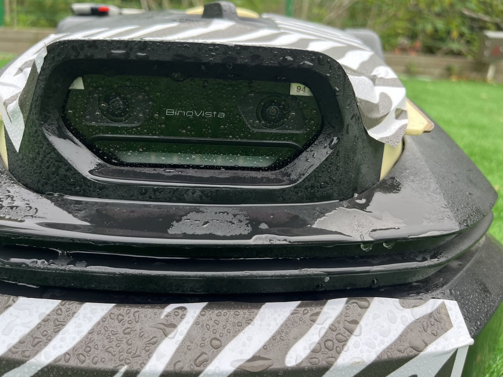 | 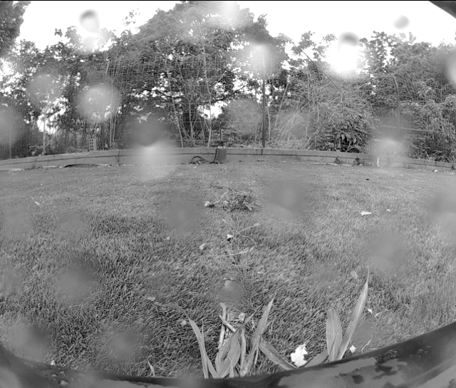 |
   | ~~2~~ | ~~清水~~                          | ~~持续喷水~~ | ~~湿润~~ | ~~模拟下雨，采集中持续喷水，做好保护，避免器件进水~~ |                                                                                      |                                                                                     |
   | 3     | 清水                              | 喷雾       | 干涸     | 喷雾后等待干涸                      | 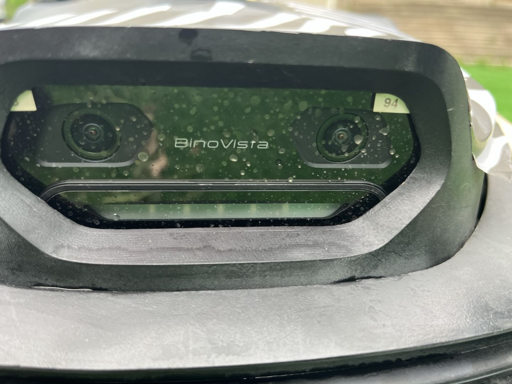 | 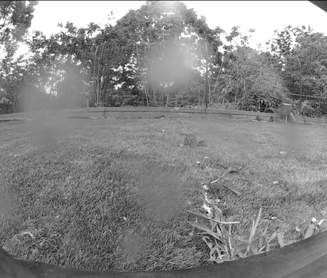 |
   | 4     | 泥水                              | 单次喷洒     | 湿润     | 模拟地面泥水迸溅，肉眼看到相机脏污            | 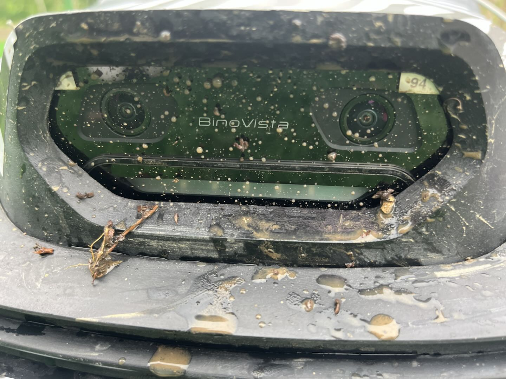 | 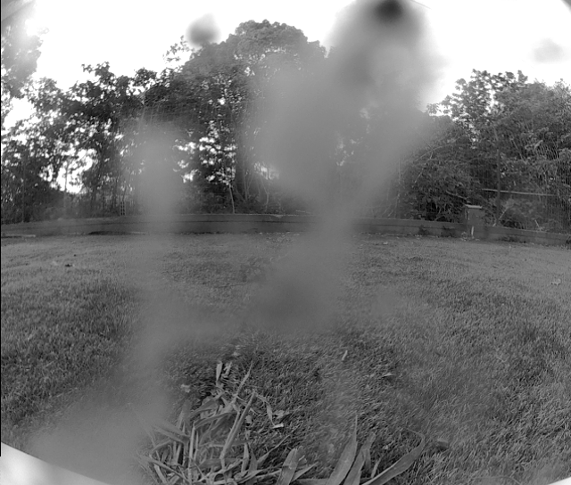 |
   | 5     | 泥水                              | 单次喷洒     | 干涸     | 喷洒后等待干涸，肉眼看到相机脏污             | 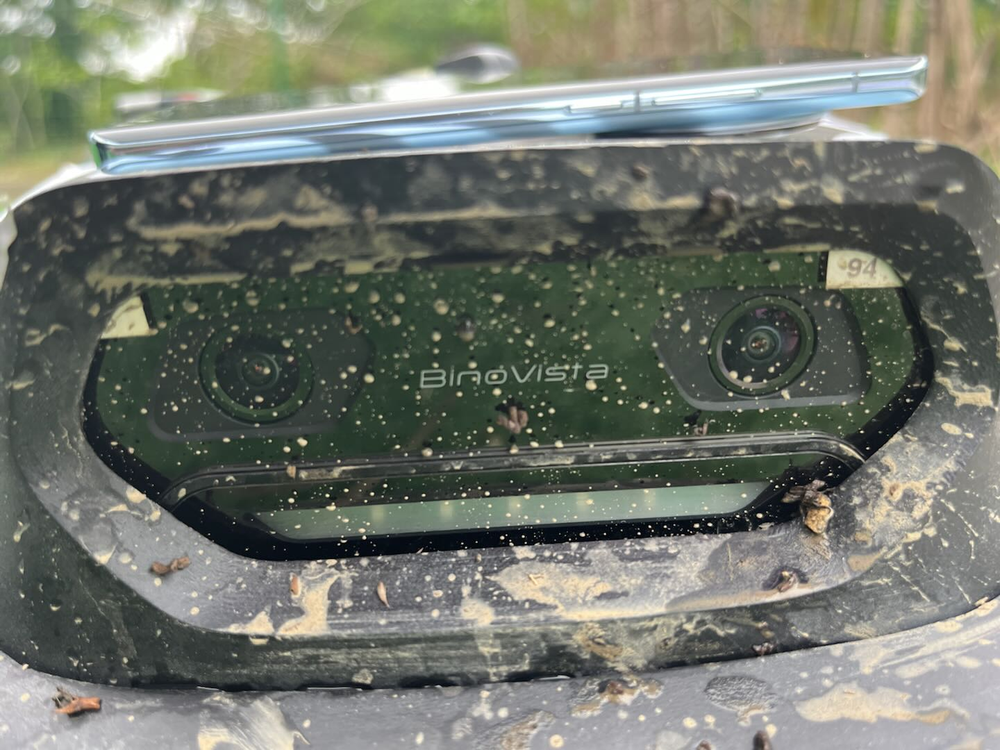 | 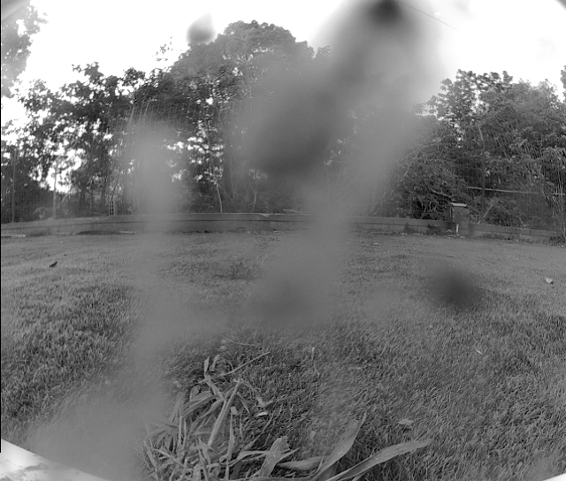 |
   | 6     | 泥块-1\~2mm相机镜头中心遮挡               | 粘到相机上    | -      | 较多小块泥点覆盖镜头                   | 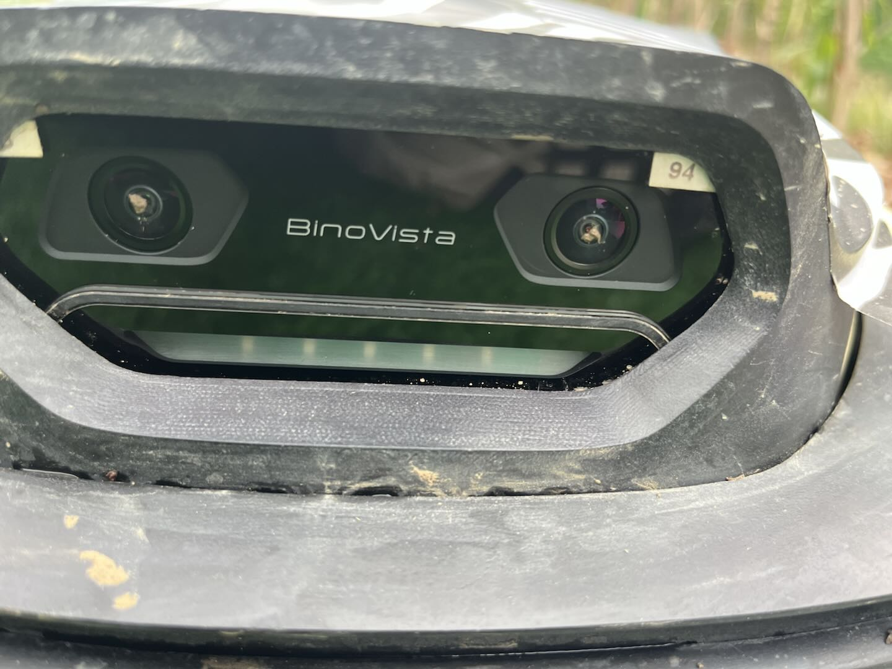 | 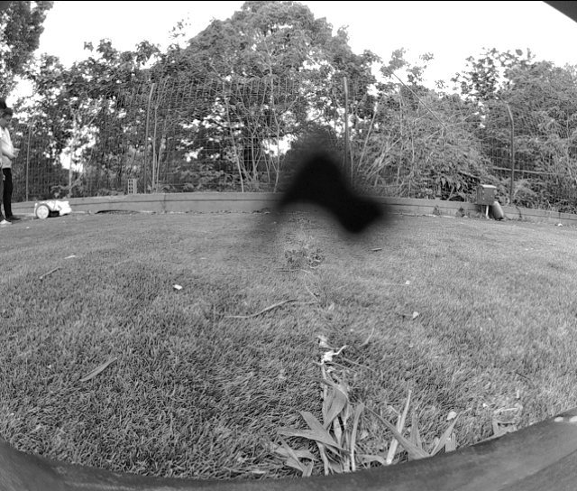 |
   | 7     | 泥块-10mm相机遮挡**一半**镜头（左右目各分别遮挡一半） | 粘到相机上    | -      | 避免行走过程中脱落                    | 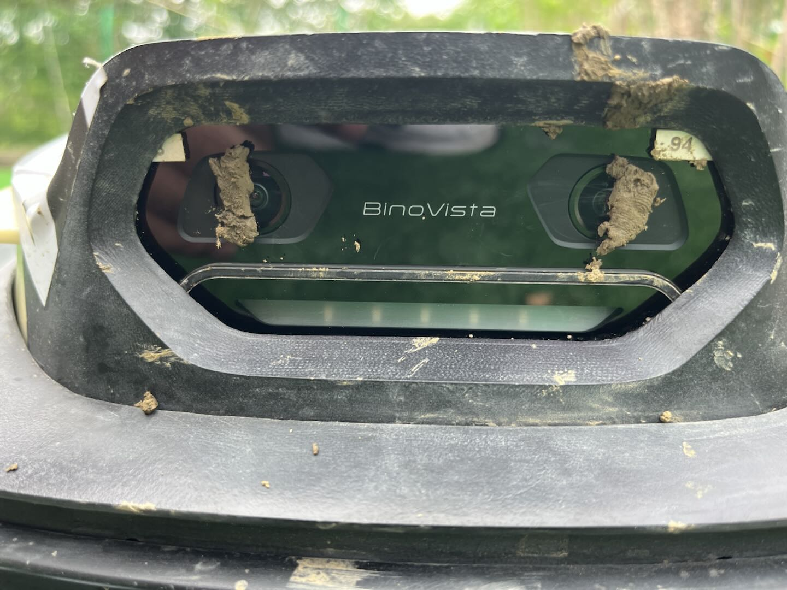 | 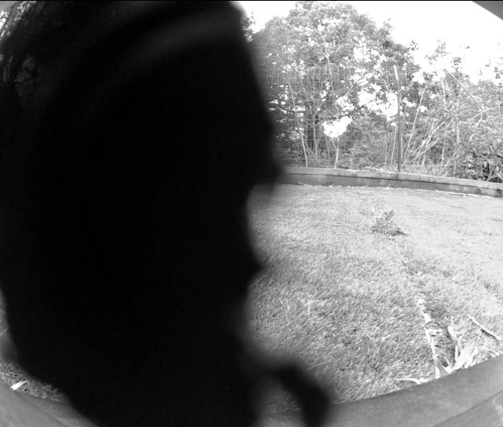 |
   | 8     | 泥块-10mm相机遮挡**全部**镜头             | 粘到相机上    | -      | 避免行走过程中脱落                    | 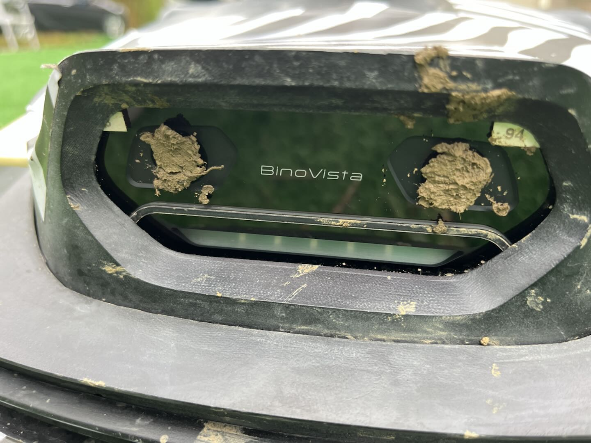 | 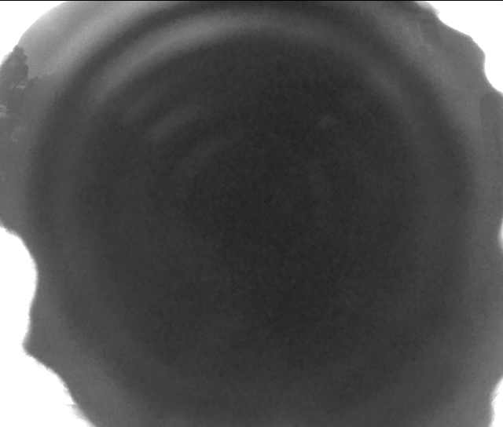 |

2. 已采集数据云盘链接

   1. https://roborock.feishu.cn/drive/folder/ZtF1fOkCzlVAbvdA4qOcdCaAn7b?fromShareWithMeNew=1

   2. https://roborock.feishu.cn/drive/folder/US7yfztlUlW81gdrFb2cPZqenLh

3. 数据APE

   1.

   |                               | 图像                                                                                  | APE-iter0 | APE-iter1 | APE-iter2 | 匹配点数量 | 备注            |
   | ----------------------------- | ----------------------------------------------------------------------------------- | --------- | --------- | --------- | ----- | ------------- |
   | MK2-17\_脏污\_泥块-1\~2mm相机镜头中心遮挡 | 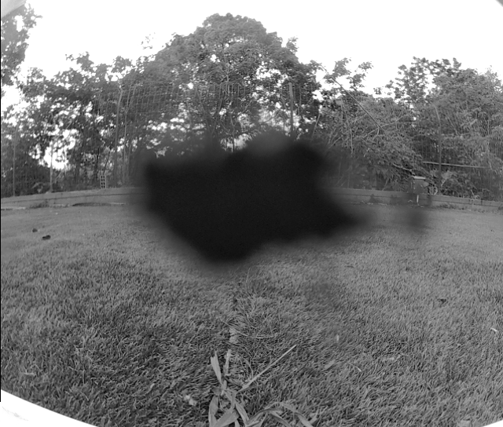 | 0.436438  | 0.400884  | 0.440365  | 87    | 可调阈值检测        |
   | MK2-17\_脏污\_泥块-10mm相机全部遮挡     | 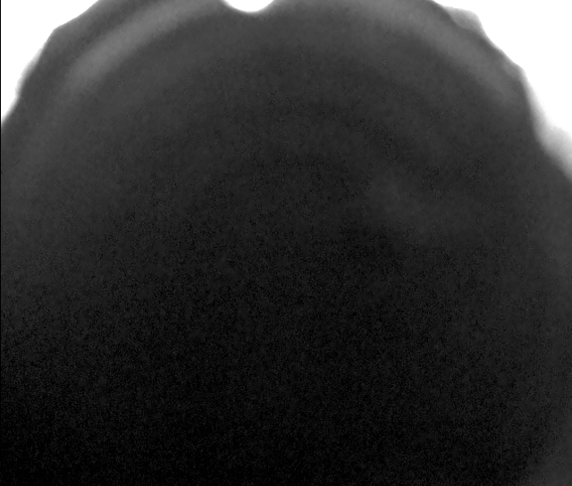 | 3.922213  | 4.054093  | 3.484909  | 5     | 可调阈值检测        |
   | MK2-17\_脏污\_泥块-10mm左右目各一半遮挡   | 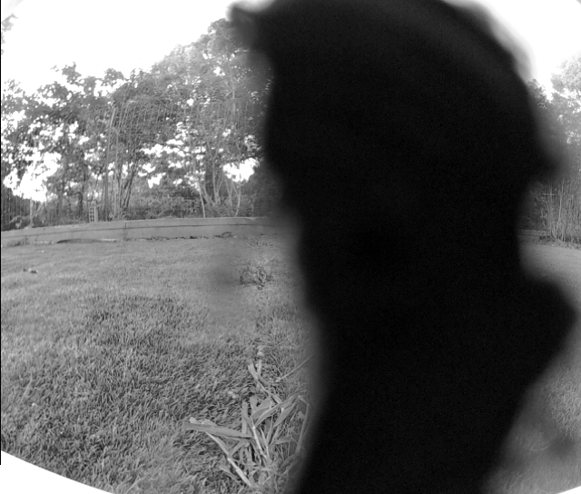 | 2.574849  | 1.987834  | 4.794891  | 50    | 可调阈值检测        |
   | MK2-17\_脏污\_泥水单次喷洒干涸          | 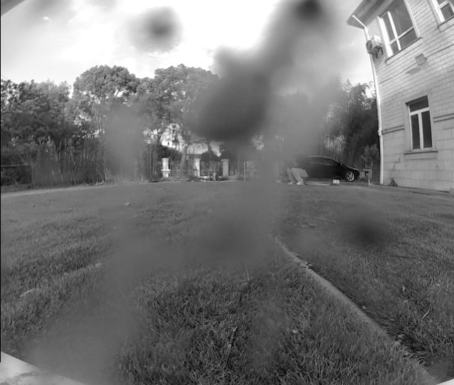 | 1.89214   | 1.973816  | 1.078939  | 75    | 可调阈值检测        |
   | MK2-17\_脏污\_泥水单次喷洒湿润          | 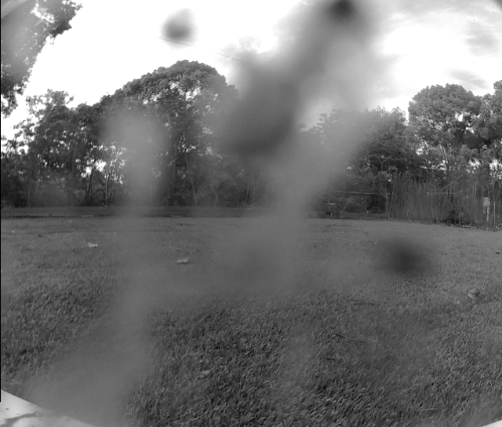 | 0.274159  | 0.631636  | 0.673002  | 76    | 相比干涸更透明，脏污小一圈 |
   | MK2-17\_脏污\_清水喷雾干涸            | 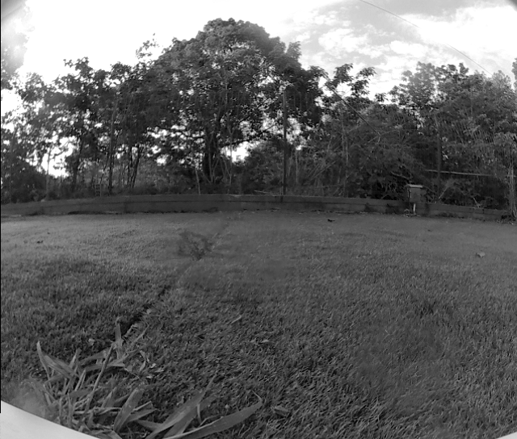 | 0.378953  | 0.492839  | 0.603541  | 107   | 近似真值          |
   | MK2-17\_脏污\_清水喷雾湿润            | 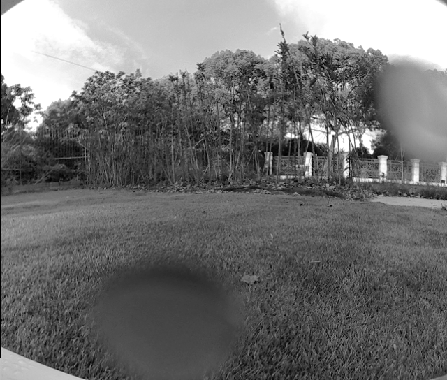 | 2.60896   | 0.772626  | 1.612823  | 100   | 可调阈值检测        |

4. 检测算法逻辑

   1. 遮挡与脏污的主要图像表现是纹理变弱、像素亮度在多帧变化较小，基于此设计两个指标：多帧梯度指标均值、多帧像素亮度变化，对每一组检测图像（原地旋转2-3圈），计算两个指标，满足任意一个则报警。

   2. 当前效果：基于12组遮挡数据+23组无遮挡数据，发生一组漏报：充电线/关灯（指标在阈值附近），无误报。

   3. 摄像头严重遮挡，背景纹理几乎被覆盖（黑胶带、化妆品、双面胶关灯）

      1. 特点：图像基本全被遮挡、图像几乎无纹理，多适用单帧梯度指标

      2. 对vslam算法影响：完全无法运行

      3. 指标计算方式

         1. resize到1/4大小，加速计算（320\*240）

         2. 中值滤波去除高频椒盐噪点

         3. laplacian计算图像梯度信息

         4. 基于梯度值进行二值化

         5. 计算当前图像中保留下的梯度像素的数量

         6. 取多帧的梯度像素均值，小于阈值（1500）则认为被严重遮挡

      4. 可能的干扰场景

         1. 低光场景下纹理较弱场景（误报，边缘梯度低于设定阈值）

         2. 采集数据时完全在很低矮的目标下（实际极少会发生）

      5. 测试数据结果（其中无遮挡与normal均为正常清晰数据）

   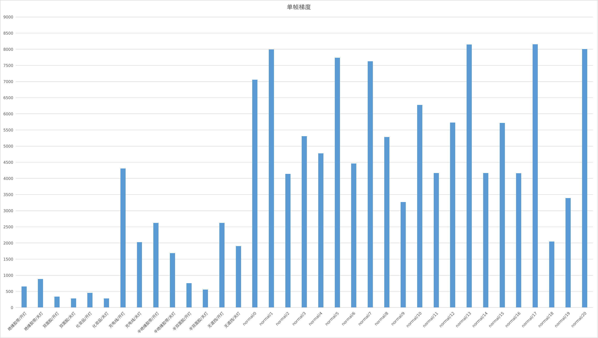

   * 局部严重遮挡（充电线、半绝缘胶带、半双面胶）

     1. 特点：部分区域清晰，部分区域完全遮挡，多适用多帧像素亮度变化判别

     2. 对vslam算法影响：可运行，性能减弱程度与遮挡区域大小成比例

     3. 指标计算方式

        1. resize到1/4大小，加速计算（320\*240）

        2. 采集旋转状态数据（像素运动越复杂越有利于提取）

        3. 中值滤波+laplacian+二值化提取梯度信息

        4. 膨胀后腐蚀增强边缘属性（腐蚀核比膨胀核尺寸小，进一步增强）

        5. 以第一帧为基础帧，后面每帧与第一帧求差

        6. 保留下每帧都不变化的像素点

        7. 去除中心圆区域（中心160，120，半径70）的不变像素，应对纯色天花板旋转

        8. 统计剩余的不变像素点数量，大于阈值（2000）则说明存在部分遮挡

     4. 可能的干扰场景

        1. 细线遮挡、遮挡区域受灯光干扰导致亮度值发生变动（漏报）

        2. 低光场景下纹理较弱场景（误报，边缘梯度低于设定阈值）

     5. 测试数据结果（其中无遮挡与normal均为正常清晰数据）

   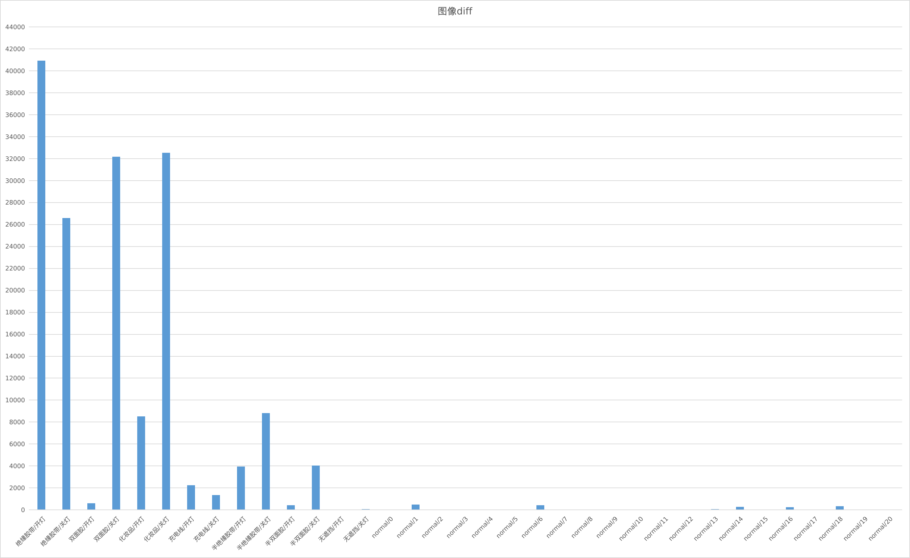

# 代码位置

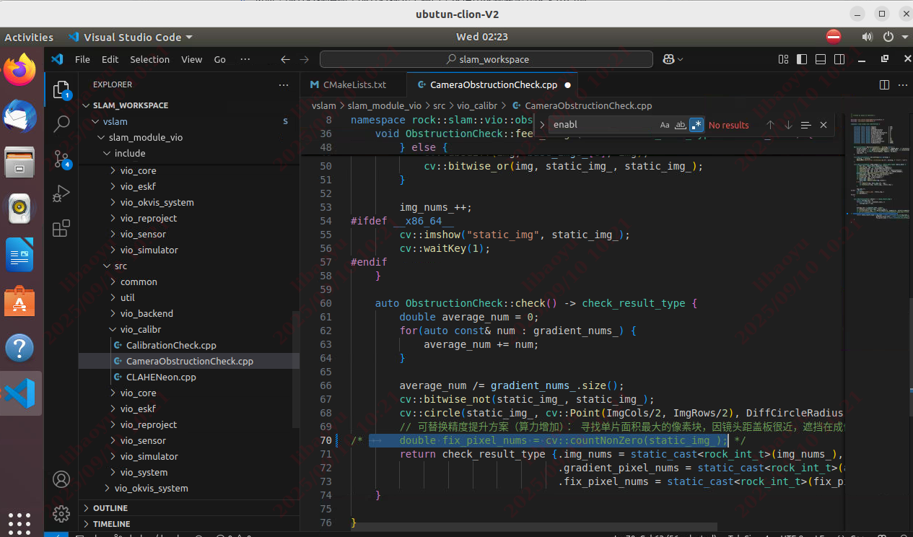

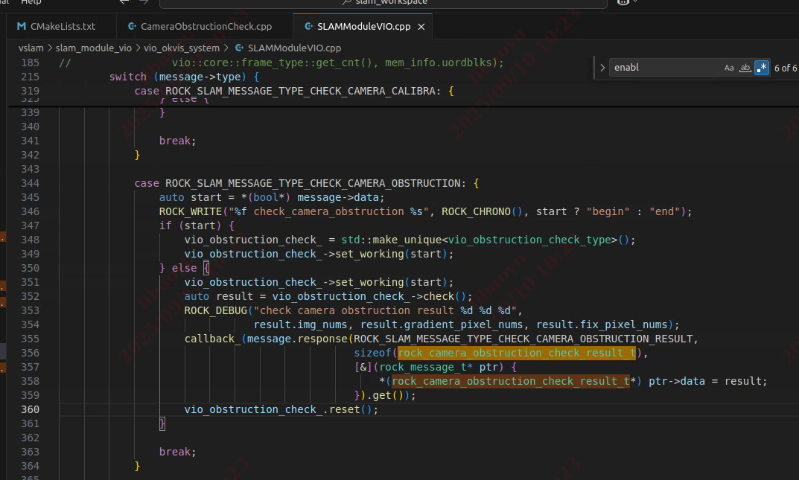

1. 代码理解 0912

   1. 先看文档

2. 跑数据集，分析改动点 0919

   1. 采集的数据出桩时做了旋转，用出桩时旋转的数据检测

   2. 圆心的mask去除，调参看要不要mask掉图像上半部分视野（天空）

   3. 代码有去噪、腐蚀、膨胀，看看和草地是不是和草地冲突，会不会把草地全认为是遮挡

3. 算法接入割草机系统 0926

   1. 沟通：割草机动作、消息交互 &#x20;

