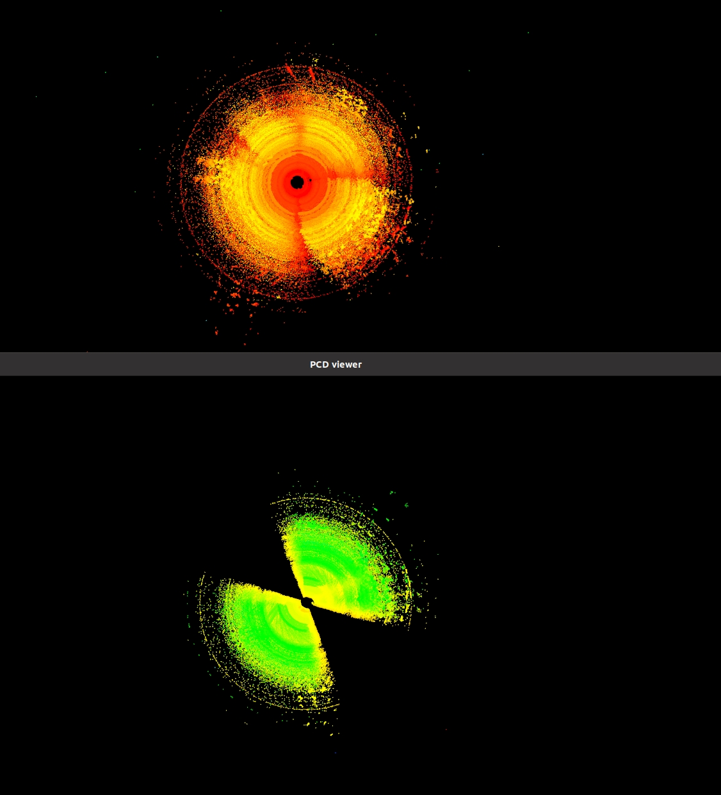
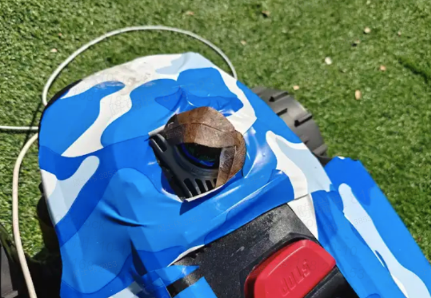
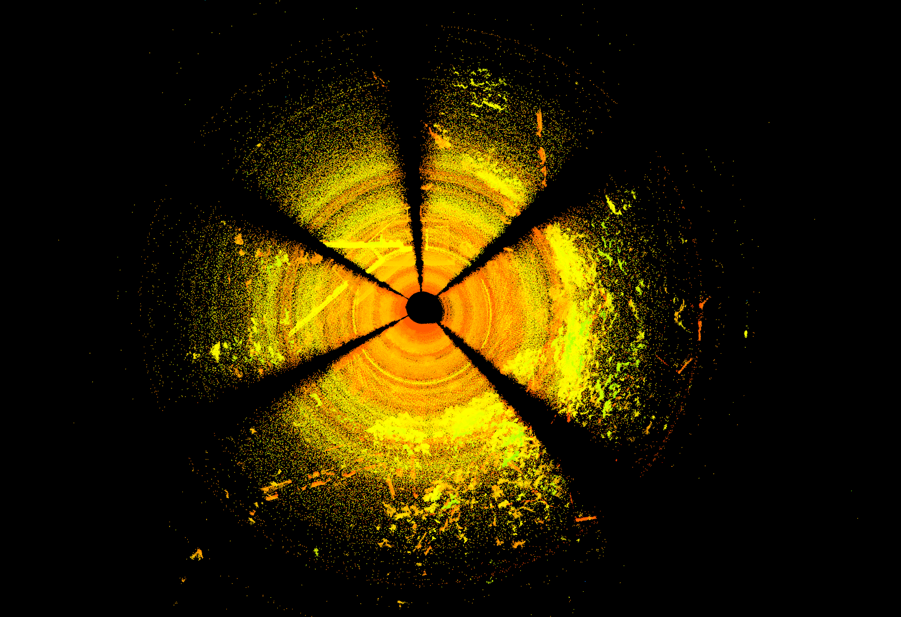
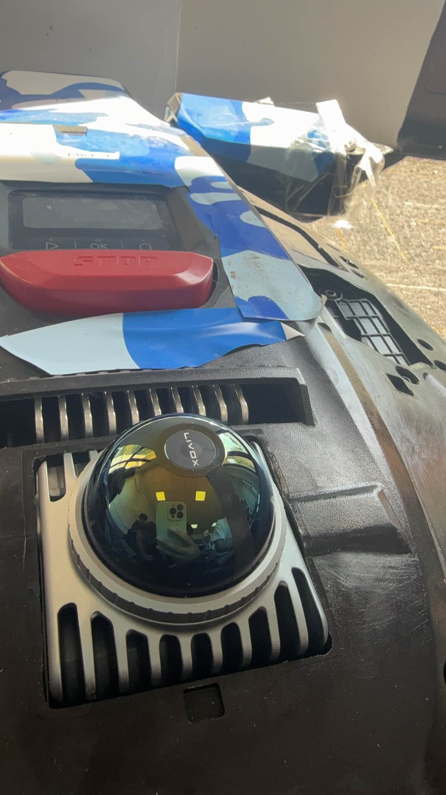
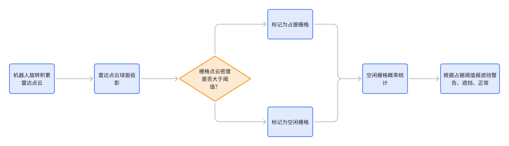
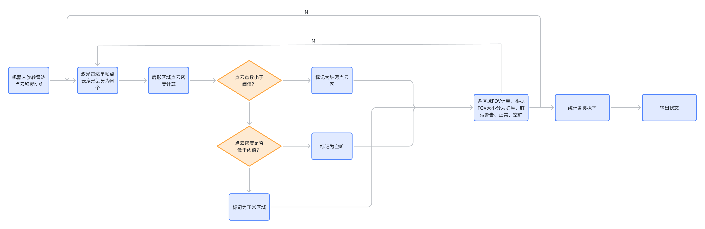
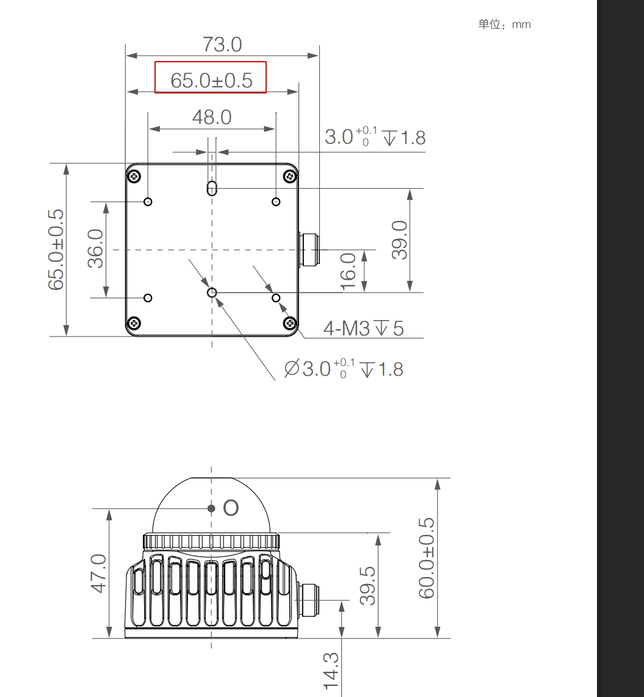

# 割草机lidar脏污follow视觉-遮挡检测

# 1. 前置讨论：

（1）雨淋传感器如果触发， 就不干活了。（默认可以雨淋传感器可以覆盖 大雨天气和大雾天气）

（2）**机器出桩做个自检，主要参考Tag、者点云个数或者是强度等等指标，这时候报错镜头脏污 让用户擦拭， 主要覆盖镜头有泥巴或者雨水等情况。**

（3）割草过程中，如果发现**定位丢失**，则主动做个重定位，若重定位成功，则继续工作，如果重定位失败，就报错定位丢失。

# 2. 后续研究

10度

转圈，体坐标系，上图：

1. 树枝，小树叶遮挡，看着没啥影响；

2. 严重遮挡，可以区分；

提示，后面，可能要分级，比如：

1. 120度上报严重；slam能容忍，也给slam留余量的情况；避免出问题，停机？提醒擦拭，或者激光异常；

2. 60度上报轻度；预警，擦一下？

# 3. 后续方案和行动项：

1. 出桩后检测；

2. 割草中定位丢失检测；主动重定位

3. ~~重定位的位置；是否在每次重定位失败；或者主动触发重定位前？~~

   1. 暂时不实现，按讨论；

# 4. 初版设计流程图

方案一：

方案二：

[ 雷达脏污算法流程](https://roborock.feishu.cn/docx/O0uJdKjfqorSe0xrl62c4e3Bn2g)

**参数设置：**

1.垂直角度分辨率0.8度、水平角度分辨率0.8度，半径1m，小方块边长1.3cm，一个小方块面积大概1.69平方厘米

2.垂直角度分辨率0.8度、水平角度分辨率0.8度，半径3cm（雷达中心到激光罩），激光罩上一个小方块边长0.03cm，面积0.001平方厘米；  **3-4mm;**

# 5. 数据引用：

[ 雷达脏污检测数据汇总](https://roborock.feishu.cn/wiki/JP1Xwf0IRiSXhRkV1YacFaHQnch?from=from_copylink)

[ 雷达脏污情况统计](https://roborock.feishu.cn/wiki/VO64wL1a6iOP5Nk1PqWc0KWtneb)

[ Butchart摄像头脏污检测数据采集](https://roborock.feishu.cn/docx/BIV8dKCX8ornfUxi8X5cUCGFndd?from=from_copylink)

