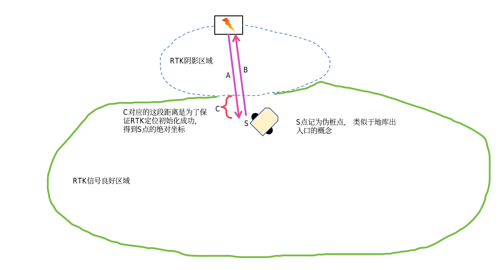
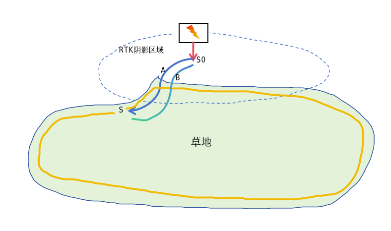
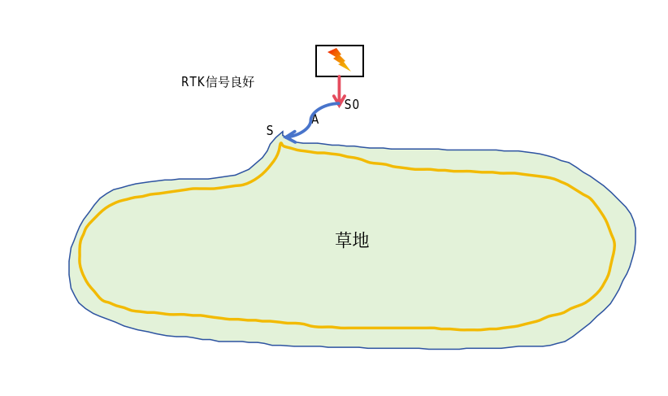
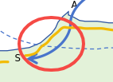
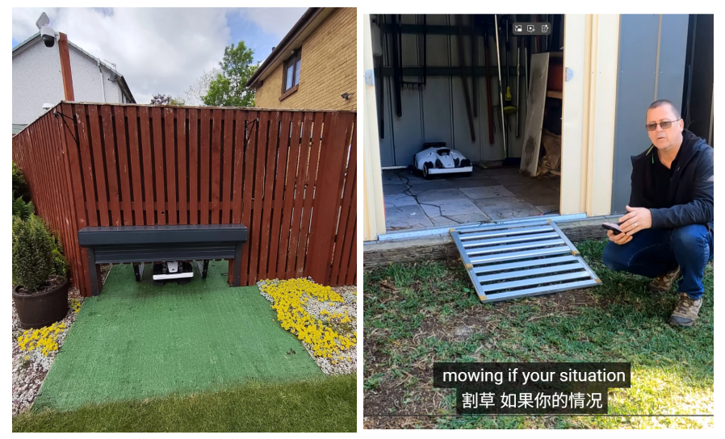

# RTK阴影区域出桩回桩方法

## 一、方案概况

当用户把桩放在RTK阴影区域时，需要用户手动遥控一段出桩和回桩的路径，并且利用这段数据，建立桩附近的视觉地图， 保证机器在后续回桩的稳定性。

## 二、操作流程

#### **1、桩在RTK阴影区域时，建图和割草流程**

##### **建图流程：**

1、机器退桩1m，到S0

2、用户接管遥控机器到信号好的边界区域S，如图中蓝色路线A。（S位置需要完成RTK定位的初始化）

3、机器在S位置显示地图和定位信息，点击开始建图，机器开始继续走黄色的建图路线。

4、建图必须要求用户在S点位置闭合。此时割草机割草地图建立完成。

5、用户需要继续遥控机器从S点回到S0

6、机器自主从S0回桩。

7、回桩后，利用S0->S 以及 S->S0的数据计算优化视觉地图。得到出桩通道A 和回桩通道B。

##### **割草流程：**

1、机器退桩到S0

2、自主按照出桩通道A行走到S点。

3、开始割草

4、割草完成后，自主回到S点

5、从S点 自主走回桩通道B，回到S0

6、从S0上桩

#### **2、桩在RTK信号良好区域时，建图和割草流程**

##### **建图流程：**

1、机器退桩1m，到S0 （S0位置需要完成RTK定位的初始化）

2、机器在S0已经有定位信息了，用户接管遥控机器到边界区域S，如图中蓝色路线A。

3、机器在S位置， 点击开始建图，开始继续走黄色的建图路线。

4、建图必须要求用户在S点位置闭合。此时割草机割草地图建立完成。

5、机器自主从S点回到S0，从S0上桩

##### **割草流程：**

1、机器退桩到S0 （S0位置需要完成RTK定位的初始化）

2、开始割草

3、割草想从哪里开始就从哪里开始，直接走过去就行

4、完成割草后，机器自主走到S0点，回桩。

*注意：*

*1、遥控路径可能会重复一小点，图中黄色建图路径和出桩通道A 有部分重合。（如下图）*

*2、每次割草都要先沿路径A到S点，略微奇怪一点点。*

*3、无论是在S0初始化成功，还是在S点初始化成功，都需要在S0或者S点之前的一段时间内都是RTK为4的固定解。（无法做到在S0或者S点刚刚变更为固定解，就立马初始化成功）*

*4、用户示教出桩路线A时，定位需要实时判断是否RTK定位初始化成功， 如果成功可以上报状态， APP显示示教可以结束了，如果是建图状态，这时候显示开始建图的按钮。否则需要用户一直遥控到满足要求的位置。*

## 三、实现细节

slam组：

1. 示教出桩路径A时，实时判断是否初始化成功。

2. 当用户完成AB路线的示教，机器回到桩，视觉slam开始进行此段路径的建图计算。建立桩区域的视觉地图， 并根据S点的坐标绑定一个视觉地图和全局地图间的联系。

3. 地图构建完成后，重新将路径A和路径B换算成全局坐标系的下坐标，将这两条路径发布给导航。

4. 判断地图构建是否成功，成功和失败都上报消息，告知用户。

5. 视觉地图构建成功后，将视觉地图以及视觉地图和全局地图间的转换关系都需要保存成地图文件，写到机器的flash中。

6. 收到导航的开始走示教路线的消息后，加载该地图，并利用该地图实时修正机器人位置，避免定位飘太远。

7. 收到导航的结束示教路线行走的消息后，释放内存中的视觉地图。

导航：

1. 记录slam发布的校准后的AB路线， 后续出桩和回桩都先按照AB路线走。

2. 在AB路线上开始行走和结束行走的时候，需要发送一个信号告诉slam，slam在行走过程中，需要做实时位姿修正的工作。

   1. tips：

   2. 无论是示教走AB，还是以后正常走AB，并且消息最好都区分开比如带个参数，是示教A、示教B、割草A、割草B。这些都需要告知slam，以便适应环境，建立不同版本的地图。

   3. 回桩走割草B路线时，到达伪桩点后，希望能够静止3S，用来让slam挂载地图。（可以先不实现，后续根据效果调整）

   4. 出桩走割草A前，希望能够静止3S，用来让slam挂载地图。（可以先不实现，后续根据效果调整）

3. 行走速度做一下限制，可以进一步保证vslam的精度。 速度先定为0.4m/s，后续测试期间随效果调整。

## 四、注意事项&可能存在的问题

#### 注意事项：

1. 强调且强迫用户必须白天做出桩和回桩的路线示教。（避免夜晚视觉效果差，无法构建视觉地图）

2. 如果用户把桩放在工具间或者杂物间，这个房间尽量开灯，或者保证光纤充足

3. 桩附近的场景可能会随着季节变化，再机器无法正确按照示教路线行走的时候，需要用户重新建立示教路线。（相当于重建桩附近视觉地图）

4. 用户遥控上下桩示教路径的时候，避免站在机器人的正前方， 尽量都跟在机器屁股后面，避免人物移动对vslam带来干扰。

#### 可能存在的问题：

1. 夜间割草后，存在无法回桩的风险

2. 可能隔段时间需要重建一下桩附近的地图。

