# IMU预积分推导

# 1. 预积分原始论文

https://zhuanlan.zhihu.com/p/635496502

1. 状态递推公式

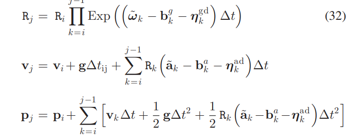

* 将状态量提出到等式一边，等式两边等价，记为相对运动增量

  1. 这个公式可以这么理解

     1. 公式各个部分表示的都是相对运动增量

     2. 左边是新起的表示运动增量的符号

     3. 中间是状态量推出的相对运动增量

     4. 右边是观测量推出的相对运动增量

     5. 状态和观测可以形成残差

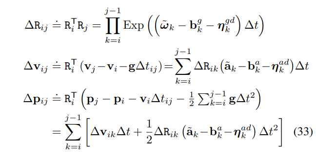

* 将观测量推出的相对运动增量展开

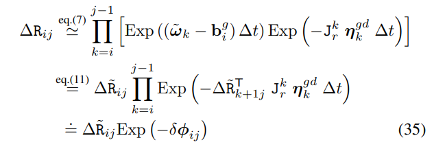

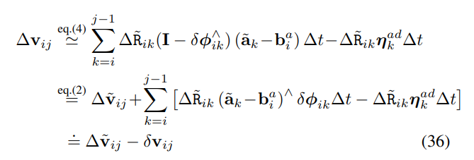

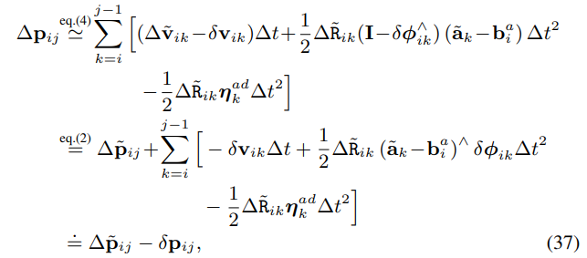

* 观测模型可以得到

  1. 左边为使用观测数据地推出来的相对运动

  2. 右边为状态量做差得到的相对运动以及噪声项

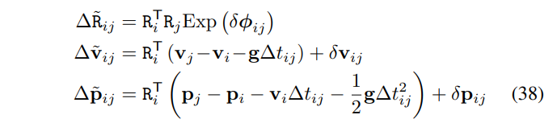

* 噪声项展开（为后面噪声递推做准备）

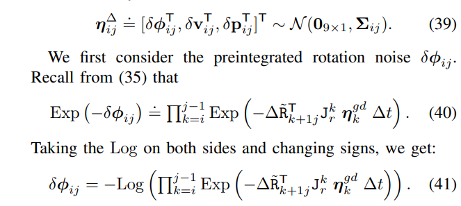

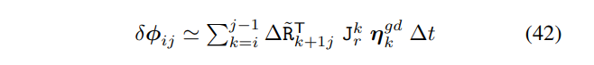

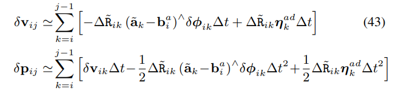

* 观测模型的“使用观测数据地推出来的相对运动”与bg相关，拆分为bg的增量形式（vins也用了这个技术，避免bias变化时重新递推）

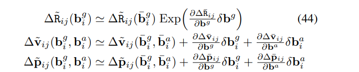

* IMU边的定义

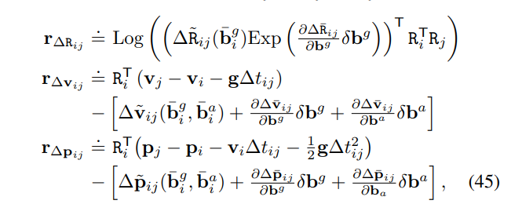

* 噪声传播公式（为了计算IMU边的协方差）

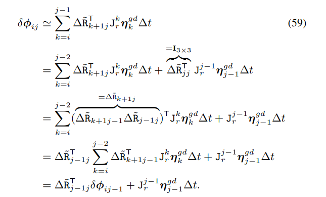

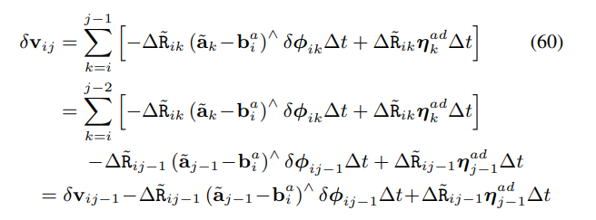

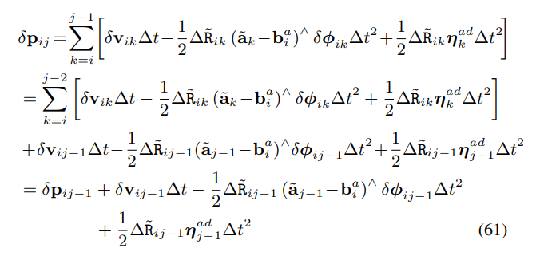

# 2. OKVIS2

&#x20;

okvis2的imu边继承自okvis，okvis是2014年的论文，预积分原始论文还没发表。论文声称借鉴的是这个论文。即MSCKF。但是实现和MSCKF也不一样。https://docs.openvins.com/propagation\_discrete.html

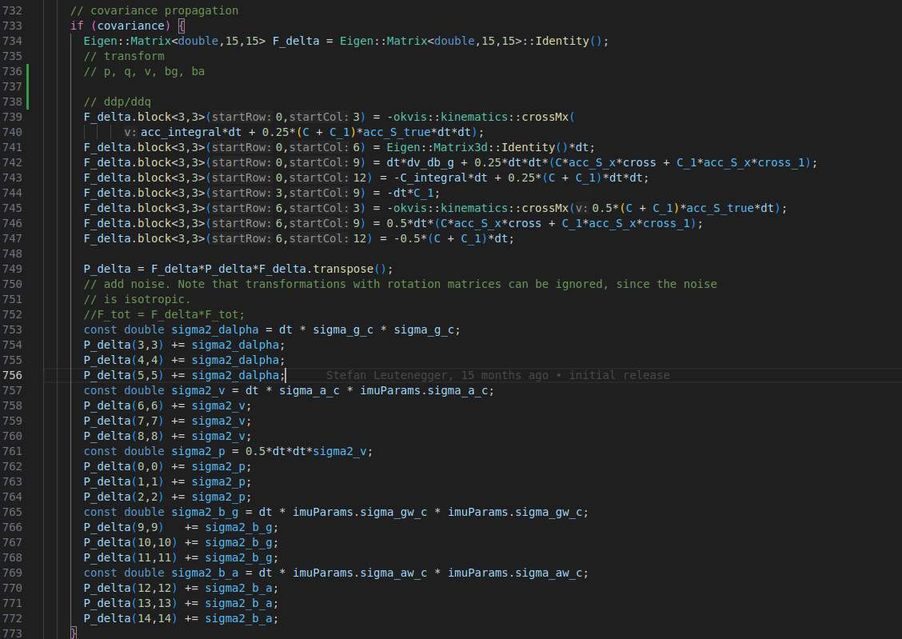

p对q部分的导数，实现的是状态的传播，而不是误差状态的传播。并且对于旋转用的左扰动。

而且有些代码实现不明所以。

# 3. vins\_mono

推导过程与深蓝学院VIO课程完全一致。

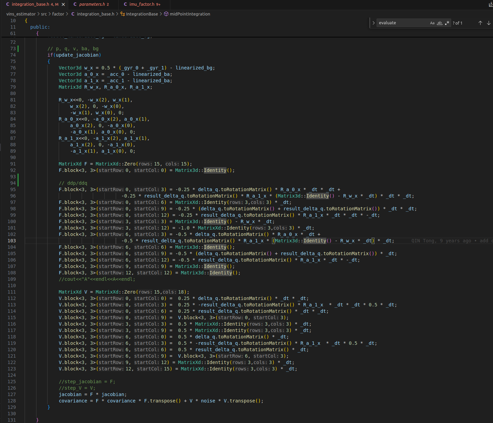

&#x20;

# 4. vins\_mono VS 预积分原始论文

使用了中值积分，公式更复杂一些。

预积分原始论文只推导了欧拉积分。

