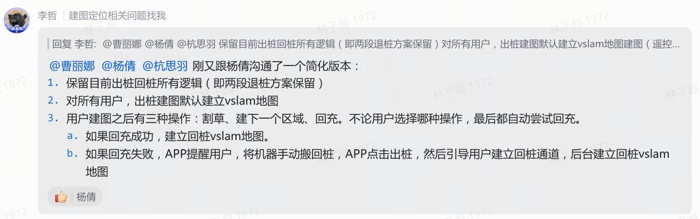
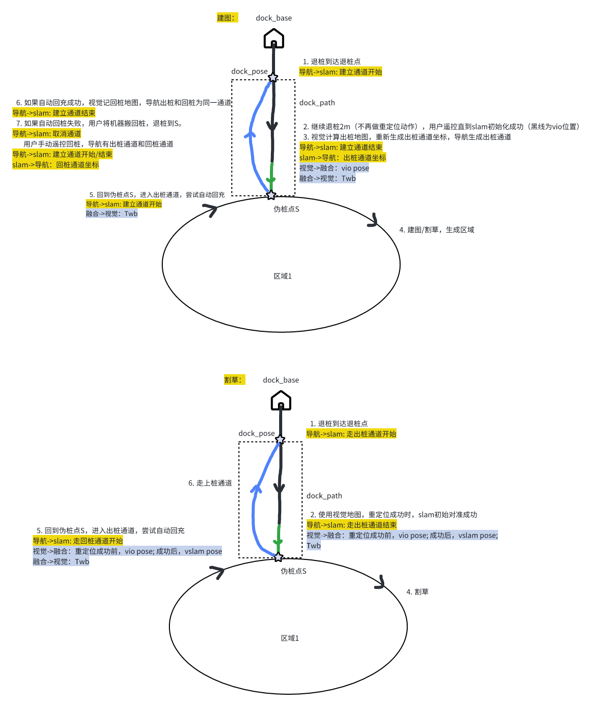

# 一、问题描述

主要解决以下问题：

1. 问题一：在大范围RTK阴影区出桩，两段退桩2m还在RTK阴影区范围内

2. 问题二：RTK质量不稳定，在建图时桩上有RTK固定解但割草时没有

# 二、流程概述

1. 问题一：在大范围RTK阴影区出桩，两段退桩2m还在RTK阴影区范围内

3月25日更新：

1. 建图的出桩通道，如果视觉建图成功，视觉返回通道坐标；如果视觉建图失败，导航根据slam初始化结果反算出桩通道

2. slam建图成功发送优化后的通道轨迹，建图失败不发送，导航标记通道类型是视觉通道还是rtk通道

3. 建图的出桩通道和回桩通道，导航/slam默认存储两个通道，在app显示时，如果两个通道相似，只显示一个通道

4. 割草的出桩通道，在slam初始化成功之前，导航需要根据RTK系下的出桩通道走

5. 出通道后，视觉优化通道坐标有时间延迟（1min左右），导航等到视觉消息后更新通道坐标

6. 问题二：RTK质量不稳定，在建图时桩上有RTK固定解但割草时没有

问题二和问题一的接口相同

* 导航改动：

  1. 取消二阶段退桩失败之后的重定位

  2. 第二阶段退桩开始，需要发出桩通道开始消息（而不是结束了才发）

  3. 导航随机后退可能受影响

  4. 导航接收定位发送的通道轨迹：slam建图成功发送优化后的通道轨迹，建图失败不发送，导航标记通道类型是视觉通道还是rtk通道

  5. 判断是否生成回桩通道

* 其他

  1. 按此方案，退桩1m初始化即成功，不建立视觉地图

