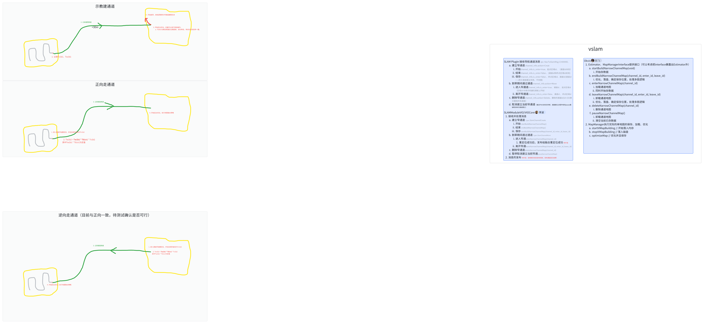

1. 此方案为第三兜底方案

   1. 第一方案：不区分是否通道，提高VIO优先级 `@林子越`

   2. 第二方案：区分通道，在通道内提高VIO优先级`@林子越`

   3. 第三方案：通道区域建图，在通道内靠VSLAM进行定位 `@李宝玉`

1. vslam算法

   1. 开始、结束建通道（开始、结束存图）

      1. 存图功能完善

         1. 支持保存VIMAP、优化后再存。 `@肖鸿飞`&#x20;

   2. 开始、结束走通道（重定位、开始、结束存图）

      1. 加载&重定位 debug`@李波`&#x20;

      2. 持续重定位，加观测，保证精度（单次重定位可能精度不高，在okvis回环基础上复用maplab加观测代码） `@李波`&#x20;

      3. 持续保存数据

   3. 删除通道（删除地图即可）

   4. 多次重复走通道处理（应对环境改变） 、存图的策略整理`@陈飞`

      1. 每次走通道都保存数据、优化。

      2. 每次走通道优化完成后。使用本通道的最近N次的正/反向数据融合生成完一个整地图。

      3. 当某个方向走过的次数大于N，删除老数据。

      4. 整理应用层接口（`@李波`调用，`@陈飞`提供）

         1. 开始存图（Type=NarrowChannel MAPID=idA）

            1. 标记开始保存

            2. 确定并创建临时文件夹（ChannelID未知，所以需要临时文件夹）

            3. 内部实现多次运行的数据保存（检查先有多少个，自增保存session id，区分正反）

         2. 结束存图（Type=NarrowChannel MAPID=idB ChannelID=id）

            1. 标记结束存图

            2. 内部实现多次运行的数据保存（检查先有多少个，自增保存session id，区分正反）

         3. 删除地图（Type=NarrowChannel ChannelID=id）

            1. ChannelID=-1时，删除结束并删除当前正在建的地图

            2. 否则删除指定地图

         4. 优化地图（Type=NarrowChannel ChannelID=id）

            1. 内部实现融合、多次重复走的逻辑（针对Type=NarrowChannel的逻辑为此，对于其他Type逻辑要区分）

         5. 加载地图（Type=NarrowChannel ID=ChannelID）

            1. 加载以后标记要重定位

   5. 代码整理合入okvis、vslam`@李波`

      1. 消息接入

      2. VSLAM和融合定位的通信（workspace内部统一通信协议的实现，不要再开私有接口了）

      3. 根据消息调用`@陈飞`提供的接口

2. 异常处理（待讨论确定）

   1. 建通道时

      1. 跟踪丢失、VIO Reset

         1. 融合定位直接报错，停止地图创建，需要用户重新建图`@林子越`

   2. 走通道时

      1. 重定位失败、长时间不成功

         1. 待测，预期不应该如此。考虑设计逻辑，重复N帧无法重定位成功，则报错。

      2. 跟踪丢失、VIO Reset

         1. 重启后，加载通道地图，继续重定位

         2. 重复N帧无法重定位成功，则报错

      3. 长时间重定位不成功

         1. 重复K帧无法重定位成功，则报错。

3. 融合算法 `@林子越`&#x20;

   1. 开始存图：

      1. 记录开始存图时的VIO姿态Tv1b1、Tw1b1（此时可能RTK已处于阴影区域，不准确了，简化认为准确）

   2. 重定位成功后

      1. vslam输出姿态：Tv1b2

      2. 融合计算Tw1b2 = Tw1b1 \* Tb1v1 \* Tv1b2为重定位后的全局姿态，上报发给导航

4. 导航需求

   1. 如果通道处的RTK姿态不稳定，那么Tw1b1可能不准确，导致Tw1b2不准确，但是因为有存图，可以确保走通道时的轨迹一致性。

   2. 建议：指导用户遥控到RTK良好区域开始存图，不一定能做到。目前以起点是在草坪边沿0.5m以内为准

   3. 建议：建通道、走通道，开始、结束转一圈。

5. ~~通信部分（与导航，已确定）~~

   1. ~~管理通道~~

      1. ~~参数~~

         1. ~~Action：~~

            1. ~~*Create*：建通道~~

            2. ~~Delete：删除通道~~

            3. ~~*Move*：走通道~~

         2. ~~is\_enter~~

            1. ~~1 进入/开始建 通道~~

            2. ~~0 离开/结束建 通道~~

         3. ~~id：通道ID。~~

            1. ~~*Create is\_enter=1 时为-1*，因为目前导航框架，开始建通道时不知道ID。~~

            2. ~~*Create is\_enter=0*, Delete, *Move*，Delete必带。区分处理的通道。~~

         4. ~~region\_id：~~

            1. ~~地图ID。*Create、Move*必带。表示当前位置所在的地图区域，用来区分通道方向。~~

         5. ~~暂停时取消建通道~~

   1) ~~发布消息~~

      1. ~~融合定位处理姿态搬动、world系姿态计算上报~~

6. 通信部分（0228修改）

   1. 管理通道

      1. 参数

         1. Action：

            1. Unknown

            2. *Create*：建通道

            3. Delete：删除通道

            4. *Move*：走通道

            5. ***<u>Create</u>*<u>Save：目前特指完成保存</u>**

         2. is\_enter

            1. 1 进入/开始建 通道

            2. 0 离开/结束建 通道

         3. id：通道ID。

         4. region\_id：

            1. 地图ID。*Create、Move*必带。表示当前位置所在的地图区域，用来区分通道方向。

         5. 暂停时取消建通道

            1. 备注：建通道时没有取消建通道的UI交互，用户在退出建通道后状态机就会发布消息 进入暂停状态。因此在VSLAM在建图时，收到暂停，就取消建通道。

