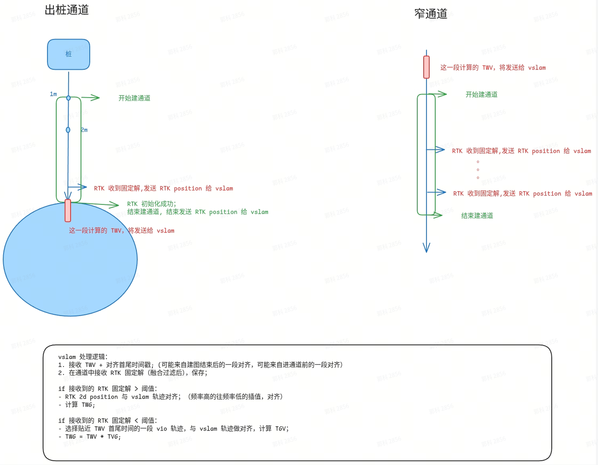

1. 背景

   1. 现有调试分支，Twv由单帧计算得到，实测对齐误差偏大，因此考虑采用多帧对齐的方式，需要融合与视觉同事进行额外开发。

2. 新逻辑

   

3. 需要额外开发的内容

   1. 融合模块

      1. **在主动query时发送多帧对齐的Twv，同时发送用来对齐的数据的起始时间**

      2. ~~在创建通道中时，发送经过过滤的RTK固定解，包含时间戳+位置（现有逻辑桩附近N米不过滤，则不发）~~

         1. ~~需要事先pick 20260409李岩通道中RTK恢复功能的私分支版本的对应提交后继续开发~~

         2. 在第二版中实现，可延后

   2. 视觉模块

      1. 接收并记录RTK固定解、vio位姿、vslam建图位姿，根据通道内RTK固定解情况按图中描述计算TWG，用于建图位姿转换。

         1. RTK数据的接收和对齐，可在第二版中实现

4. 期望完成时间

   1. 4/13前各自完成第一版私分支开发（基于vio串联RTK与VSLAM），开始进行联调

