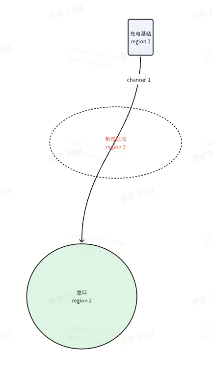
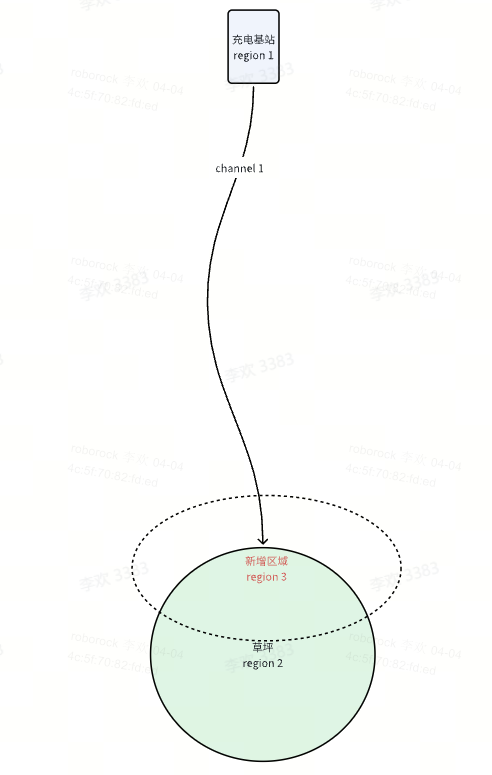
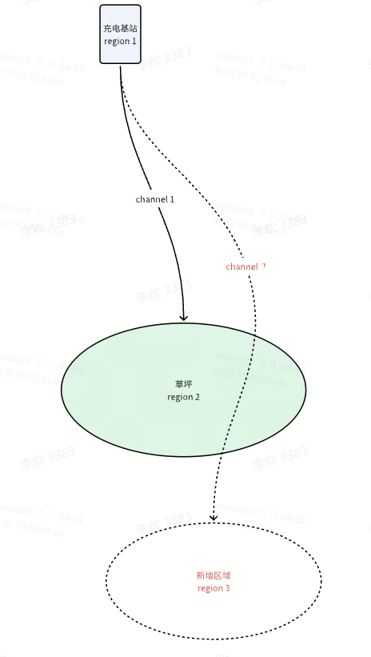

# 定位需求

[ 导航通道合并逻辑](https://roborock.feishu.cn/wiki/YMA1wkql4i2lrkk2RSac4DHgn2g?from=from_copylink)

# CASE1 新建区域仅截断已有充电桩通道

图1 新建区域仅截断充电桩通道

## 导航实现逻辑

假设已有区域region2与充电桩连接的通道id是1，新建区域region3截断通道1；

则通道1被分为两段，新建region3与充电桩的通道id继承原有的通道id即为1，region2与region3的通道id为最小未使用id。

# CASE2 新建区域截断已有充电桩通道且与已有区域有交叠

图2 新建区域截断已有充电桩通道且与已有区域有交叠

## 导航实现逻辑

假设已有区域region2与充电桩连接的通道id是1，新建区域region3截断通道1，且新建区域region3与已有区域region2有重叠；

则新建区域region3继承原有region2的通道，通道id1将被截断（删除）一部分，region2将不直接与充电桩相连。

如果region3和region2融合，则新的region继承region2和region3最小的区域id，通道id与重叠处理方式一致。

# CASE3 新建区域的充电桩通道被已有区域截断

图3 新建充电桩通道被已有区域截断

## 导航实现逻辑

假设已有区域region2与充电桩连接的通道id是1，新建区域region3，且新建与region3相连的充电桩通道经过region2；

则新建与region3相连的充电桩通道被截断，region2将有两条充电桩通道，region2和region3将有一条普通区域通道。
