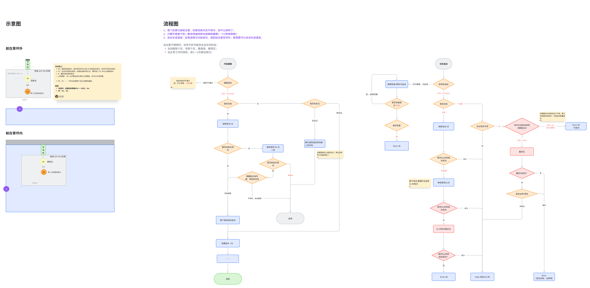
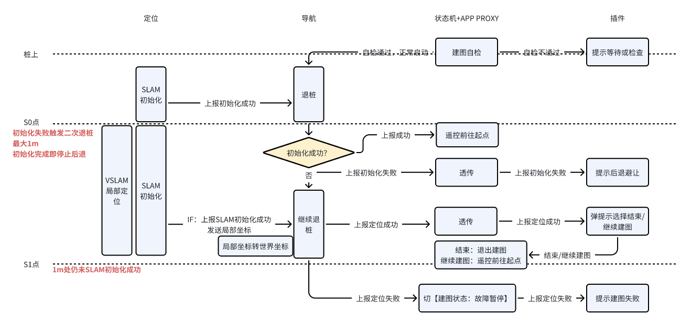
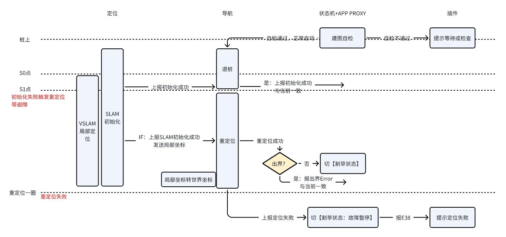
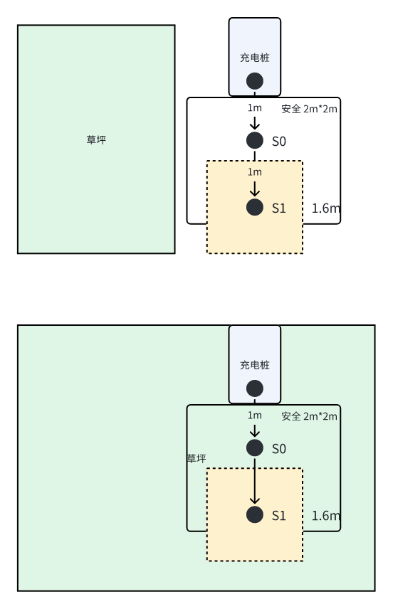

# 文档版本记录

| 版本   | 变更时间       | 变更记录                     | 变更人   |
| ---- | ---------- | ------------------------ | ----- |
| V0.1 | 2025/12/4  | 初稿创建                     | `@吉莉` |
| V0.2 | 2025/12/11 | 修改桩外启动建图                 | `@吉莉` |
| V0.3 | 2025/12/16 | 修改工作中冷启动交互               | `@吉莉` |
| V0.4 | 2026/1/7   | 因自检条件需求修改，相应修改工作桩外启动自检逻辑 | `@吉莉` |

# 方案流程图（原产品需求）

[ 阴影出桩建图、工作（退两段）](https://roborock.feishu.cn/wiki/CoqZwsoUnivRnPkQmw9cmAflnWh)

# 工作项分解

## 1. 开机启动时间同步

* **【驱动】**&#x53;LAM时间同步问题驱动加逻辑判断：`@豆文礼` ——已完成，12/6已进dev，SLAM确认不影响当前版本功能

仅开机时，AP-MCU时间同步完成之后再将ODO消息广播给SLAM，未完成时间同步则不广播。

## 2. RTK自检

* **【 RTK 状态机】**&#x81EA;检条件修改为最终版本：`@刘正鹏`——开发+联调 1天

  * 冷启动状态计时：拉起RTK模块即开始计时，RTK=4或计时超过120s冷启动完成，退出冷启动状态。

  * RTK状态自检条件修改：从4改为 0/1/2/4/5 均可自检通过，有串口失效Error时自检不通过。

  建图时逻辑：

  * 触发自检时冷启动未结束：上报冷启动未完成，上报F310，不报E38；

  * 触发自检时冷启动已结束：正常自检，上报自检通过/自检不通过(E38)。

  工作时逻辑：

  * 触发自检时冷启动未结束：

    * 上报冷启动未完成，上报F310，不报E38；

    * 语音【定位中，请稍后（**robot_location.wav）**】；

    * 退出冷启动状态时解除F310，上报插件，并自行再重启一次自检

  * 触发自检时冷启动已结束：正常自检，上报自检通过/自检不通过(E38)。

## 3. 建图桩出

* **【状态机/APP_PROXY】**&#x5EFA;图退桩——接口定义 `@梁彬欣` 0.5天

  **APP\_PROXY与插件定接口**：

  APP\_PROXY->插件：收到导航上报定位状态后上报【初始化失败F码/定位成功/定位失败】； 插件—>APP\_PROXY: 继续建图/退出建图

  **状态机与导航定接口**：

  导航->状态机：定位成功/初始化失败/定位失败

* **【导航+ SLAM 】**&#x9000;桩+二次退桩：`@李欢`1周开发+3天联调

  退桩过程接收SLAM初始化结果：

  * 退到S0完成初始化，直接上报定位成功，进遥控；

  * 退到S0未完成初始化，向状态机上报初始化失败，继续二次退桩；

  * 二次退桩过程中如果收到定位的SLAM初始化完成则立即停止，上报定位成功，进遥控；后退距离最大1m，到达1m后完成等待SLAM依然未初始化成功，停止并上报退桩定位失败。

  * SLAM：退桩期间持续VSLAM局部定位 `@林子越` `@李宝玉`

  * 导航：SLAM初始化成功后做局部坐标到世界坐标系的转换`@李欢`

* ** 【状态机/APP_PROXY】**&#x5EFA;图退桩——与导航/插件交互逻辑： `@梁彬欣`1天开发+1-2天联调

  \[建图-退出基站中]状态中持续监听导航上报退桩定位状态，根据导航上报初次退桩定位成功/失败：

  * 初次退桩定位成功（S0成功）：进遥控

  * 初次退桩定位失败（S0点失败）：APP\_PROXY上报初始化失败错误码（F码）给插件

  收到初始化失败错误F码后退桩二阶段，根据导航上报定位完成/失败：

  * 定位完成：APP\_PROXY向插件上报定位成功，等待插件返回值：

    * 插件返回继续建图：进遥控

    * 插件返回退出建图：转为空闲状态

  * 定位失败：APP\_PROXY向插件上报定位失败，转空闲。

* **【插件】**&#x4E8C;次退桩过程中交互

  * 收到退桩初始化失败F码后，页面显示退桩页面，与现有的退桩一致，弹提示

  > **提示：**&#x536B;星信号弱，继续后退以获取定位，请注意避让。    &#x20;

  * 定位成&#x529F;**：**&#x5F39;UI引导建图

> **卫星信号弱**
>
> 充电桩安装位置可能靠墙、或在有遮挡区域，或与 RTK 信号站有墙面阻隔影响卫星信号接收。
>
> 如若您坚持在此位置继续，机器人在此位置可能会有无法定位的风险，影响正常任务。建议您在建图前按说明书要求正确安装后再建图。
>
> **注意：每次挪动  RTK  基站位置后，都需要重新建图。*
>
> **坚持继续建图 / 好的，退出建图**

坚持继续建图则进遥控建图，退出建图退回主页面；给APP\_PROXY发继续建图/退出建图。

* 定位失败： 震动 + 小机器人弹窗报建图失败 （一阶段版本首个区/非首个区逻辑相同）

> 震动 + 小机器人弹窗：
>
> **卫星信号弱**
>
> 机器人所在位置卫星信号差，定位获取失败，无法开始建图。
>
> 可能是充电桩安装位置靠墙、或在有遮挡，或与 RTK 信号站有墙面阻隔影响卫星信号接收。
>
> 请您按说明书提示正确安装RTK 基站与充电桩后再重试。
>
> Button：**知道了，退出**

退出后退回主页面，机器为空闲状态。

## 4. 工作桩出&#x20;

* **【导航+ SLAM 】**&#x81EA;动连续退桩：`@李欢` 同建图一起做，导航总计1周开发+3天联调

S0处若未SLAM初始化成功，继续向后退桩1m，自主进行二次退桩，中间无交互。

* 若在S1点前完成SLAM初始化，原地掉头goto割草起点；

* 退桩到S1点完成后仍未完成初始化，上报SLAM初始化失败，进重定位。

【SLAM】：退桩期间持续VSLAM局部定位

【导航】：SLAM初始化成功后需要做VSLAM局部坐标系到世界坐标系的转换，不覆盖桩坐标，仅留作位移检测的接口。

**导航—>状态机：**&#x4E0A;报退桩初始化成功/失败

* **【导航+SLAM】**&#x9000;桩初始化失败后进重定位：`@李欢`同建图一起做，导航总计1周开发+3天联调

退桩失败后以S1为中心走重定位，重定位区域边长由桩是否在草坪外确定，草坪外走1.6\*1.6m，草坪内走2\*2m。

* 重定位过程加避障，重定位避障功能进入后此处保持一致，无特殊修改；

* SLAM初始化成功后导航需要做VSLAM局部坐标系到世界坐标系的转换，不覆盖桩坐标，仅留作位移检测的接口。

重定位成功上报定位成功，做出界检测，若出界报出界Error，若未出界开始goto；

重定位失败报Error38。

**导航—>状态机：**&#x4E0A;报重定位成功/失败

## 5. 工作桩外启动

* **【状态机】**&#x6869;外工作启&#x52A8;**：`@梁彬欣`**开发+自测 1天

  桩外计划启动，若无定位（上次任务结束时定位丢失），自检RTK= 0/1，不启动，取消该段割草计划，报Error38；

  其余情况正常启动，根据有定位/无定位分别直接启动/自检后启动。

  ~~完成自检后增加一轮检测：~~

  * ~~若导航上报需重定位（F码），若此时满足\[计划割草]且\[RTK = 0/1]，不启动，延迟该段割草计划，报Error 38；~~

  * ~~其余情况正常启动，由导航走重定位/goto逻辑。~~

# 一阶段暂不做

* ~~【插件】SLAM 初始化失败： 非首个区，震动+弹窗引导提示~~

> ~~**卫星信号弱**~~
>
> ~~机器人所在位置卫星信号差，定位获取失败。你可以遥控机器人到草坪开阔区域，定位成功后再继续建图。~~
>
> ~~同时建议您参考如下提示，确认是否需要调整基站或充电站位置后再开始建图。~~
>
> 1. ~~请观察基站信号灯是否为绿色，如若不是，则说明基站位置信号不佳，建议您按说明书要求调整 RTK 基站位置后再重试。~~
>
>    ~~**注意：每次挪动 RTK 基站位置后，都需要重新建图。*~~
>
> 2. ~~也可能是充电桩安装位置靠墙、或在有遮挡，或与 RTK 信号站有墙面阻隔影响卫星信号接收。~~
>
>    ~~建议您按说明书要求调整充电桩位置，否则机器人在后续工作时可能会在充电站附近有无法定位的风险。~~
>
> ~~Button：**开始遥控** / **退出建图**~~

~~开始遥控则进遥控初始化，退出建图则退回主页面，给APP\_PROXY发退出建图。~~

* ~~【状态机】收到建图指令后进【建图状态>遥控前往建图起点】状态；收到退出建图后状态流转：建图状态>「无任务：等待指令」状态~~

~~**非首个区初始化失败遥控建图 状态-遥控初始化：**~~

* ~~【状态机】新增【建图状态>遥控初始化】状态，该状态下尝试完成初始化~~

