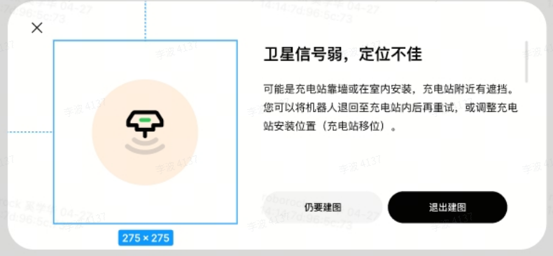
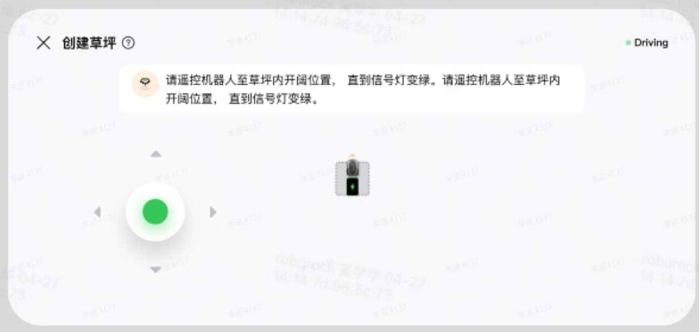
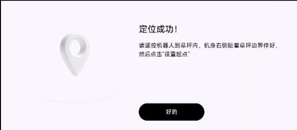
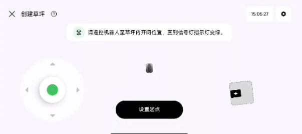
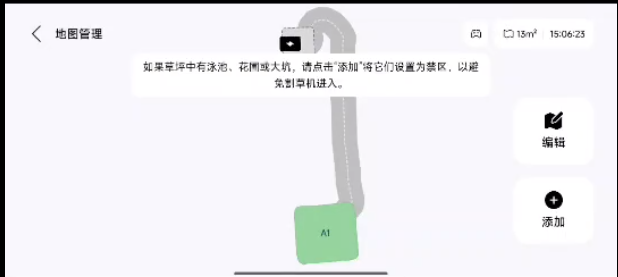
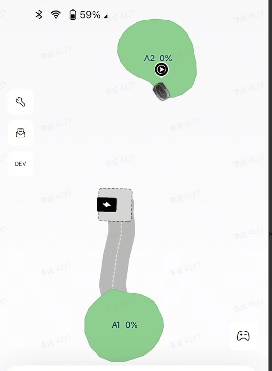

# 阴影区出桩-通道建图功能简介

# 1、产品需求

## 1.1 背景与用户场景

- 问题来源
  充电桩安装在 RTK 阴影区域（靠墙、有遮挡或与 RTK 基站有墙面阻隔）时，机器退桩后桩前区域 RTK 为非固定

  解，导致：

  - 建图时：退桩后无法完成 SLAM 初始化，两段退桩（2m）后仍在阴影区，建图失败
  - 工作时：建图时桩上有 RTK 固定解，但割草时没有，重定位失败
- 解决思路
  在退桩通道建立视觉地图，使机器在 RTK 信号不足的阴影区域仍能通过视觉定位完成出桩/回桩。

## 1.2 核心方案

1. 保留目前出桩回桩所有逻辑（即两段退桩方案保留）
2. 对所有用户，出桩建图默认建立视觉地图
3. 用户建图之后有三种操作：割草、建下一个区域、回充。不论用户选择哪种操作，最后都自动尝试回充：
  回充成功→建立回桩 vslam 地图

  ~~回充失败→APP 提醒用户，将机器手动搬回桩，APP 点击出桩，勿然后引导用户建立回桩通道，后台建立回桩（下一个版本实现）~~

## 1.3 需求块

| # | 需求 | 说明 |
| --- | --- | --- |
| 2 | 退两段定位没初始化成功可继续建图 | 退桩过程中定位未初始化成功，不报错，切用户手遥，继续遥控寻找信号好的位置 |
| 1 | 无感视觉优化 | 建图成功后，自动在后台生成/更新通道视觉地图，用户无感知 |

- **详细需求 1-----建图时：针对退桩后定位未初始化成功时的流程**<u>**（充电桩 2m 范围内为 rtk 阴影区）**</u>：
  - 退桩 1m 未初始化成功 ---> 继续退桩至 2m 仍未初始化成功，App 提示“卫星信号弱，定位不佳”

  - 退桩 2m 后仍未初始化成功 ----> 用户选择“仍要建图”，跳出手摇界面

  - 一直遥控到 rtk 信号好的区域
    - 遥控超过通道长度限制（40m）→报警建图失败
    - （40m 以内）rtk 信号好，且定位初始化成功后，弹窗显示定位成功，app 显示可以设置地图起点
|  |  |
| --- | --- |
    - 外轮廓建立完成到达闭合点，建图成功可正常显示地图，并自动生成通道（导航根据定位初始化结果反算出桩通道）

  - 无感视觉优化通道轨迹，app 无感更新通道
    - 遥控创建草坪完成后，生成从桩前往草坪路径的单向视觉地图，空闲任务下 app 更新通道
    - 首次回充成功后，补充回充的视觉地图，但 app 不更新，仅显示一条出桩通道
    - 视觉地图生成成功或失败，不报错、不影响地图创建
    - 信号好的情况下，定位在后台做视觉优化，用户无感知
- **详细需求 2-----建图完成，割草时（**<u>**充电桩 2m 范围内为 rtk 阴影区**</u>**）：**
  - 退桩 1m 未初始化成功 ---> 继续退桩至 2m，期间若定位初始化成功则 app 正常显示位置，机器沿通道去割草
  - 退桩至 2m 仍未初始化成功 ---> 导航走三角型重定位轨迹，**三角型第一条边朝向进通道方向 ---> **成功则 app 正常显示位置沿通道去割草，失败则报错 Error 38
- **case1 需求----已经存在地图，继续桩出扩建**
  - 两段退桩失败，不报错切手遥，只针对“从桩出建首个区域”，其他桩出区域不复用
  - 非首个区域出桩建图两段退桩失败会报错
  - 非首个区域出桩建图两段退桩成功则切用户手摇，手摇过程不会自动生成通道

- **case2 需求----连桩通道被新建区域截断**
  - 用户无感，视觉内部删除地图，再次穿过时重新创建