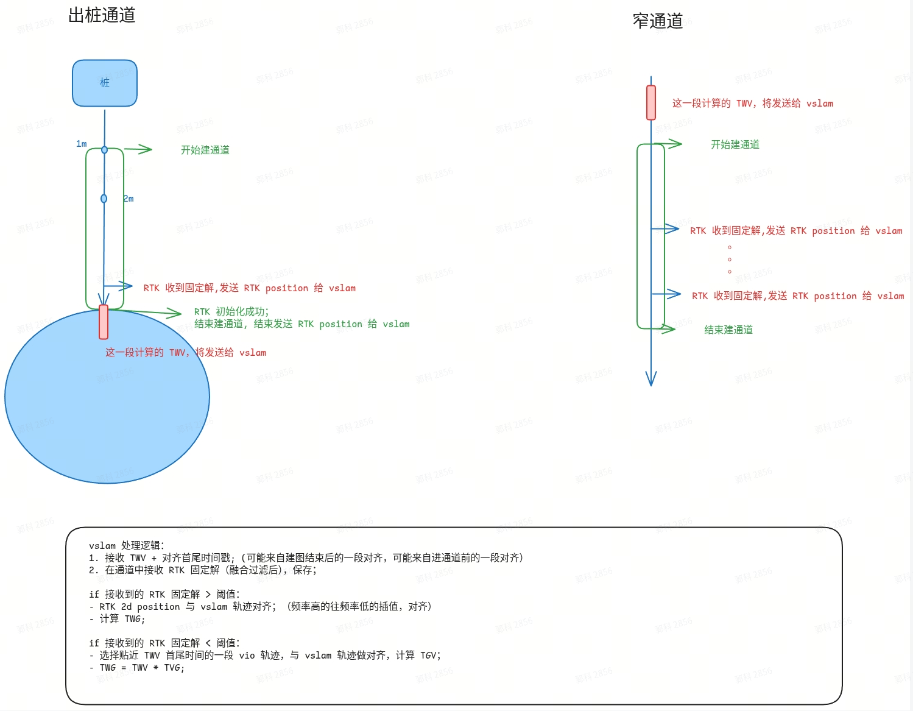

# 通道建图 — 定位组算法细节

> **文档状态**：当前有效版
> **整理时间**：2026-04-13（2026-04-14 飞书同步更新）
> **原始材料目录**：`teams/vision/inbox/通道建图/`

---

## 1. 方案背景

当前通道建图为**第三兜底方案**，三个方案依次为：

1. 不区分是否通道，提高 VIO 优先级 `@林子越`
2. 区分通道，在通道内提高 VIO 优先级 `@林子越`
3. **通道区域建图，在通道内靠 vslam 进行定位 `@李宝玉`**（当前方案）

> 来源：`inbox/通道建图/VSLAM窄通道建图需求/VSLAM窄通道建图需求.md` §1

---

## 2. vslam 与融合的接口

> 来源：`inbox/通道建图/窄通道建图接口讨论 2026年3月17日.md`

### 2.1 flag vio / vslam（v 是否重定位成功）

- **TGV pose filter 收敛**之后，重定位成功，切换为 vslam 状态
- vslam pose 的世界系为 **RTK 全局世界系**
- vio pose 在 **vio 从 0 启动的世界系**下

### 2.2 出通道后的定位切换行为

通道内为 vslam 定位时：

- **离开通道前**，vslam 发布 `TRV`（RTK 全局世界系 → VIO 世界系的变换，即 `Twv`）
- 出通道后 RTK 不稳定 → 切换回 vio → **需做一次对齐**
  - 对齐时，若通道 + 通道外 RTK 长度 **< 5m**，改用 vslam 发布的 **`TRV`** 做对齐
- 通道内始终未重定位成功（全程 vio flag）→ 出通道后直接使用 **vio 对齐**（待确认）

### 2.3 轨迹多帧对齐方案

> 来源：`inbox/通道建图/视觉通道建图-轨迹多帧对齐/视觉通道建图-轨迹多帧对齐.md`

- 背景与问题：历史版本中，进通道后（定位模式下），vslam 发送请求，融合发送 `TRti`，vslam 计算 `TRG = TRti * TGti.inv`（即视觉局部坐标系到世界坐标系的变换），由**单帧计算**得到，实测对齐误差偏大。

- 新方案：采用**多帧对齐**方式计算 `TRV`（即 `Twv`，两者为同一变换的不同命名，均表示 **RTK 全局世界系 → VIO 世界系的变换**）；vslam 内部计算 TGV（轨迹对齐），TRG = TRV \* TVG。

- **第二版（排期中）**：
  - 融合模块：创建通道中时，发送经过过滤的 RTK 固定解（含时间戳+位置）
  - 视觉模块：RTK 数据的接收和对齐

---

## 3. 导航↔vslam 通信接口（0228 修改版）

> 来源：`inbox/通道建图/VSLAM窄通道建图需求/VSLAM窄通道建图需求.md` §6（0228修改）

### 3.1 管理通道消息参数

| 参数          | 取值                                                      | 说明                                        |
| ----------- | ------------------------------------------------------- | ----------------------------------------- |
| `Action`    | `Unknown` / `Create` / `Delete` / `Move` / `CreateSave` | `CreateSave` 特指完成保存                       |
| `is_enter`  | `1` = 进入/开始建通道；`0` = 离开/结束建通道                           |                                           |
| `id`        | 通道 ID                                                   |                                           |
| `region_id` | 地图 ID                                                   | `Create`、`Move` 必带；表示当前位置所在的地图区域，用来区分通道方向 |

### 3.2 暂停时取消建通道

建通道时没有取消建通道的 UI 交互，用户退出建通道后状态机发布进入暂停状态的消息。vslam 在建图时收到暂停，取消建通道。

> 注：早期版本通信接口（已废弃）见原文 §5，以 §6（0228修改）为准。

---

## 4. 建图策略

### 4.1 SLAM 初始化流程

见 `02-定位导航交互接口.md`

### 4.2 建图结果处理

- 发布频率：**7Hz** 建图轨迹
- 建图成功：发送**优化后的通道轨迹**
- 建图失败：**不发轨迹、不报错**，由导航标记为 RTK 通道
- merge vslam 地图功能在 **HF2.0 已关闭**，正反向通道默认两张独立 vslam 地图

> 来源：`inbox/通道建图/通道视觉建图接口对齐 - 4.7.md` §建图结果与通道类型标记；`inbox/通道建图/窄通道建图接口讨论 2026年3月17日.md` §6

### 4.3 多次重复走通道的地图更新策略

> 来源：`inbox/通道建图/VSLAM窄通道建图需求/VSLAM窄通道建图需求.md` §1.4

每次走通道均保存数据并优化，具体策略：

1. 每次走通道都保存数据、优化
2. ~~每次优化完成后，使用本通道最近 **N 次**的正/反向数据融合生成一张完整地图~~
3. ~~当某个方向走过的次数大于 N，删除最老数据~~

---

## 5. 应用层接口

> 来源：`inbox/通道建图/VSLAM窄通道建图需求/VSLAM窄通道建图需求.md` §1.4.4

| 接口       | 参数                                                | 说明                                                    |
| -------- | ------------------------------------------------- | ----------------------------------------------------- |
| **开始存图** | `Type=NarrowChannel`, `MAPID=idA`                 | 标记开始保存；创建临时文件夹（ChannelID 建图时未知）；内部自增 session id，区分正反向 |
| **结束存图** | `Type=NarrowChannel`, `MAPID=idB`, `ChannelID=id` | 标记结束存图；内部自增 session id，区分正反向                          |
| **删除地图** | `Type=NarrowChannel`, `ChannelID=id`              | `ChannelID=-1` 时删除当前正在建的地图；否则删除指定地图                   |
| **优化地图** | `Type=NarrowChannel`, `ChannelID=id`              | 执行多次走通道的融合逻辑（仅针对 NarrowChannel 类型）                    |
| **加载地图** | `Type=NarrowChannel`, `ID=ChannelID`              | 加载后标记要重定位                                             |

---

## 6. 异常处理

> 来源：`inbox/通道建图/VSLAM窄通道建图需求/VSLAM窄通道建图需求.md` §2

### 6.1 建视觉地图时

| 异常             | 处理   |
| -------------- | ---- |
| 跟踪丢失、VIO Reset | 建图失败 |

### 6.2 重定位时

| 异常               | 处理          |
| ---------------- | ----------- |
| 重定位失败 / 长时间不成功   | 不做处理        |
| 跟踪丢失 / VIO Reset | 不卸载地图，继续重定位 |

---

## 7. 通道轨迹发布

> 来源：`inbox/通道建图/窄通道建图接口讨论 2026年3月17日.md` §5

- 格式：**2D 轨迹（不含姿态）**
- 发布方：**vslam 直接发，不经过融合**
- 发布方式：广播消息（IPC 消息有大小限制，不适用）
- 轨迹点密度：间隔 **≤ 5cm**；间隔过小则滤波，过大则插值
- 数据量估算：40m / 0.05m = **800 个点 = 1600 个 float**
- 方案选型：插值到 vio 频率，fix vslam kf，添加 vio 相对位姿约束，做 PGO 优化
- 导航所需的通道刷新频率：（**待确认**）

---

## 8. 已知限制与风险

| 限制/风险        | 说明                           | 状态          |
| ------------ | ---------------------------- | ----------- |
| 通道长度上限 40m   | 超过 40m 建图失败                  | 当前版本约束      |
| 视觉频繁保图 IO 卡顿 | 建图过程中频繁写图可能造成 IO 卡顿          | 风险待验证       |
| 视觉建图优化时间较长   | 约 1min，掉电/OOM/Core 等异常可能打断优化 | 需确认中断后的恢复行为 |

> 来源：`inbox/通道建图/通道视觉建图接口对齐 - 4.7.md`；`inbox/通道建图/VSLAM窄通道建图需求/VSLAM窄通道建图需求.md` §4

---
