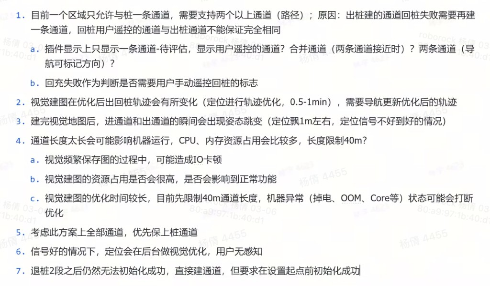

# 通道建图 — 定位组算法细节

> **文档状态**：当前有效版
> **整理时间**：2026-04-13
> **原始材料目录**：`teams/vision/inbox/通道建图/`

---

## 1. 方案背景

当前通道建图为**第三兜底方案**，三个方案依次为：

1. 不区分是否通道，提高 VIO 优先级 `@林子越`
2. 区分通道，在通道内提高 VIO 优先级 `@林子越`
3. **通道区域建图，在通道内靠 vslam 进行定位 `@李宝玉`**（当前方案）

> 来源：`inbox/通道建图/VSLAM窄通道建图需求/VSLAM窄通道建图需求.md` §1

---

## 2. 坐标系与对齐原则

- vslam 地图坐标系**复用 vio 坐标系**，vslam 地图与 RTK 地图的对齐可直接复用 vio 与 RTK 的对齐结果
- **进入通道时**（收到导航"进入通道"消息），融合强行进行一次对齐，该结果作为 vslam 地图与 RTK 地图的坐标转换关系

**融合坐标转换公式**：

- 开始存图时，记录 vio 姿态 `Tv1b1`、`Tw1b1`（此时 RTK 可能已处于阴影区域，简化认为准确）
- 重定位成功后，vslam 输出姿态 `Tv1b2`
- 融合计算全局姿态：`Tw1b2 = Tw1b1 * Tb1v1 * Tv1b2`，上报给导航

> 来源：`inbox/通道建图/窄通道建图接口讨论 2026年3月17日.md` §1；`inbox/通道建图/VSLAM窄通道建图需求/VSLAM窄通道建图需求.md` §3

---

## 3. vslam 与融合的接口

> 来源：`inbox/通道建图/窄通道建图接口讨论 2026年3月17日.md` §2

### 3.1 两个 flag

**Flag 1：vio / vslam**（v 是否重定位成功）

- **TGV pose filter 收敛**之后，重定位成功，切换为 vslam 状态
- vslam pose 的世界系为 **RTK 全局世界系**
- vio pose 在 **vio 从 0 启动的世界系**下

**Flag 2：定位 / 建图**（vslam 是否需要融合给出对齐的坐标转换关系）

vslam 需要告诉融合当前是建图状态还是定位状态：

| 状态 | vslam 行为 | 融合行为 |
|------|-----------|---------|
| **建图** | 需要融合发来 vio → RTK 的坐标转换关系 | 工作在 RTK 或 vio 模式 |
| **定位** | 发 RTK 系下坐标（vslam 自己转换），带 vslam flag；每次出通道**强制发**通道与 RTK 的转换关系（即使全程未重定位成功） | 工作在 RTK / vio / vslam 模式；收到转换关系自己决定是否使用 |
| **vio** | 发 vio 坐标系下坐标，带 vio flag | — |

### 3.2 出通道后的定位切换行为

通道内为 vslam 定位时：

- **离开通道前**，vslam 发布 `TRV`（RTK 全局世界系 → VIO 世界系的变换，即 `Twv`）
- 出通道后遇 RTK 固定解 → 融合切换为 RTK → 很快变浮点解 → 切换回 vio → **需做一次对齐**
  - 对齐时，若通道 + 通道外 RTK 长度 **< 5m**，改用 vslam 发布的 **`TRV`** 做对齐
- 通道内始终未重定位成功（全程 vio flag）→ 出通道后直接使用 **vio 对齐**（待确认）

---

## 4. 导航↔vslam 通信接口（0228 修改版）

> 来源：`inbox/通道建图/VSLAM窄通道建图需求/VSLAM窄通道建图需求.md` §6（0228修改）

### 4.1 管理通道消息参数

| 参数 | 取值 | 说明 |
|------|------|------|
| `Action` | `Unknown` / `Create` / `Delete` / `Move` / `CreateSave` | `CreateSave` 特指完成保存 |
| `is_enter` | `1` = 进入/开始建通道；`0` = 离开/结束建通道 | |
| `id` | 通道 ID | |
| `region_id` | 地图 ID | `Create`、`Move` 必带；表示当前位置所在的地图区域，用来区分通道方向 |

### 4.2 暂停时取消建通道

建通道时没有取消建通道的 UI 交互，用户退出建通道后状态机发布进入暂停状态的消息。vslam 在建图时收到暂停，取消建通道。

> 注：早期版本通信接口（已废弃）见原文 §5，以 §6（0228修改）为准。

---

## 5. 建图策略

### 5.1 SLAM 初始化流程

- 退桩期间持续进行 **vslam 局部定位**
- SLAM 初始化成功后，将 vslam **局部坐标系发给导航**，由导航做局部坐标到世界坐标系的转换

> 来源：`inbox/通道建图/阴影出桩建图、工作方案工作项拆解/阴影出桩建图、工作方案工作项拆解.md` §定位·二次退桩局部定位

**退桩阶段分支**：

- **S0 点（退桩约 1m）初始化成功**：上报定位成功，进遥控建图（正常流程）

> 来源：`inbox/通道建图/【RTK 款】阴影出桩建图、工作（退两段）.md` §退桩，原文："退到 S0 完成初始化，直接上报定位成功，进遥控"

- **S1 点（退桩约 2m）仍未初始化成功**：用户手摇 → RTK 初始化 + 视觉建图 → 导航根据 SLAM 初始化结果反算出桩通道

> 来源：`inbox/通道建图/通道视觉建图接口对齐 - 4.7.md` §退桩 2m 后逻辑修改；`inbox/通道建图/RTK阴影区出桩VSLAM建图定位-导航接口.md`，原文："如果视觉建图失败，导航根据 slam 初始化结果反算出桩通道"

### 5.2 建图结果处理

- 发布频率：**7Hz** 建图轨迹
- 建图成功：发送**优化后的通道轨迹**
- 建图失败：**不发轨迹、不报错**，由导航标记为 RTK 通道
- merge vslam 地图功能在 **HF2.0 已关闭**，正反向通道默认两张独立 vslam 地图

> 来源：`inbox/通道建图/通道视觉建图接口对齐 - 4.7.md` §建图结果与通道类型标记；`inbox/通道建图/窄通道建图接口讨论 2026年3月17日.md` §6

### 5.3 多次重复走通道的地图更新策略

> 来源：`inbox/通道建图/VSLAM窄通道建图需求/VSLAM窄通道建图需求.md` §1.4

每次走通道均保存数据并优化，具体策略：

1. 每次走通道都保存数据、优化
2. 每次优化完成后，使用本通道最近 **N 次**的正/反向数据融合生成一张完整地图
3. 当某个方向走过的次数大于 N，删除最老数据

---

## 6. 应用层接口

> 来源：`inbox/通道建图/VSLAM窄通道建图需求/VSLAM窄通道建图需求.md` §1.4.4

| 接口 | 参数 | 说明 |
|------|------|------|
| **开始存图** | `Type=NarrowChannel`，`MAPID=idA` | 标记开始保存；创建临时文件夹（ChannelID 建图时未知）；内部自增 session id，区分正反向 |
| **结束存图** | `Type=NarrowChannel`，`MAPID=idB`，`ChannelID=id` | 标记结束存图；内部自增 session id，区分正反向 |
| **删除地图** | `Type=NarrowChannel`，`ChannelID=id` | `ChannelID=-1` 时删除当前正在建的地图；否则删除指定地图 |
| **优化地图** | `Type=NarrowChannel`，`ChannelID=id` | 执行多次走通道的融合逻辑（仅针对 NarrowChannel 类型） |
| **加载地图** | `Type=NarrowChannel`，`ID=ChannelID` | 加载后标记要重定位 |

---

## 7. 异常处理

> 来源：`inbox/通道建图/VSLAM窄通道建图需求/VSLAM窄通道建图需求.md` §2

### 7.1 建通道时

| 异常 | 处理 | 负责方 |
|------|------|--------|
| 跟踪丢失、VIO Reset | 融合定位直接报错，停止地图创建，需用户重新建图 | `@林子越` |

### 7.2 走通道时

| 异常 | 处理 |
|------|------|
| 重定位失败 / 长时间不成功 | 重复 K 帧无法重定位成功则报错（K 值待确认） |
| 跟踪丢失 / VIO Reset | 重启后加载通道地图，继续重定位；重复 N 帧仍无法重定位成功则报错 |

> 建议（导航）：指导用户遥控到 RTK 良好区域开始存图；目前以起点在草坪边沿 0.5m 以内为准。

---

## 8. 通道轨迹发布规格

> 来源：`inbox/通道建图/窄通道建图接口讨论 2026年3月17日.md` §5

- 格式：**2D 轨迹（不含姿态）**
- 发布方：**vslam 直接发，不经过融合**
- 发布方式：广播消息（IPC 消息有大小限制，不适用）
- 轨迹点密度：间隔 **≤ 5cm**；间隔过小则滤波，过大则插值
- 数据量估算：40m / 0.05m = **800 个点 = 1600 个 float**
- 方案选型：插值到 vio 频率，fix vslam kf，添加 vio 相对位姿约束，做 PGO 优化
- 导航所需的通道刷新频率：（**待确认**）

---

## 9. 轨迹多帧对齐方案

> 来源：`inbox/通道建图/视觉通道建图-轨迹多帧对齐/视觉通道建图-轨迹多帧对齐.md`

### 9.1 背景与问题

历史版本中，进通道后（定位模式下），vslam 发送请求，融合发送 `TRti`，vslam 计算 `TRG = TRti * TGti.inv`（即视觉局部坐标系到世界坐标系的变换），由**单帧计算**得到，实测对齐误差偏大。

### 9.2 新方案

采用**多帧对齐**方式计算 `TRV`（即 `Twv`，两者为同一变换的不同命名，均表示 **RTK 全局世界系 → VIO 世界系的变换**），具体逻辑见原文流程图（`inbox/通道建图/视觉通道建图-轨迹多帧对齐/images/视觉通道建图-轨迹多帧对齐-image.png`）。

### 9.3 额外开发内容

**融合模块（第一版）**：
- 主动 query 时，发送**多帧对齐的 `Twv`**，同时发送对齐数据的**起止时间**

**视觉模块（第一版）**：
- 接收并记录 RTK 固定解、VIO 位姿、vslam 建图位姿
- 根据通道内 RTK 固定解情况，按流程图描述计算 `TWG`，用于建图位姿转换

**第二版（可延后）**：
- 融合模块：创建通道中时，发送经过过滤的 RTK 固定解（含时间戳+位置）
  - 需事先 pick `20260409 李岩通道中 RTK 恢复功能`私分支的对应提交后继续开发
- 视觉模块：RTK 数据的接收和对齐

### 9.4 排期

- **4/13 前**：融合、视觉各自完成第一版私分支开发（基于 vio 串联 RTK 与 vslam）
- **4/13**：开始联调

---

## 10. 已知限制与风险

| 限制/风险 | 说明 | 状态 |
|-----------|------|------|
| 通道长度上限 40m | 超过 40m 建图失败 | 当前版本约束 |
| 视觉频繁保图 IO 卡顿 | 建图过程中频繁写图可能造成 IO 卡顿 | 风险待验证 |
| 视觉建图优化时间较长 | 约 1min，掉电/OOM/Core 等异常可能打断优化 | 需确认中断后的恢复行为 |
| 进/出通道姿态跳变 | 视觉地图优化后，进/出通道瞬间可能出现定位飘（约 1m），信号不好时更明显 | 已知问题 |
| 起点 RTK 不准确影响全局姿态 | 若进入通道时 RTK 已处于阴影区域，`Tw1b1` 不准确，导致 `Tw1b2` 误差 | 建议起点在草坪边沿 0.5m 以内 |

> 来源：`images/screenshot-接口技术问题讨论.png`（第 2、3、4 条）；`inbox/通道建图/通道视觉建图接口对齐 - 4.7.md`；`inbox/通道建图/VSLAM窄通道建图需求/VSLAM窄通道建图需求.md` §4

---

## 11. 历史仿真分析（已合入）

| 内容 | 时间 | 链接 |
|------|------|------|
| okvis 通道建图仿真分析 | — | [飞书](https://roborock.feishu.cn/wiki/QI1FwUzGZicm7ykQ9Z3cVM4qnyL) |
| OKVIS 通道建图仿真分析与问题修复 | 2026-03-16，PR 151 合入 | [飞书](https://roborock.feishu.cn/wiki/JFZNwjVH3imNuekEHkFc9IThnif) |
| 通道建图 bug fix（点云平面距离判定） | 2026-03-23，B2/B3 产线数据测试 Done | — |

> 来源：`teams/vision/modules/vslam/gaps.md` G-019、G-022；`teams/vision/modules/vslam/timeline.md`

---

## 12. 待补充（飞书文档未同步本地）

| 文档 | 链接 | 说明 |
|------|------|------|
| 通道建图测试（算法 bug 分析） | [飞书](https://roborock.feishu.cn/wiki/PUAtw4HsNikT2Vk7XYMc7q8onSf) | bug 分析记录 |

> 来源：`teams/vision/modules/vslam/gaps.md` G-020
