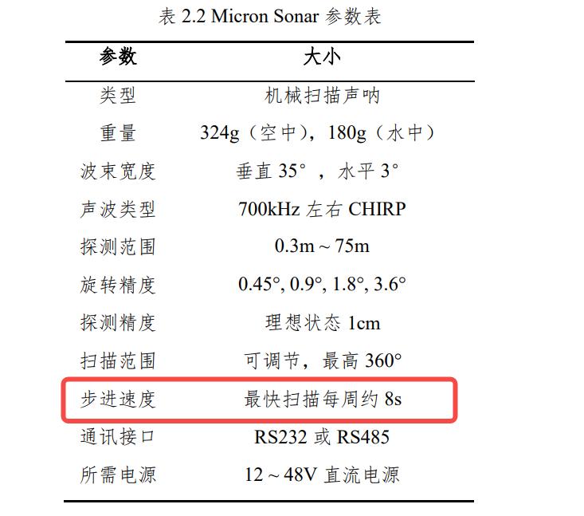
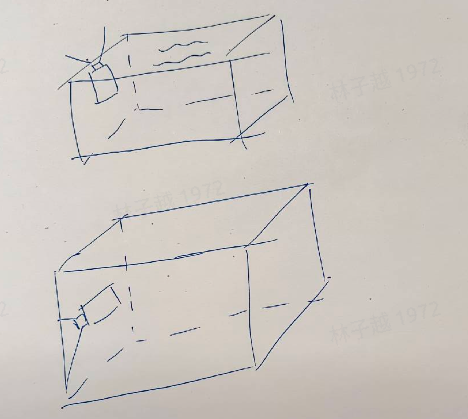
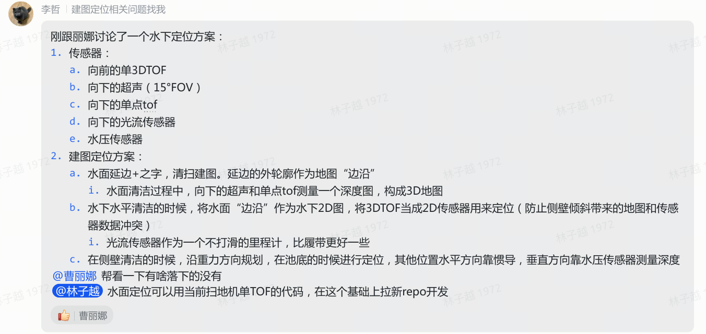

# 水下机器人定位方案梳理

> 整理日期：2026-04-14  
> 来源：水下机器人方案概述（飞书文档 + 内部讨论）

---

## 一、传感器方案概览

### 1.1 通用传感器对比

| 传感器 | 优点 | 缺点 |
|--------|------|------|
| DVL（多普勒速度计） | 提供速度量，可用于递推 | 价格昂贵；易受水流速度影响 |
| 激光/TOF/结构光 | — | 水下量程短；室外受阳光干扰 |
| 视觉 | — | 受光照影响；水下特征不足；浮动影响成像 |
| GNSS | 水面可用；可配水面浮标 | 水下信号弱；水流延迟导致误差 |
| 水深计 | 垂直方向可靠 | 只测单轴 |

### 1.2 声呐传感器对比

| 声呐类型 | 测量特性 | 优点 | 缺点 |
|---------|---------|------|------|
| 单波束声呐（SBS） | 单点深度 | 价格便宜 | 只能测单点深度 |
| 多波束声呐（MBS） | 扇形深度图（类似 TOF 拍平） | 精度高、效率高、可生成深度图像 | 价格昂贵 |
| 机械扫描声呐（MSS） | 360° 旋转扫描（类似机械激光原理） | 价格便宜 | **扫描速度慢（最快约 8s/周）**；运动畸变大 |

**关键参数（Micron Sonar，机械扫描声呐代表型号）：**

- 探测范围：0.3m ~ 75m
- 理想精度：1cm
- **步进速度：最快约 8s/周**（红框标注，是主要瓶颈）
- 波束宽度：垂直 35°，水平 3°

> 机械扫描声呐扫描模型：垂直 35° FOV + 水平 3° 分辨率，机械旋转采集，运动畸变是实际部署时的主要问题。

**多波束声呐几何模型说明：**
- 坐标系：极坐标 P(r, θ, φ)，r 为距离，θ 为方位角，φ 为仰角
- 2D 投影：在 Zero-elevation plane 上投影为扇形可视区域，测量距离 R、张角 α

---

## 二、泳池作业场景分析

### 2.1 三种作业模式

#### 模式一：纯水面清洁
- **方案**：直接复用 RTK + IMU 方案
- **复用建议**（飞书讨论，林子越）：水面定位可复用扫地机单 TOF 代码，在此基础上拉新 repo

#### 模式二：纯水底清洁
- **方案**：复用 2D 激光 / 3D TOF 方案 + 一个递推传感器

#### 模式三：水面 + 水底 + 侧壁（完整泳池清洁）

这是最复杂的场景，三个子区域各自挑战不同：

**水面沿边：**
- TOF + IMU，但缺少可靠递推传感器
- 向下超声可能只能建图，无法用于定位

**水底定位：**
- 复用 2D 激光 / 3D TOF 建 2D/3D 地图，在平面上导航

**侧壁定位（难度最高）：**

- 向上时前向 TOF 会打出水面（无效测量）
- 向左/右或向下时只有单边观测，无法做激光定位
- **唯一可行方案**：纯递推 + 水深计（重力方向规划，水平方向靠惯导，垂直方向靠水压传感器）

### 2.2 重定位问题

| 场景 | 问题 |
|------|------|
| 机器每次从水面随机位置入水 | 无固定初始位置，无法假设初始位姿 |
| 规则形状泳池 | 特征稀少，全局定位困难 |
| 侧壁回到水底 | 区域切换时需重定位 |

---

## 三、李哲提出的具体传感器配置方案

**传感器配置：**
1. 向前的单 3DTOF
2. 向下的超声（15° FOV）
3. 向下的单点 TOF
4. 向下的光流传感器
5. 水压传感器

**建图定位策略：**

| 作业区域 | 策略 |
|---------|------|
| 水面清洁（沿边+之字） | 水面延边外轮廓作为地图"边沿"；向下超声+单点TOF测量深度图构成 3D 地图 |
| 水底清洁 | 以水面"边沿"作为 2D 图；将 3DTOF 当成 2D 传感器定位（防止侧壁倾斜带来地图/传感器数据冲突）；光流传感器作里程计（比履带更可靠） |
| 侧壁清洁 | 沿重力方向规划；水底时定位；其他位置水平方向靠惯导，垂直方向靠水压传感器测深度 |

---

## 四、关键技术风险

| 风险点 | 描述 |
|--------|------|
| 机械扫描声呐扫描速度 | 8s/周，运动畸变大，实时性差，快速运动时不可用 |
| 侧壁感知盲区 | TOF 打出水面/单边观测，只能靠递推，长时间漂移不可控 |
| 规则泳池重定位 | 四边形对称结构，全局定位特征不足 |
| 水面-水底-侧壁地图一致性 | 三种作业区域坐标系需统一，切换时有重定位需求 |
| 入水位置随机 | 无法依赖固定初始位姿，需全局定位或人工标定起点 |

---

## 五、参考资料（文档内链接）

- [水下机器人 SLAM 调研](https://roborock.feishu.cn/wiki/OZGZwvgPQi2qGPk1O18cBlGynqc)
- [调研](https://roborock.feishu.cn/wiki/WwIZwLbtHivHK4k0enBcTrNAn1d)
- [泳池清洁机器人 SLAM 参考方案](https://roborock.feishu.cn/wiki/KCsQw1eRoixVrIkIzjicb5vOnxg)

---

## 引用原始材料

- **主文档**：`inbox/0414新增/水下机器人方案概述_2026-04-14-23-42-49/水下机器人方案概述.md`
- **图片来源**（均来自同目录 `images/`）：

| 本地副本 | 原始文件 | 内容 |
|---------|---------|------|
| `underwater-feishu-proposal.png` | `Tk2pbRr1qo8KzAxa1aoch2x0n6x.png` | 飞书讨论截图：李哲提出传感器配置+建图方案 |
| `underwater-micron-sonar-spec.png` | `TP5mbN21MouPkRxuNnyczJcYnSb.png` | Micron Sonar 参数表（机械扫描声呐，8s/周瓶颈） |
| `underwater-sidewall-sketch.png` | `GtDAbrrYtoov2axPS4ocEvBtniz.png` | 侧壁清洁感知盲区手绘示意图 |
| —（未复制） | `DP59bZ4lWozbR0xnjvnc6H2inWf.png` | 单波束声呐示意图 |
| —（未复制） | `RUq9beNsGotX8sx23PfcZ7ZCn54.png` | 多波束声呐示意图 |
| —（未复制） | `Fh8sbIbs6ozhd0xkWsRcJIiQnbd.png` | 多波束声呐坐标系 + 2D 投影（图 2-3/2-4） |
| —（未复制） | `CcdwbulMKoJizKxtfZ9cXVqPnib.png` | 成像声呐几何模型（图 2-5） |
| —（未复制） | `VWGnbNZwdoGNbax74UtcMF3JnYK.png` | 机械扫描声呐扫描模型（35°/3° FOV） |
