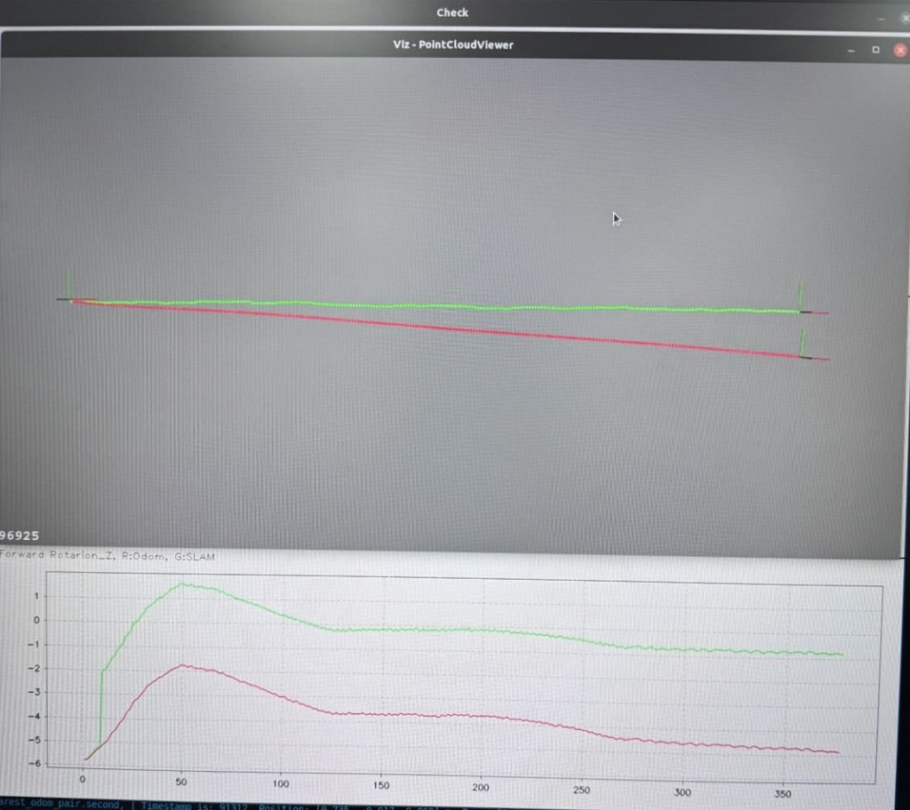
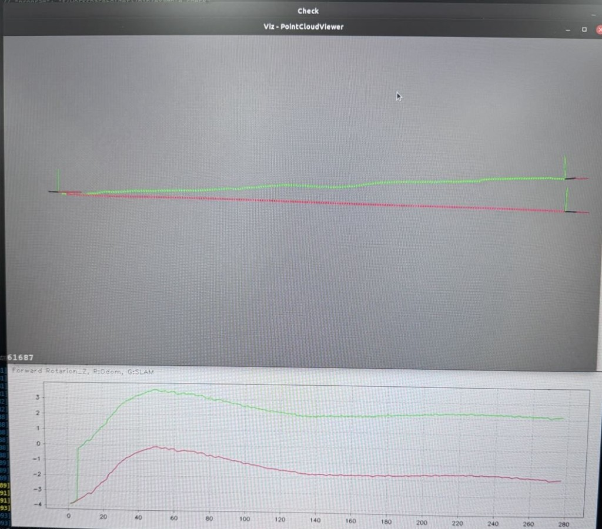
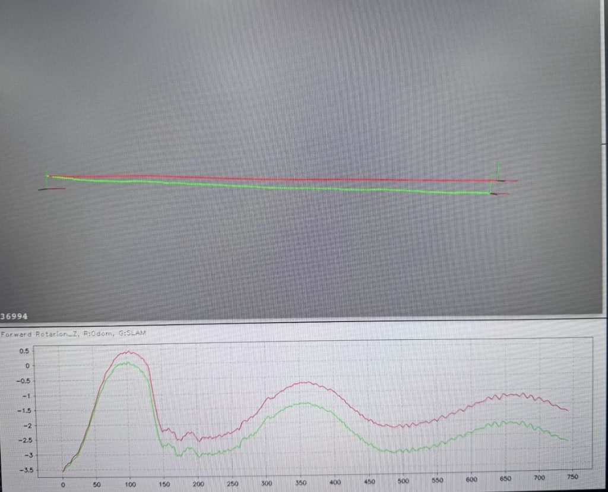
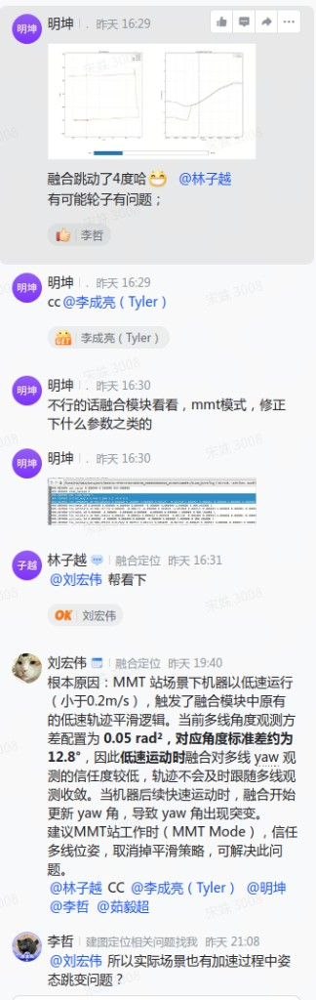
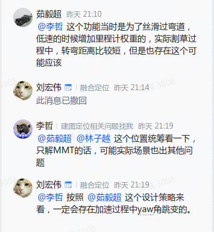
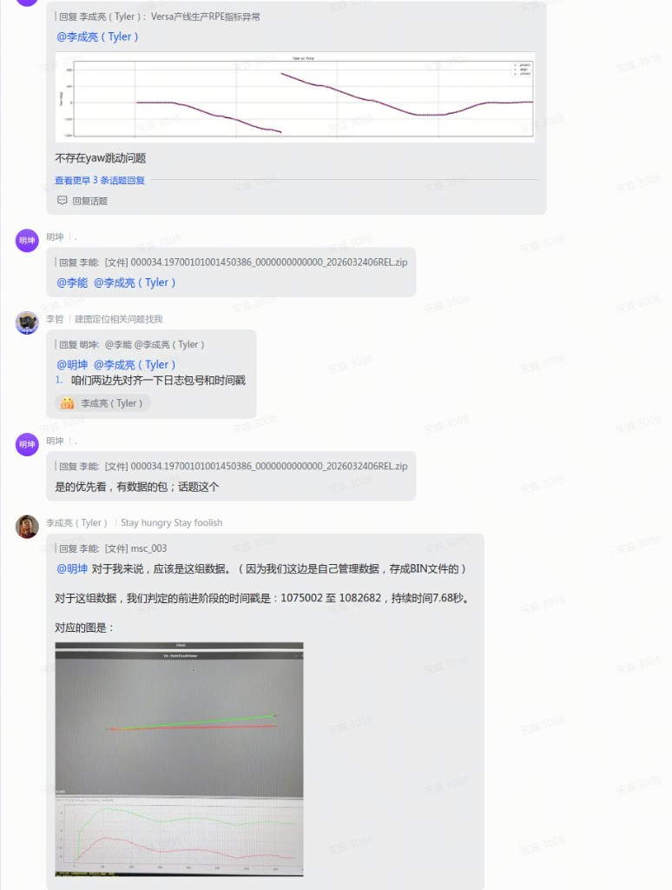

# Versa 产线生产 RPE 指标异常 — yaw 跳变问题讨论梳理

**日期**：2026-05-07
**来源**：飞书「融合定位 / 建图定位相关问题找我」话题串
**涉及人员**：李成亮（Tyler，Versa 算法）/ 明坤（laser）/ 林子越（fusion）/ 刘宏伟（融合）/ 李哲（建图定位）/ 茹毅超（融合，原平滑策略设计者）/ 李能 / 刘博

---

## 1. 问题

- **现象**：Versa 产线生产环节，部分机器 RPE 指标异常。
- **复现条件**：MMT 站场景，机器低速直行（< 0.2 m/s）→ 后续加速运动。
- **可视化表现**（红 = Odom，绿 = SLAM）：
  - 直行段 SLAM 轨迹与 Odom 轨迹**逐渐偏离**（图一 96925 段、图二 61687 段）。
  - 同段 Yaw 曲线显示 **SLAM 端在直行阶段发生约 4° 跳变**（明坤 16:29「融合跳动了 4 度哈」）。
  - 对照组：B2 产线 MMT 数据（图三 36994 段）**未见明显跳变**。
- **数据包**（用于双方对齐）：`000034.197001011001450386_…_2026032406REL.zip`
  - Tyler 侧前进阶段判定时间戳：`1075002 – 1082682`，持续 7.68 s。

### 配图

- 图一 / 图二：Versa 产线两段问题数据轨迹与 Yaw 曲线
  
  
- 图三：B2 产线 MMT 对照数据（无明显跳变）
  

---

## 2. 分析过程

### 2.1 早期假设（已被否定）

- **假设**：直行前期前轮发生轻微移动，导致 Odom/SLAM 两段直行定位结果不同。
- **缓解方案**：去除直行阶段前 1 s 数据再算 RPE（绕开不稳定数据，不解根因）。
- **反对（Tyler）**：前轮姿态调整理论上能被 IMU 感知到，不该让 SLAM 端出现跳变。

### 2.2 现有可视化分析（Tyler）

- 把 Odom / SLAM 两段轨迹 + 各自绕 Z 轴 Yaw 角度叠图。
- 结论：**跳变发生在 SLAM 端**，不是 Odom 前轮抖动；问题应在融合 / 建图侧。

### 2.3 根因定位（刘宏伟，融合）

- **触发条件**：MMT 站场景下机器低速运行（< 0.2 m/s）。
- **机制**：触发融合模块原有的「**低速轨迹平滑**」逻辑。
  - 多线角度观测方差配置为 `0.05 rad²`（≈ 角度标准差 12.8°）。
  - 低速时融合对多线 yaw 观测信任度低 → 轨迹不及时跟随多线收敛。
  - 后续机器**加速运动**时，融合开始更新 yaw → **yaw 角突变**。
- **建议（被搁置，见下文决议）**：MMT Mode 下信任多线位姿，取消平滑策略。

### 2.4 设计原意补充（茹毅超，平滑策略原作者）

- 该策略最初目的：**丝滑过弯道**，低速时增加里程计权重。
- 适用场景：实际割草中转弯距离较长，所以低速段权重切换原本是合理的。
- 但茹毅超本人也承认：「实际割草过程中…**也存在这个可能问题**」。

### 配图（飞书讨论原文）

---

## 3. 争议

### 3.1 是否仅在 MMT 模式下取消平滑（核心争议）

- **刘宏伟**：MMT 模式下取消平滑即可解 MMT 场景的 RPE 异常。
- **李哲（反对一刀切）**：「这个置信**统筹一下**，只解 MMT 的话，可能实际场景也出其他问题」——担心改 MMT 分支会让割草主场景受影响，需要全局重新评估置信策略。
- **刘宏伟回应**：「按照@茹毅超 的设计策略来看，**一定会存在加速过程中 yaw 角跳变的**」——只要保留低速增权 + 加速切回的策略本身，加速跳变就无法避免，需重新设计而不是只改阈值。

> 争议本质：是改一个 MMT 分支开关（局部修复），还是重做置信切换策略（全局修复）。

### 3.2 实际割草场景是否同样会出现该跳变

- **李哲**提问：实际割草是否会在加速过程出现姿态跳变？
- **茹毅超**：转弯距离较长虽然弱化了影响，但「也存在这个可能问题」。
- **结论倾向**：跳变机制并非 MMT 独有，割草场景理论上同样会触发，只是表现不一定能在 RPE 指标上明显暴露。

### 3.3 是否真的存在 yaw 跳变（数据对齐前的认知差异）

- 早前 Tyler 的回复曾说「**不存在 yaw 跳动问题**」。
- 之后明坤 / 李哲推动**对齐日志包号 + 时间戳**，Tyler 重新基于自己 BIN 数据复核，给出前进段时间戳 `1075002–1082682`，承认存在跳变。

---

## 4. 今日结论与决议（2026-05-07，宋姝）

### 4.1 已确认事实

- ✅ **确实存在 yaw 跳变**（基于双方对齐后的同一段数据复核）。
- ✅ 触发机制为融合模块「低速增权 + 加速切回」策略 — 已由刘宏伟定位。

### 4.2 当前决策：暂不调整参数

- **原因 1**：MMT 站场景触发该问题的**概率很小**，对产线 RPE 的整体影响可控。
- **原因 2**：直接调整低速平滑参数 / 取消平滑策略，**可能影响实际割草运行**（茹毅超原设计目的：丝滑过弯道）；副作用未评估清楚之前不动。
- **结论**：**保留现有融合参数与策略，不在本周修改**。

### 4.3 派发工作项（owner: 茹毅超）

需要先把以下两个问题搞清楚，再决定是否、以及如何调整策略：

1. **找 3 组放羊（实际割草作业）日志数据**，复核：
   - 实际割草运行过程中是否同样出现「低速 → 加速」时 yaw 跳变？
   - 跳变幅度（与 MMT 场景的 ~4° 对比）、出现频率？
2. **评估 yaw 跳变对导航的实际影响**：
   - 是否会传导到路径规划 / 直线行走 / 边界跟随？
   - 是否在某些场景下已经造成可观测的导航异常（绕弯、压线、漏割）？

> 决策路径：
> - 若实际割草场景**不存在**该跳变 → MMT 是孤例，可在 MMT 分支单独处理（或干脆不处理）。
> - 若实际割草场景**存在**该跳变，但**对导航无可观测影响** → 维持现状，作为已知风险记录。
> - 若实际割草场景**存在跳变 + 对导航有影响** → 升级为 P 级问题，重做置信切换策略（按李哲意见全局统筹）。

---

## 5. 后续归档（待茹毅超数据回来后处理）

- `teams/fusion/modules/fusion/problems.md`：新增条目「Versa MMT 低速→加速 yaw 跳变（融合低速平滑策略）」，关联 P-006（同样是 yaw 非连续跳变类问题）。
- `teams/fusion/modules/fusion/gaps.md`：新增 `Q-xxx`「MMT 模式取消平滑 vs 重做置信策略」，待统筹决策。
- `teams/fusion/modules/fusion/decisions.md`：暂不写——核心争议（局部 vs 全局）尚未收敛。
