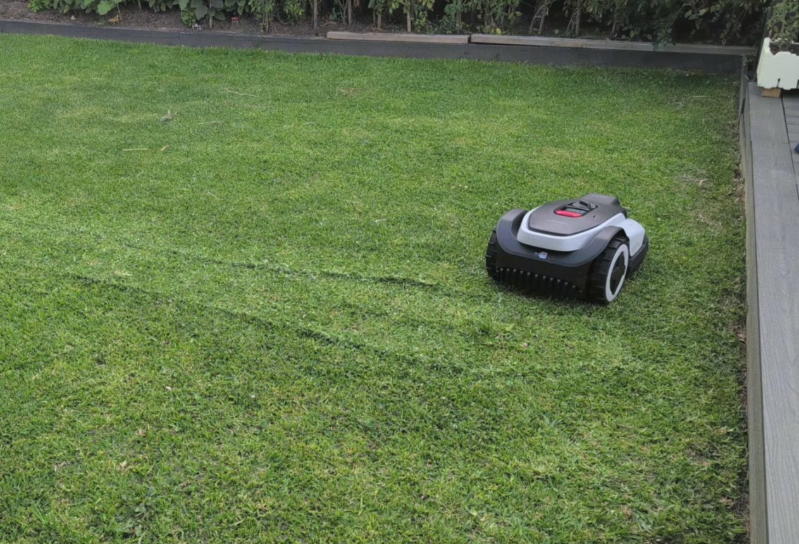
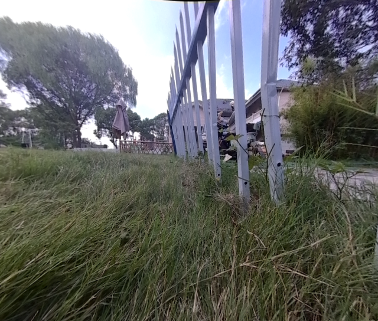
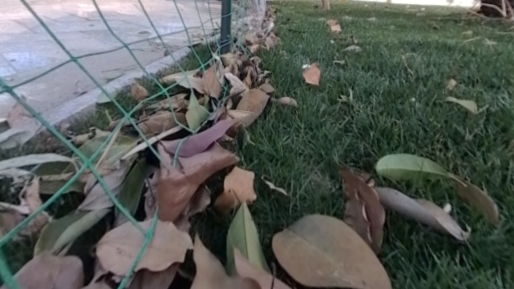
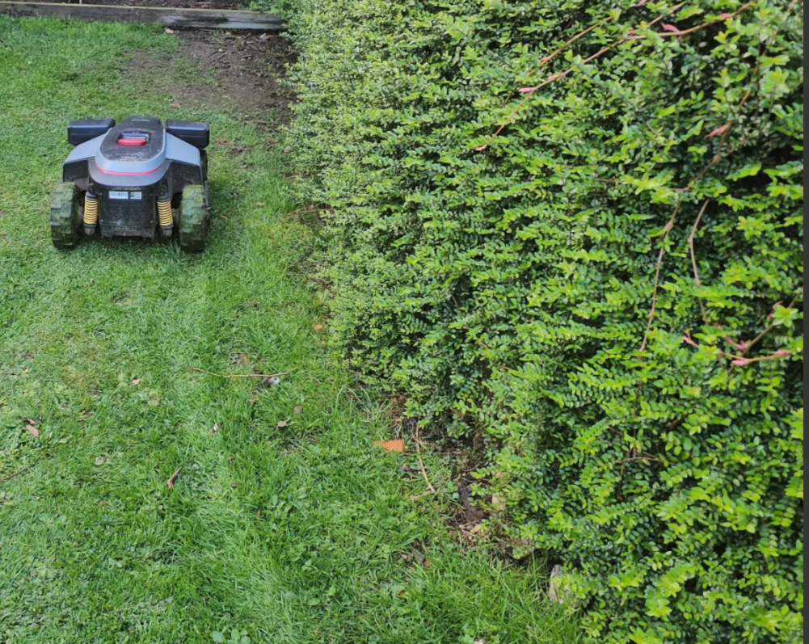
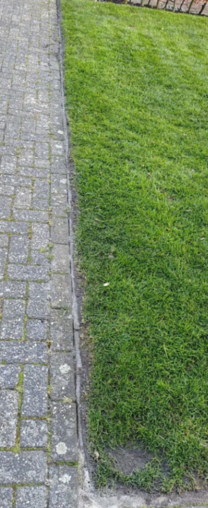
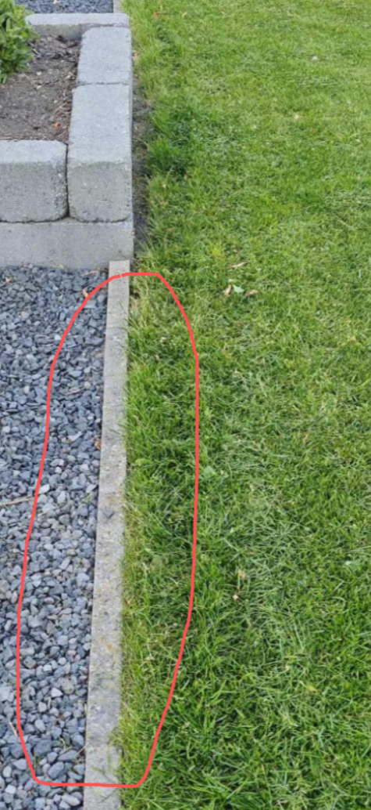
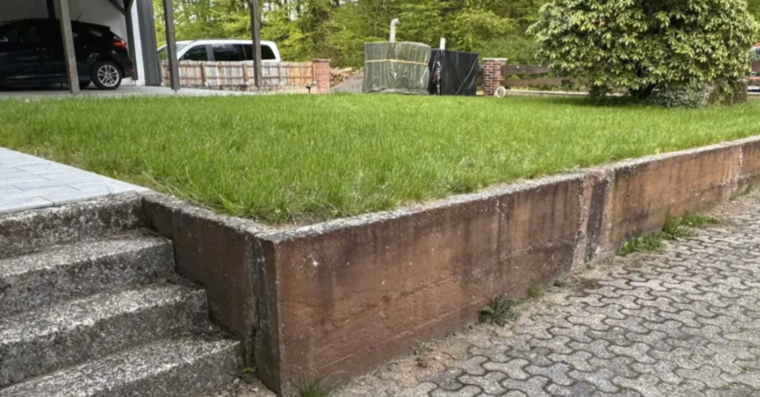
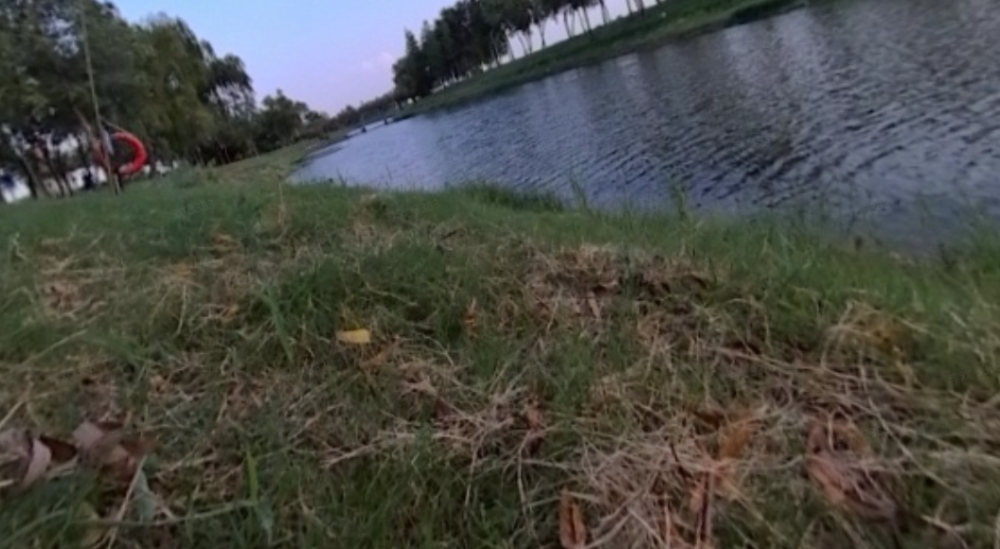
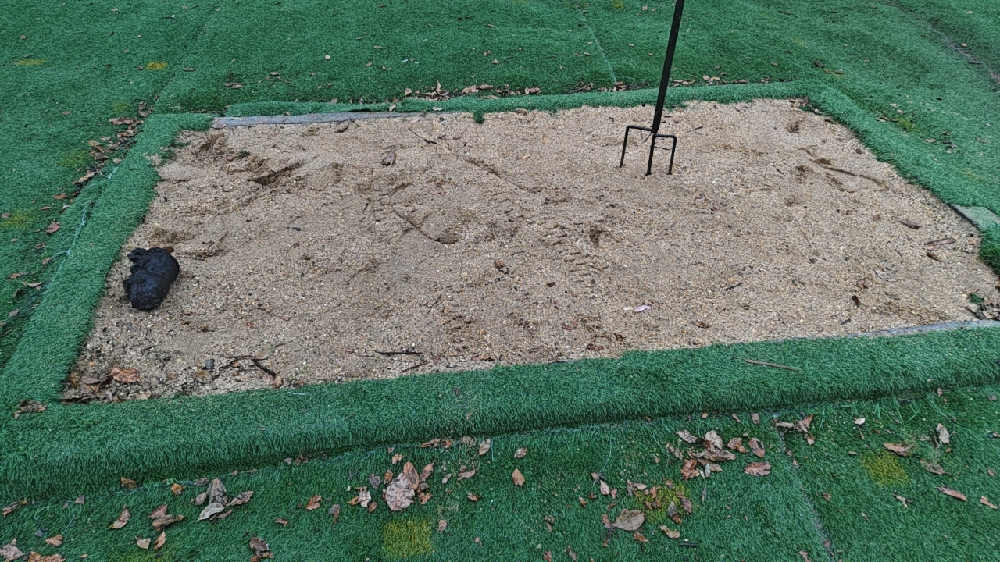

# 自主沿边 — 测试用例：边界定义与场景评估

> **骨架**：以**导航定义的边界类型**为准（已与感知核对、研发侧计划支持、本版本关注）。来源 `边界处理-导航-梳理稿.md`。
> **角色**：本文是替代产品 `AI贴边专项测试.xlsx` 的测试用例底稿——按研发边界体系组织，含细分场景 / 物理特征 / 风险 / 识别难点 / 感知能力现状评估 + 示意图。
> **配套**：优先级梯度与离谱项对齐见 `自主沿边-测试用例收敛表-草表.md`；与产品定义的差异见本文 §3 gap 表。
> **存疑标注约定**：`⚠️存疑` = 分类或物理特征定义待 6/9 与感知负责人确认；存疑点汇总见 §4。
> 事实分级：`[事实]` confirmed / `[判断]` 高置信 / `[待验证]`。

---

## 1. 导航边界类型总表（研发计划支持）

> 用户侧只看一级（安全/危险）；算法内部按二级/三级执行策略。`[事实]`

| 一级 | 二级 | 三级 | 典型场景 | 本期优先级 | 示意图 |
| --- | --- | --- | --- | --- | --- |
| 安全 | 高度边界 | 实心 | 墙体、路沿石 | P2（高墙）|  |
| 安全 | 高度边界 | 镂空 | 铁艺/木质围栏 | P2（栅栏）|  |
| 安全 | 高度边界 | 网状 | 铁丝网 | P3 |  |
| 安全 | 高度边界 | 植被 | 树篱、灌木 | P2（景观植被）|  |
| 安全 | 齐平边界 | 可跨 | 步道、草坪分区 | **P1** |  |
| 安全 | 齐平边界 | 不可跨 | 鹅卵石、沙地 | P3 ⚠️存疑 |  |
| 安全 | 默认边界 | 未知 | 不清晰/未识别 | P3 | （无）|
| 危险 | 跌落边界 | 跌落 | 陡坎、深坑、水渠 | **P1** |  |
| 危险 | 水池边界 | 水池 | 泳池、自然水体 | **P1** |  |
| 危险 | 易陷边界 | 泥沙 | 沙地、湿地 | P3 ⚠️存疑 |  |

---

## 2. 各边界测试用例细分（场景 / 物理特征 / 风险 / 识别难点 / 感知现状）

### 2.1 安全 · 齐平边界 · 可跨（P1）

| 细分场景 | 物理特征 | 风险 | 识别难点 | 感知能力现状 |
| --- | --- | --- | --- | --- |
| 硬化步道/平台 | 与草坪齐平，硬质，纹理差异显著 | 低（可平稳驶过）| 落叶沙土覆盖；防腐木/仿古砖与草坪颜色接近误判 | 分割路面 0.91；点云 1.2cm`[事实]` |
| 草坪功能区平齐（草种分区）| 两侧均草坪，仅草种/修剪高度/颜色区分 | 低 | 特征极接近，识别难度最大；修剪后辨识度降 | 分割草 0.98`[事实]` |
| 瓷砖路（齐平）/石板路 | 高差 ≤2cm | 低 | 缝隙杂草；雨天反光 | 瓷砖齐平 1.23cm、石板 1.25cm`[事实]` |

> 策略：智能模式取最大集，外扩 ≤0.3m（导航）/ 齐平外扩上限 30cm（PDD）。`[事实]`

### 2.2 危险 · 水池边界（P1）

| 细分场景 | 物理特征 | 风险 | 识别难点 | 感知能力现状 |
| --- | --- | --- | --- | --- |
| 自然无围边水体 | 草地直接衔接水面，无围边 | 高（越界直接落水，不可逆）| 水面反光倒影；雨季水位动态变化；草遮挡 | **点云无法感知水面**；分割水面 0.78`[事实]` |
| 泳池/水景围边 | 硬质垂直围边 10–50cm | 高 | 水体反光；底部水渍青苔 | 沿边专项泳池 3.6cm（拉丝）`[事实]` |
| 低矮防护围栏水体 | 围栏高 **1–2cm**，可轻松跨越 | 高 | ⚠️低于感知高度阈值（≥5cm），易漏检 | 见 §4 存疑 4 |

> 策略：危险边界内缩（PDD 10cm）。`[事实]`

### 2.3 危险 · 跌落边界（P1）

| 细分场景 | 物理特征（负高差）| 风险 | 识别难点 | 感知能力现状 |
| --- | --- | --- | --- | --- |
| 陡坎/悬崖/边坡 | 5–30cm（极端数米）| 高（坠落）| 杂草灌木遮挡；塌方动态变化；光影大 | 跌落由导航检测`[事实]` |
| 深坑/孔洞 | ≥30cm | 高 | 坑口杂草落叶遮挡；薄土覆盖 | 同上 |
| 水渠/排水沟 | 5–100cm | 高 | 盖板 2–5cm 负高差；杂草遮挡 | 同上 |
| 下沉式种植区 | 5–50cm | 高 | 无直角拐点；缓坡识别难 | 同上 |

> 关键存疑：跌落算法当前 6cm，**5cm 单帧不可信**，建议测 10cm 起 + step（5/8/10cm）。`[判断]` 见 §4 存疑 1。

### 2.4 安全 · 高度边界 · 实心（P2，高墙）

| 细分场景 | 物理特征 | 风险 | 识别难点 | 感知能力现状 |
| --- | --- | --- | --- | --- |
| 建筑墙体/地基 | 垂直硬质墙面，≥5cm | 低 | 反光/树荫阴影；管线等特殊障碍；与草坪颜色接近 | 水泥墙 1.06cm，稳定；弱光劣化（傍晚 9.9cm）`[事实]` |
| 路沿石/道牙 | 高 5–20cm，直角过渡 | 低 | 破损/缺角边界不规则；底部杂草；逆光弱化 | 点云稳定`[事实]` |
| 花坛/花池围边 | 5–30cm，直角/弧形/异形 | 低 | 异形曲率突变；枝叶落叶遮挡 | 点云稳定`[判断]` |
| 景观石/假山 | 5–100cm，不规则曲线 | 低 | 不规则难拟合；半埋入土边界模糊 | 点云稳定`[判断]` |

### 2.5 安全 · 高度边界 · 镂空（P2，栅栏）

| 细分场景 | 物理特征 | 风险 | 识别难点 | 感知能力现状 |
| --- | --- | --- | --- | --- |
| 铁艺/木质/PVC 围栏、竹篱笆 | 立柱+栏栅，镂空，底部间隙 0–10cm | 低 | 镂空光影变化大；前后景点云粘连 | 镂空铁栅栏 1.48cm（细杆波动）；已单独成类优化`[事实]` |

### 2.6 安全 · 高度边界 · 网状（P3）

| 细分场景 | 物理特征 | 风险 | 识别难点 | 感知能力现状 |
| --- | --- | --- | --- | --- |
| 铁丝网/网状栅栏 | 极细网状结构 | 低 | 前后景穿插粘连 | **基本失效（4.6cm）**；极细铁丝网难识别`[事实]` |

### 2.7 安全 · 高度边界 · 植被（P2，景观植被）

| 细分场景 | 物理特征 | 风险 | 识别难点 | 感知能力现状 |
| --- | --- | --- | --- | --- |
| 树篱、灌木围挡、花栏 | 高 10–100cm，枝叶垂落 | 低 | 枝叶落叶遮挡；植被特征接近草坪 | 分割植物 0.81；点云树篱 2.13cm（抖动）；研发：不一定稳定`[判断]` |

### 2.8 安全 · 齐平边界 · 不可跨（P3，⚠️存疑归类）

| 细分场景 | 物理特征 | 风险 | 识别难点 | 感知能力现状 |
| --- | --- | --- | --- | --- |
| 鹅卵石 | 齐平，松散颗粒 | 中（开刀盘危险）| 无明确分界线 | 鹅卵石沿边 1.24cm`[事实]` |
| 沙地/碎石 ⚠️ | 齐平，松散 | 高（陷落卡困/打刀盘）| 干湿变化颜色波动；无分界线 | ⚠️归类见 §4 存疑 2 |

### 2.9 危险 · 易陷边界 · 泥沙（P3，⚠️存疑归类）

| 细分场景 | 物理特征 | 风险 | 识别难点 | 感知能力现状 |
| --- | --- | --- | --- | --- |
| 裸土/菜园 | 齐平，裸露泥土 | 高（易卡困）| 雨天颜色接近草坪；动态变化 | 分割泥地 0.66（弱项）`[事实]` |
| 湿地/沼泽软泥 | 表面似草地，实为软质 | 高（陷车无法脱困）| 表面与草地一致难区分；无分界 | 分割难`[判断]` |

### 2.10 安全 · 默认边界 · 未知（P3）

| 细分场景 | 物理特征 | 风险 | 识别难点 | 策略 |
| --- | --- | --- | --- | --- |
| 无属性/不清晰/未识别 | — | — | 未识别或置信度低 | 沿手摇轨迹切割`[事实]` |

---

## 3. 与产品定义的 Gap（导航/研发 vs 产品 PDD）

| 维度 | 导航/研发定义 | 产品 PDD 定义 | Gap 性质 |
| --- | --- | --- | --- |
| 分类轴 | 安全语义三级（安全:高度/齐平/默认；危险:跌落/水池/易陷）| 几何形态四类（高度≥5cm / 平齐≤2cm / 水体 / 低矮凹陷）| **分类轴不同**：语义 vs 几何 |
| 沙地/裸土归类 | 倾向危险/易陷（泥沙）| 平齐边缘（几何齐平，标高风险）| **归类冲突** ⚠️ |
| 一级粒度 | 用户看一级，算法看二级执行 | 用户视角呈现四大类 | 粒度/视角不同 |
| 高度阈值 | 高度 ≥5cm；跌落算法 6cm | 高度 ≥5cm；低矮 ≥2cm | 低矮 2cm vs 跌落 6cm **不一致** |
| 电线/溢线 | 做不了，本期排除 | 列为危险边界 | **范围 gap** |
| 默认/未知边界 | 导航有（沿手摇轨迹）| PDD 无明确对应 | 导航独有 |
| 网状 | 单列（基本失效）| 并入围栏/镂空 | 粒度 gap |
| 沿边精度 | 按场景实测分档 | 统一 ±1cm | **口径 gap** |

---

## 4. 存疑点汇总（6/9 与感知负责人确认）

1. **跌落最小高度阈值**：算法 6cm vs 测试 5cm，5cm 单帧不可信 → 稳定阈值定多少？是否加 step（5/8/10cm）。`[判断]`
2. **沙地/碎石、裸土归类**：归「安全/齐平-不可跨」还是「危险/易陷-泥沙」？产品归平齐、风险上是高风险。`[事实]`（冲突）
3. **鹅卵石定义**：开刀盘危险，算「齐平-不可跨」还是另立？`[待验证]`
4. **低矮围栏水体 1–2cm**：低于感知高度阈值（≥5cm），能否检测/如何归类/是否豁免？`[事实]`
5. **网状 vs 镂空粒度**：铁丝网/网状基本失效，是否单列为不支持类？`[判断]`
6. **默认/未知边界**：是否纳入本期测试？通过标准如何定？`[待验证]`
7. **高度边界各子类物理参数**：花园设施 10–80cm 等数值是否准确（产品标注，研发存疑）。`[待验证]`
8. **精度口径**：感知层单独给 vs 感知+导航融合给（关联精度估算提纲 Q6）。`[事实]`
