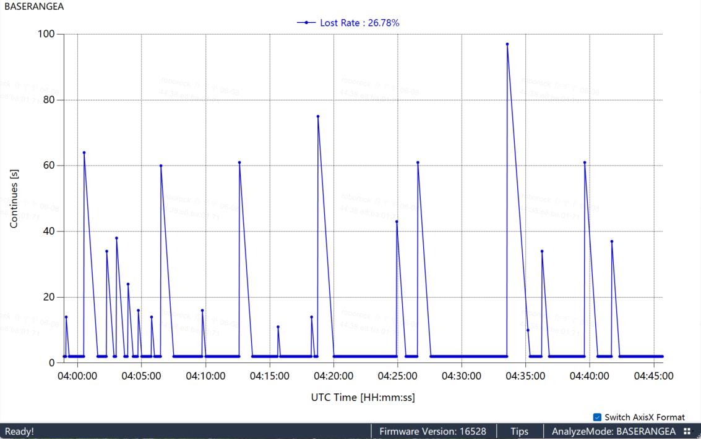
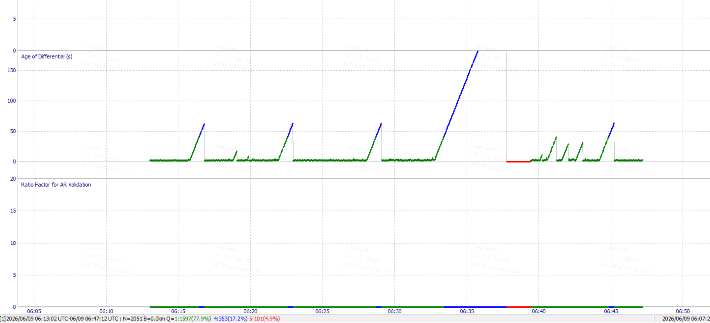

# 智能纪要：wifi桩lora 测试的视频会议 2026年6月10日

> 会议主题：wifi桩lora 测试的视频会议
> 
> 会议时间：2026年6月10日（周三） 13:48 - 15:26 （GMT+08）
> 
> 参会人：          

> 智能会议纪要由 AI 生成，可能不准确，请谨慎甄别后使用

# 总结

本次会议围绕 NRTK 遮挡环境测试、Gaia 充电桩 nRTK lora 功能单体测试报告及 Lora 测试验收标准等内容展开讨论，对测试结果进行分析，明确后续测试重点和时间安排，以确定 NRTK 方案是否可行，内容如下：

- **NRTK 遮挡环境测试问题分析**
  - **丢包问题探讨**
    - 长丢包原因：乔平平认为长丢包大概率是软件问题，如桩重启、网络断连或 RTK 服务中断等。侯振锟会后将查看 30 秒、60 秒长丢包情况，确认是否为网络或 RTK 服务问题。
    - 小丢包影响：小丢包可能受信号质量影响，在遮挡严重区域，频繁丢包会使割草机定位处于浮动状态，难以收敛。乔平平表示小丢包较难优化，可能是硬件性能问题。
  - **桩放置位置影响**
- 墙边丢包情况：桩放在墙边时丢包率明显增加，小长丢包也增多，可能影响 RTK 定位。乔平平提出需加测墙边场景数据，评估对定位的影响。
- 对角线测试结果：对角线空旷条件下，除长丢包问题外，其他情况与 1 + 1 RTK 表现相当。乔平平认为去掉长丢包问题，小丢包影响不大。

- **Gaia 充电桩 nRTK lora 功能单体测试报告分析**
  - **测试数据评估**
    - 与 1 + 1 RTK 对比：测试结果显示，NRTK 在某些场景下表现不如 1 + 1 RTK，尤其是桩放在墙边时。宋姝认为投入更多成本的 NRTK 不应出现性能下降情况。
    - 验收标准分析：去年制定的验收标准要求隔墙距离 50 米，一小时内大于 5 秒的频次不超过 10 个，95%的数据小于 5 秒，整体丢包率小于 10% - 15%。当前测试数据部分不满足该标准，需进一步评估对定位的影响。
  - **问题排查与解决**
    - 高丢包率原因：徐成认为高丢包率可能是与其他基站频率相似导致撞包，建议复测确认。侯振锟将查看 80% 丢包率的情况，确认是否因桩重启导致。
    - 软件与硬件优化：若墙边测试效果不佳，需评估硬件提升空间和软件兜底能力。乔平平认为硬件优化空间有限，宋姝表示软件对没数据情况兜底方法有限。
- **Lora 测试验收标准讨论**
  - **标准来源与要求**
    - 标准制定：验收标准由定位、器件和供应商共同制定，主要依据导航对定位的要求。乔平平提到去年首次制定该标准，产品要求距离为 200 - 300 米，但实际用户使用中一般不超过 50 米。
    - 当前数据对比：当前测试数据在某些场景下不满足验收标准，如 20% 以上的丢包率。徐成认为应重点关注长丢包情况，卡丢包率意义不大。
  - **对定位的影响评估**
    - 性能下降评估：若 NRTK 不满足验收标准，需评估对定位的影响。宋姝表示需动用测试人力进行量化分析，确定影响程度。
    - 解决方案探讨：若硬件无法优化，软件无法兜底，NRTK 方案可能不可行；若下降幅度小且软件能兜底，项目可继续推进。
- **后续工作计划**
  - **墙边场景测试**：乔平平负责明天下午完成墙边场景测试，根据结果判断 NRTK 方案是否可行。若效果不佳，需评估硬件提升空间和软件兜底能力。
  - **Gaia 测试安排**：徐成表示 Gaia 的 SCG 下周开始测试，预计两周左右完成所有场景测试。乔平平需提前准备好测试场景，不能等软测结果。
  - **数据查看与分析**：侯振锟会后查看长丢包问题，确认原因并在群里反馈。赵一沣查看测试数据，确认是主机 RTK 还是桩 RTK 工作。
  - **会议跟进**：若下午有墙边测试数据，乔平平第一时间拉会，共同查看数据并评估结果。

# 待办

- [ ] 桩问题分析：分析桩重启后一直不可用的原因，对桩的当前固件版本功能进行全量压测，确定在哪些场景下会出现问题和 bug（来自徐成）  
- [ ] 桩日志分析：查看桩的 log，确定数据转发情况，判断是否是 NRTK 下发时出现问题；分析桩 RTK 连接不稳定场景，确定是重启还是长时间未连接导致连接中断（来自徐成,李威）    
- [ ] 数据情况确认：查看日志，确认除锯齿状情况外，3、4、5 这几个数据属于试装还是主机（来自乔平平）  
- [ ] 软测结果核查：double check 软测测试，以确保测试结果的准确性，为判断当前测试数据是否满足需求提供依据（来自李威）
- [ ] 长丢包数据查看：查看长丢包的模板数据，确认数据是否有发出问题，以及是否为电台情况的表现（来自乔平平）  
- [ ] 丢包问题确认：查看日志确认 80% 丢包率的原因，若为软件问题则去掉该数据；确认 30 秒、60 秒长丢包及重启问题是否由软件问题导致，分析长丢包是网络、NRTK 还是其他问题，将结果发群（来自乔平平）    
- [ ] 丢包定位复测：重点复测墙边遮挡场景及整机对角线场景，确认长丢包问题并将结果发群里；对比 NRTK 与 1+1 RTK 定位效果，将测试数据报告给宋姝（来自侯振锟,宋姝）  
- [ ] S1G 测试沟通：与阳洋哥沟通 S1G 裸板测试跑不通原因，确认是否需整机及 APP 控制，还要与源哥沟通 S1G 板子需求  
- [ ] 墙边测试安排：优先测试墙边情况，若下午有测试数据，第一时间组织会议，与相关人员共同查看数据和结果，并以数据进行评判  

# 会议最佳表现成员

# 相关链接

- 文字记录
  - [wifi桩lora 测试的视频会议 2026年6月10日](https://roborock.feishu.cn/docx/SmZFdHtYBoGebtxjxrYcUBIenAM)